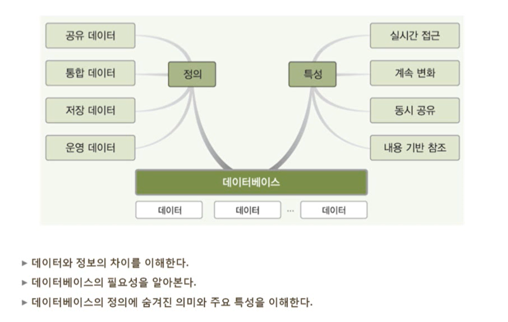
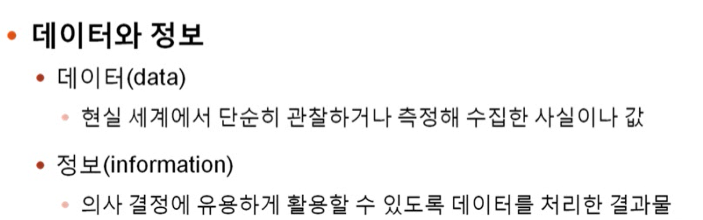
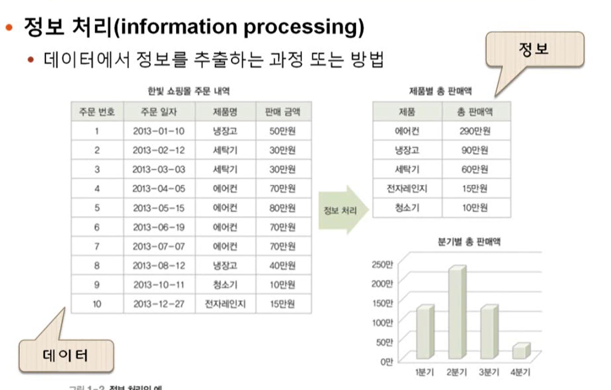
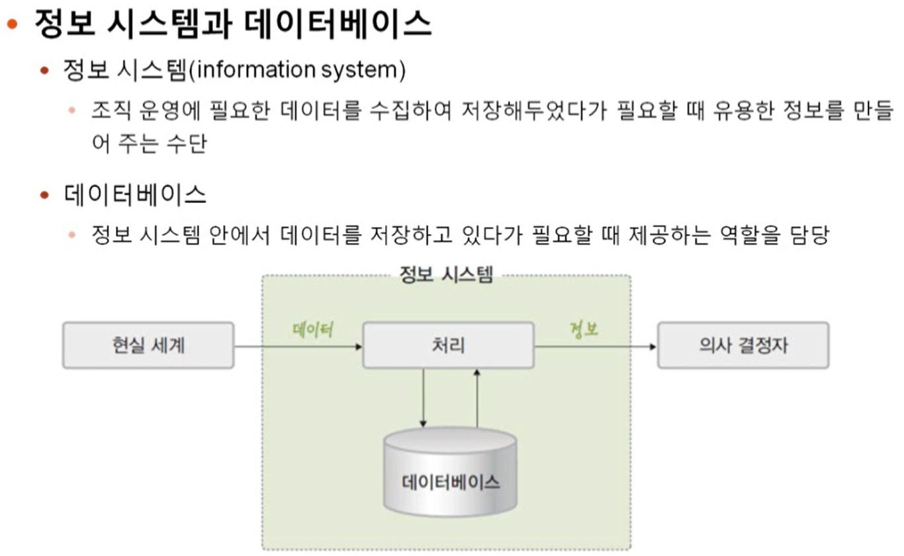
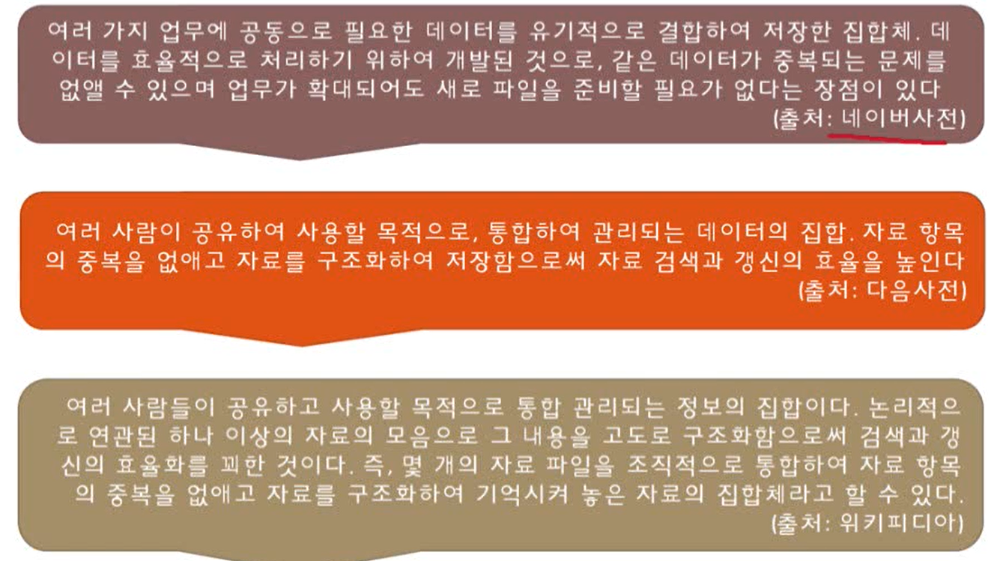
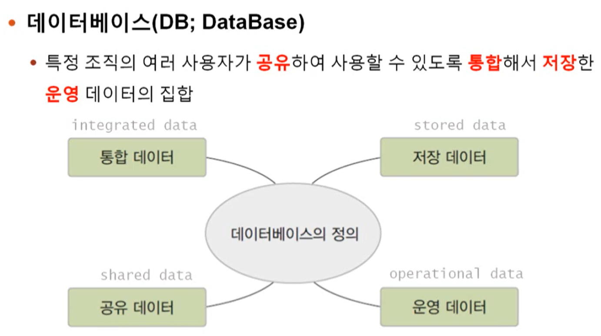
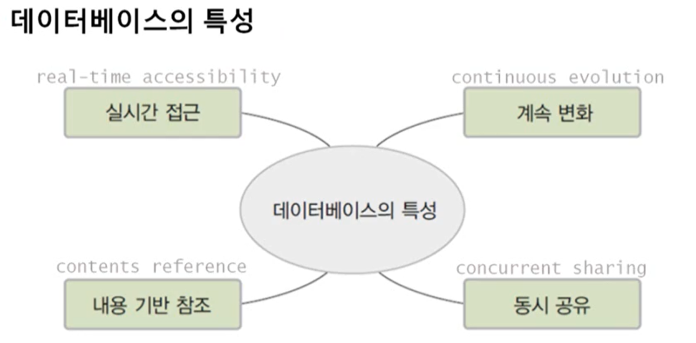

# 1. 데이터베이스 기본 개념

[TOC]

## 학습 목표

## 데이터와 정보의 차이

## 데이터베이스의 필요성

## 데이터베이스의 정의와 특성

- 통합 데이터: 최소의 중복과 통제가능한 중복만 허용하는 데이터
- 저장 데이터: 컴퓨터가 접근할 수 있는 매체에 저장된 데이터
- 공유 데이터: 특정 조직의 여러 사용자가 함께 소유하고 이용할 수 있는 공용 데이터
- 운영 데이터: 조직의 주요 기능을 수행하기 위해 지속적으로 유지해야 하는 데이터

- 실시간 접근: 사용자의 데이터 요구에 실시간으로 응답
- 계속 변화: 데이터의 계속적인 삽입, 삭제, 수정을 통해 현재의 정확한 데이터를 유지
- 내용 기반 참조:  데이터가 저장된 주소나 위치가 아닌 내용으로 참조
- 동시 공유: 서로 다른 데이터의 동시 사용뿐만 아니라 같은 데이터의 동시 사용도 지원

