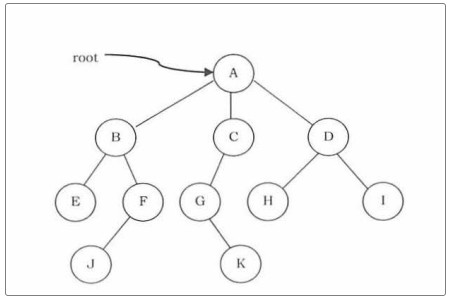

# Tree

> 트리는 노드로 이루어진 자료 구조

1. 트리는 하나의 루트노트를 갖는다.
2. 각 노드는 0개 이상의 자식 노드를 갖는다.

### 특징

- 그래프의 한 종류이다.
- 루트에서 어떤 노드로 가는 경로는 유일하다.

### 구현 방법

- 일반 트리 - 인접 배열 이용 

1. 1차원 배열에 자신의 부모 노드만 저장하는 방법
   - 트리는 부모 노드를 0개 또는 1개를 가지기 때문
   - 부모 노드를 0개: 루트 노드

2. 이진 트리의 경우, 2차원 배열에 자식 노드를 저장하는 방법
   - 이진 트리는 각 노드가 최대 두개의 자식을 갖는트리이기 때문
   - Ex) `A[i][0]` 왼쪽 자식 `A[i][1]` 오른쪽 자식

- 완전 이진 트리(complete binary tree)  - 1차원 배열 이용 (힙, 이진탐색 트리 포함)

완전 이진 트리는 배열 index 1부터 차례대로 node가 채워져서 1차원 배열을 이용해 구현 가능.

`parent = left//2, right//2`

`left,right = parent*2, parent*2+1`

- 힙(heap) - 1차원 배열 이용

힙은 완전 이진 트리의 한종류이다. 부모 노드가 자식 노드보다 크거나 작은(최대,최소 힙) 조건만 만족시키게 해서 1차원 배열로 구현할 수 있다.

- 일반 트리 - 클래스 이용

Node, tree 클래스 2개를 선언한다.

##### < 클래스 명세서 >

<b>Node</b>

-----

멤버 변수

------

- data

- left

- right

-------

<b>Tree</b>

------

멤버 변수

-----

- root

-----

메쏘드

-----

- insert : 트리에 노드를 넣는다.

- search: 트리에 해당 노드가 있는지 확인.

------

