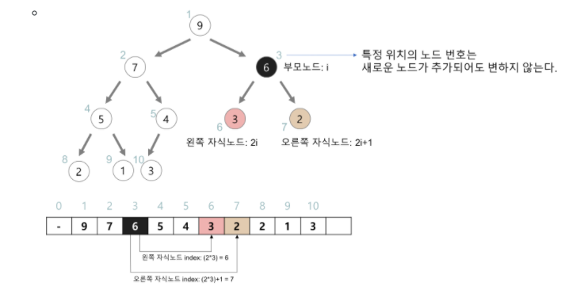
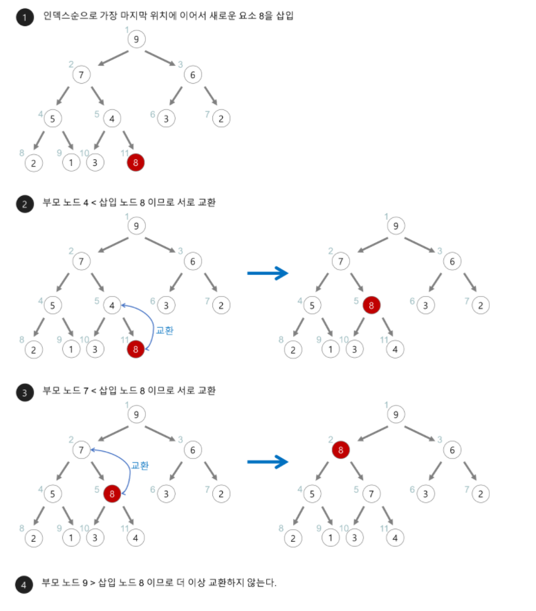
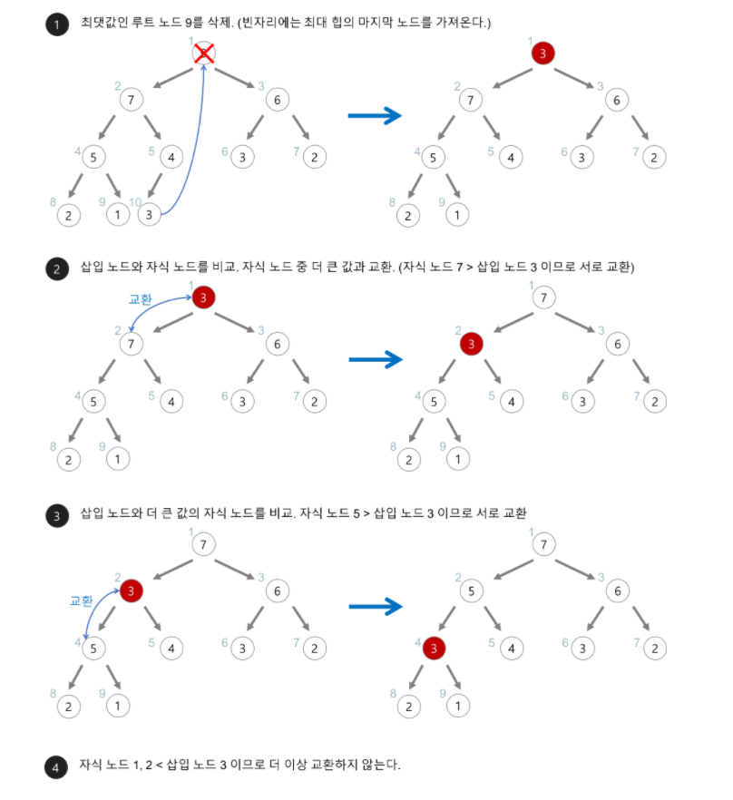

# HEAP

> 우선 순위 큐를 위하여 만들어진 자료구조

우선 순위 큐는 시뮬레이션,네트워크 트래픽 제어,운영체제 작업 스케쥴링 등 쓰임새가 많다.

우선 순위 큐는 힙으로 구현하는 것이 가장 효율적이다.

- 최대 힙 : 부모 노드의 키 값이 자식 노드의 키 값보다 크거나 같은 완전 이진 트리
- 최소 힙:  최대 힙 반대

### Heap 의 구현

1. 배열로 구현

- 인덱스 0은 사용 안함.
- 특정 위치의 노드 번호는 새로운 노드가 추가되도 안 변함.
- 부모 노드, 자식 노드의 관계
  - 자식 인덱스 = 왼쪽: (부모 인덱스) * 2, 오른쪽: (부모 인덱스)*2 + 1
  - 부모 인덱스 = (자식 인덱스) // 2

### Heap의 삽입

1. 힙에 새로운 요소가 들어오면, 새로운 노드를 힙의 마지막 노드에 이어서 삽입.
2. 새로운 노드를 부모 노드랑 계속 교환해서 힙의 성질을 만족하게 한다.

### Heap의 삭제

1. 최대 힙에서 최댓값은 루트 노드이므로, 루트노드를 삭제한다.
2. 삭제된 루트 노드에는 힙의 마지막 노드를 가져온다.
3. 힙을 재구성한다.

