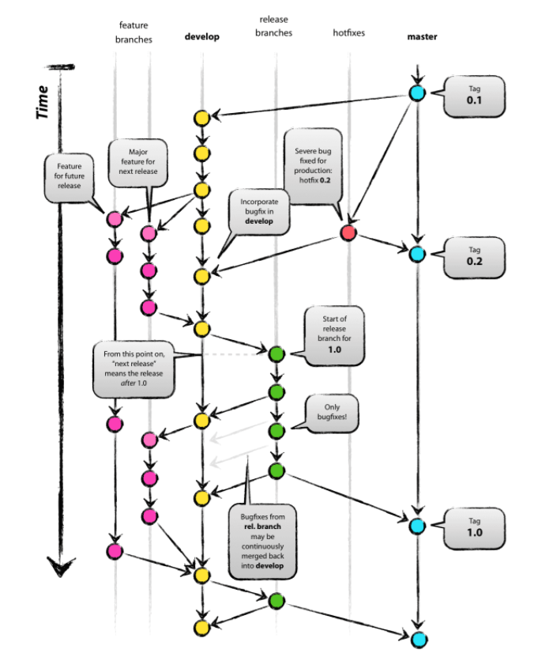

# Git-flow

> Git 브랜치 전략 중 하나

5가지 종류의 브랜치가 존재. 항상 유지되는 메인 브랜치들(master, develop)과 일정 기간 동안만 유지되는 보조 브랜치들(feautre, release, hotfix)이 있다.

- master : 제품으로 출시될 수 있는 브랜치
- develop : 다음 출시 버전을 개발하는 브랜치
- feature : 기능을 개발하는 브랜치
- release : 이번 출시 버전을 준비하는 브랜치
- hotfix : 출시 버전에서 발생한 버그를 수정하는 브랜치

1. 처음에는 master와 develop 브랜치가 존재. develop 브랜치는 master에서부터 시작된 브랜치.
2. develop 브랜치에서는 상시로 버그를 수정한 커밋들이 추가.
3. 새로운 기능 추가 작업이 있는 경우 develop 브랜치에서 feature 브랜치를 생성. feautre 브랜치는 언제나 develop 브랜치에서 시작. 기능 추가 작업이 완료되었다면 feature 브랜치는 develop 브랜치로 merge
4. develop에 이번 버전에 포함되는 모든 기능이 merge 되었다면 QA를 하기 위해 develop 브랜치에서부터 release 브랜치를 생성. QA를 진행하면서 발생한 버그들은 release 브랜치에 수정.
5. QA를 무사히 통과했다면 release 브랜치를 master와 develop 브랜치로 merge 한다.
6. 마지막으로 출시된 master 브랜치에 버전 태그를 추가.

###  출처 : 우아한형제들 기술 블로그