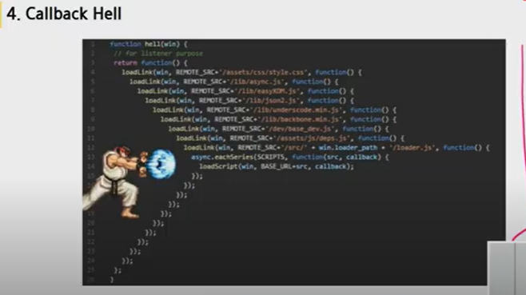
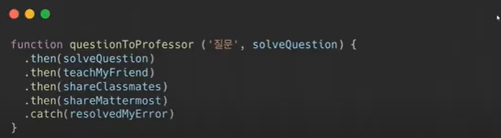
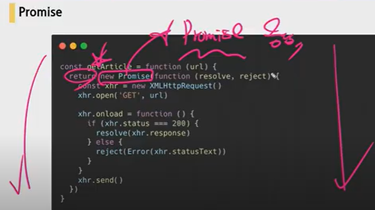
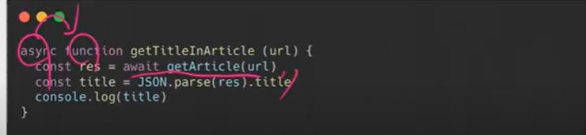
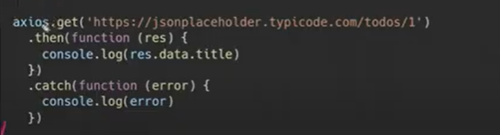

# AJAX

> Asynchronous JavaScript And XML

1. 서버와 통신하기 위해 `XMLHttpRequest` 객체를 사용하는 것

2. 페이지 전체를 리프레쉬(새로고침) 하지 않고도 수행 되는 "비동기성"
3. 사용자의 Event가 있으면 전체 페이지가 아닌 일부분만을 업데이트 할 수 있게 해준다.

- 페이지 새로고침 없이 서버에 요청
- 서버로부터 데이터를 받고 작업을 수행

### 1) XHR

> XMLHttpRequest

서버와 상호작용하기 위해 사용. 전체 페이지의 새로고침 없이 URL로부터 데이터를 받아올 수 있다.

사용자가 하고 있는 것을 방해하지 않으면서 페이지의 일부를 업데이트 할 수 있도록 해준다.

AJAX 프로그래밍에 주로 사용

### 2) How JavaScript works

1. Asynchronus
2. Single Thread
3. Event Loop

#### 1. Asynchronus

> JavaScript는 기다려주지 않는다.
>
> 왜??
>
> -> 2. 혼자서 일을 하기 때문에(Single Thread) 기다리는 동안 딴 거를 해야 한다. 안 그러면 낭비가 심하다

#### 2. Single Thread

> 혼자 일을 해서 한 번에 하나의 일만 할 수 있다.
>
> 어떻게? -> 3. Event Loop 방식을 사용해서

#### 3. Event Loop

- Call Stack

요청이 들어올 때마다 해당 요청을 순차적으로 처리하는 Stack

- Web API (Browser API)

브라우저에서 제공하는 API

- Task Queue

콜백 함수가 대기하는 Queue

- Event Loop

Call Stack에 현재 실행중인 Task가 없는지 확인하고 없으면 Task Queue에 Task가 있는지 확인하고 있으면 걔를 스택에 넣는다.

### 3) Callback Function

> 다른 함수의 인자로서 넘어가는 함수

- 자바스크립트의 함수는 1) 결과값에 담을 수 있고 2) 변수에 담을 수 있고 3) 함수의 인자로 넘길 수 있다.

ex) addEventListener에서 event의 종류와 function을 인자로 준다.

### 4) Callback Hell

> 디버깅 힘들고, 스스로도 본인 코드를 못 읽을 가능성이 다분하다

### 5) Promise

> Callback Hell을 깔끔하게 처리하기 위해 등장
>
> 무엇을 약속?
>
> `Promise` 객체는 비동기 작업이 맞이할 미래의 완료 또는 실패와 그 결과 값을 나타낸다.
>
> 비동기 작업의 최종 완료 또는 실패를 나타내는 객체

- .then(함수) : 성공하면 무언가 한다.
- .catch(함수) : 실패하면 무언가 한다.

그냥 Promise를 return함

- resolve : 성공하면 실행
- reject : 실패하면 실행

##### async & await (ES8+)

> Syntactic Sugar : 어떤 문법이 너무 어렵고, 복잡해서 사용률이 떨어질 때 사용하기 쉽게 만들어 주는 것
>
> 비동기를 가능하게 해준다. promise-base, 좀 더 cleaner한 style로 만든다. promise chaining을 명확하게 보여주기 위해 사용

### 6) Axios 매우매우매우매우 중요

> 매우매우 중요
>
> 요청 날릴 때 쓰는 library
>
> Promise based HTTP client for the browser and node.js

### 7) Ajax와 기존 기술의 차이점

기존엔 서버에서 데이터를 수정함.

Ajax는 클라이언트에서 데이터를 수정함. Axios라는 라이브러리 사용해서 한다.