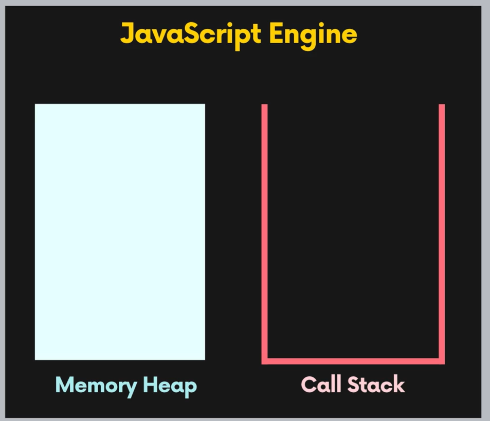
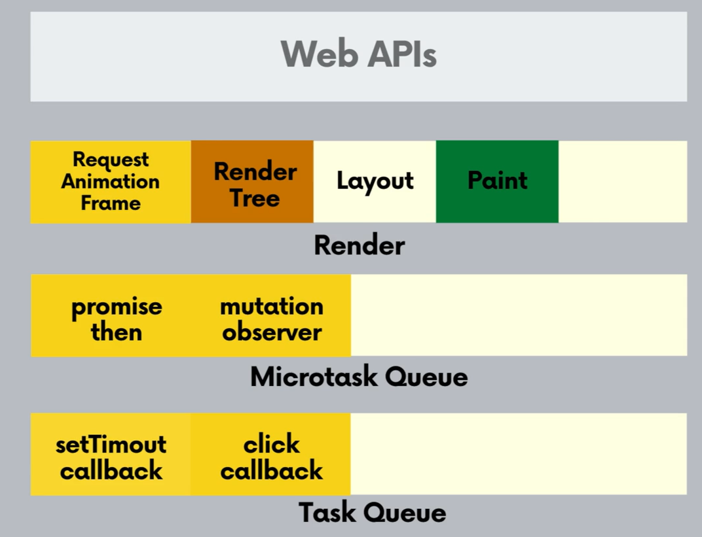

# JS 이벤트 루프

> js는 single threaded language 
>
> 멀티 쓰레딩이 없다.
>
> 브라우저라는 프로그램 안에서는 여러가지 쓰레드가 있다.
>
> 즉 웹 apis들을 이용하면 멀티 쓰레딩 가능

## 엔진 기본 구조

js가 동작하고 있는 런타임 환경에서 다양한 방식을 이용해 멀티쓰레딩 같은 효과를 얻을 수 있다.

이벤트 루프를 이용해 다양한 동작 수행 가능.

#### Memory Heap

변수를 선언해 할당하거나 하는 경우 Memory Heap에 저장.

구조적으로 저장되는게 아니라 아무데나 저장.

#### Call Stack

함수 호출하면 콜 스택에 쌓음

모든 프로세스와 쓰레드 안에 저마다의 콜 스택이 들어있다.

## 이벤트 루프(JS 런타임 환경)

> 계속 돌면서 콜스택과 태스크 큐를 관찰한다.
>
> 콜 스택에 뭐가 남아있으면, 콜스택이 비워질 때까지 기다림
>
> 콜스택이 비워져 js 엔진이 일 안할 때 태스크 큐에 있는 애를 콜 스택으로 데려온다.

웹 apis들(setTimeout, eventlistener)은 해당되는 콜백 함수를 태스크 큐에 넣는다. ( js가 멀티쓰레딩 비슷하게 작동할 수 있는 이유) -> 타이머같은 것은 웹apis에서 실행이 되고 그 실행이 끝나면 콜백함수를 태스크 큐에 넣고 이런식으로 작동.

## 브라우저 런타임 환경

#### Render Sequence

주기적으로 브라우저에서 요소들을 움직이거나 에니메이션 주면 주기적으로 브라우저에 업데이트 해줘야 함.

그 떄 주기적으로 화면에 업데이트 해주는 것

브라우저에서 DOM 변경되면 렌더트리 만들어져야 하고, 레이아웃 크기,위치 계산 후에

paint와 composite과정 통해 브라우저에 표기됌

#### Request Animation Frame

웹 api중 하나.

여기에 콜백 등록하면 다음에 브라우저 업데이트전에 이 콜백을 실행함. 여기 Request Animation Frame 자체 큐에다가 콜백을 넣음.

#### Micro Task Queue

프로미스에 등록된 콜백(then에 등록된 콜백 함수), mutation observer에 등록한 콜백함수들이 들어온다.

## 이벤트 루프는 여기서 어떻게 작동?

1. 렌더쪽으로는 갈 수도 있고, 안 갈 수 도 있다. => 브라우저에서는 우리가 업데이트 하는 내용들을 1초동안 60개의 프레임을 보여주도록 노력한다.(사용자 경험을 위해), 이벤트 루프는 한 바퀴에 1ms도 안 걸림, 즉 그 때마다 렌더 업데이트 할 필요는 없다. 60fps 할 정도로 렌더 업데이트 하게 고정도로만 render 트리를 업데이트 한다. 여기서는 RAF의 콜백함수를 다 실행하고 그다음 Render Tree, Layout, paint 순으로 간다.

2. 마이크로 태스크 큐에 아이템들이 있으면 멈춘다. 큐 안에 있는 아이템들을 하나하나 씩 콜스택으로 가져감. 여기 있는 동안 마이크로 태스크 큐에 콜백 들어오면 얘네 다 끝낼 때까지 계속 콜스택으로 가져와서 수행.

여기 있는 동안 다른 아이템 계속 들어오면 여기에 계속 머물른다. 여기 텅 비어있으면 다음 단계로 간다.

3. 태스크 큐로 넘어옴. 하나의 아이템만 콜 스택으로 가져옴. 콜 스택으로 가서 콜백 함수 끝날 때까지 기다렸다가 이전 단계 반복(마이크로 태스크 큐는 게속 있는데 비해 여기서는 하나만 가져옴.)

#### 웹 apis의 콜백안에서는순서가 안 중요.

왜냐면 콜백함수가 콜스택에 들어가면 이벤트 루프는 해당 함수가 전부 실행 될 때까지 기다렸다가 나중에 렌더링 될 때 전체적으로 적용된 내용이 레이아웃,페인트에 걸쳐서 브라우저에 표기되기 때문.

콜백 안에 들어 있는 것은 js엔진이 콜백에 들어있는 코드 블럭이 다 완료될 때까지 기다렸다가 나중에 렌더링이 발생하기 때문이다.

#### 콜스택의 코드가 수행되 있을 때는 렌더링으로 못간다.

즉, 콜백 함수에서는 최대한 간략하게 짜자. 오랫동안 일하는 건 좋지 않다.