# 01.데이터 타입

[TOC]

## 01) 데이터 타입의 종류

> 기본형(Primitive type) : 할당이나 연산 시 값이 담긴 주솟값을 바로 복제 , 불변성
>
> 참조형(Reference type) : 변수 묶음을 가리키는 주솟값을 복제

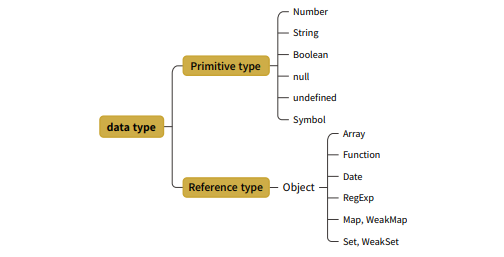


## 02) 데이터 타입에 관한 배경지식

### 1-2-1 메모리와 데이터

모든 데이터는 바이트 단위의 식별자 - <b>메모리 주솟값</b> 을 통해 서로 구분하고 연결할 수 있다.


### 1-2-2 식별자와 변수

>  변수 : 변할 수 있는 데이터(문자열,객체,배열 등)
>
> 식별자 : 데이터를 식별하는데 사용하는 이름, <b>변수명</b>


## 03) 변수 선언과 데이터 할당

### 1-3-1 변수 선언

```javascript
var a;
```

선언 시 메모리 영역의 변화

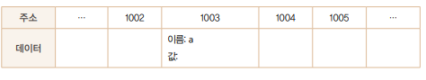

변수 선언 시 메모리의 비어있는 공간 확보

공간의 식별자를 a라 설정


### 1-3-2 데이터 할당

```javascript
var a;
a = 'abc';
```

```javascript
var a = 'abc'
```

위의 1003 메모리주소 의 데이터 값에 abc를 바로 저장하지 않는다.

데이터영역에 따로 값을 저장해놓고 그 메모리 주소를 값이 가리키게 한다.

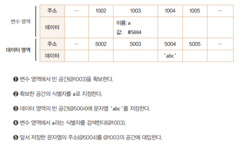


#### 왜 변수영역에 바로 저장 안하고 이렇게 할까?

데이터 변환을 자유롭게 하고, 메모리를 더욱 효율적으로 관리하기 위해

- 문자열의 경우 특별히 정해진 메모리 공간이 없다. 만약 문자열을 다른 값을 저장한다고 하면

- 현재는 'abc' 에서 `a = "abcabc"`  이렇게 하면 메모리상 뒤에 저장된 데이터들을 전부 뒤로 옮기고 이동시킨 주소를 각 식별자에 다시 연결하는등 매우 번거롭다.

> 따라서 변수 영역, 데이터 영역을 구분해 저장한다.


```javascript
var a = 'abc'
a = a + 'def'
```

컴터는 'abc'가 저장된 공간에 'abcdef'를 할당하는 대신,

 'abcdef'라는 문자열을 새로 만들어 별도의 공간에 저장하고

그 주소를 변수 공간에 연결한다.


#### 변수영역,데이터 영역을 구분했을 때 장점

> 중복 데이터 처리시 효율 좋음

500개의 변수에 각각 숫자 5를 할당하면,

변수,데이터 영역을 구분하지 않으면 매 변수마다 8바이트(숫자형 할당)의 공간이 필요하다. 

그러나 분리하면, 5를 별도의 공간에 저장하고 주소 공간의 크기가 8바이트보다 작기 때문에

메모리를 효율적으로 관리할 수 있다.


## 04) 기본형 데이터와 참조형 데이터

### 1-4-1 불변값 - 기본형 데이터

상수와 불변값은 다르다.

상수 : 한번 데이터 할당이 이뤄진 변수 공간에 다른 데이터를 할당 할 수 없다.

불변값 :  데이터 영역에 저장한 값은 GC(가비지 컬렉팅)당하지 않는 한 영원히 저장되어 있다.

변수에 새로운 값을 할당하면 새로 메모리 공간 확보해서 값 저장후 그 주소를 변수공간과 매핑한다.


### 1-4-2 가변값 - 보통 참조형 데이터

```javascript
var obj1 = {
    a: 1,
    b: 'bbb',
}
```

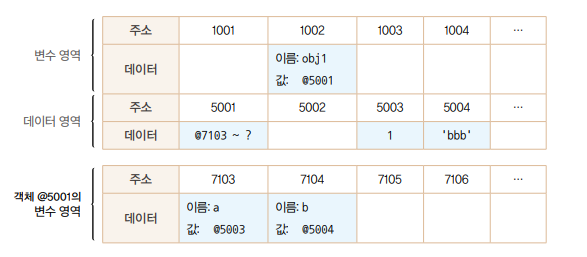

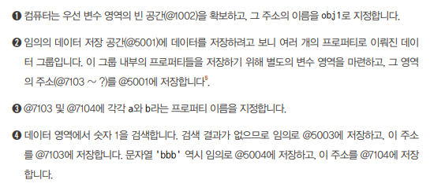

객체의 변수(프로퍼티)영역이 별도로 존재한다. ex) obj1.a

얘네들이 변경 가능하기 때문에 가변값이라 한다.

#### 가비지 컬렉터

데이터 영역에 저장된 애들 중에 자신의 주소를 참조하는 변수가 몇개인지를 참조 카운트라고 한다.

참조카운트가 0인 메모리 주소는 가비지 컬렉터의 수거 대상이 되어, 빈 공간이 된다.


### 1-4-3 변수 복사 비교

```
var a = 10;
var b= a;

var obj1 = { c: 10, d: 'ddd'};
var obj2 = obj2;
```

기본형, 참조형의 복사 과정은 동일하다.

해당 변수의 식별자와 값(주소)를 고대로 가져온다. 차이점은 기본형은 주소가 데이터영역의 주소를 가리키고 참조형은 주소가 변수영역의 주소들을 가리킨다는 것이다.

이 때문에 변수 복사 이후의 동작에서 큰 차이가 발생한다.

```
b = 15;
obj2.c = 20;
```

이렇게 하면,

a = 10으로 동일하다.

b= 15실행시 데이터 영역에 15를 저장하는 공간을 따로 만들고 이 주소를 b와 매핑했기 때문이다.

그러나 obj1.c = 20이 된다.

왜냐면 obj1과 obj2는 해당 프로퍼티(변수)영역 - 주소묶음을 가리키고 있다.

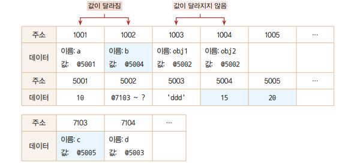

따라서 obj2.c의 값이 변경되면 obj1과 obj2가 동일한 객체를 가리키고 있기 때문에 

obj1.c의 값도 변경된다.

즉, 복사후에

```
a !== b
obj1 === obj2
```

#### 객체의 프로퍼티 값을 변경하지 않고 객체에 새 값을 할당하면 서로 다른 값을 가리키게 된다.

```
obj1 = {a:'a',b:'b'}
obj1 !== obj2
```


## 05) 불변 객체

> 불변 객체는 매우 중요하다.

### 1-5-1 불변객체를 만드는 간단한 방법

내부 프로퍼티를 변경할 때마다 새 객체를 만들어 할당해서 만든다.

#### 불변객체는 언제 필요할까?

값으로 전달받은 객체에 변경을 가하더라도 원본 객체는 변하지 않아야하는 경우

예시 - 새 객체 만들어 할당

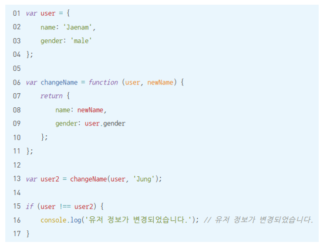

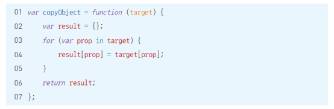

이런 불변객체를 사용하도록 시스템적으로 제약을 거는 라이브러리들이 있다.

immutable.js baobab.js


### 1-5-2 얕은 복사와 깊은 복사

> 얕은 복사: 바로 아래 단계의 값만 복사
>
> 깊은 복사: 내부의 모든 값들을 하나하나 찾아서 전부 복사

위의 copyobject는 얕은 복사를 함

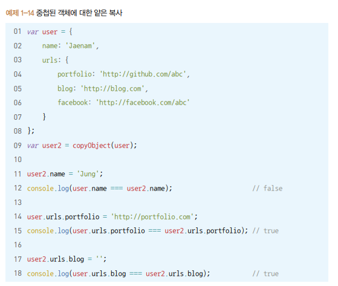

객체를 깊은복사 하려면,

객체의 프로퍼티 중에서 그 값이 <b>기본형 데이터 일 경우에는 그대로 복사</b>

<b>참조형 데이터는 다시 그 내부의 프로퍼티들을 복사</b> 해야 한다. 이 과정을 참조형 데이터가 있을 때마다 재귀적으로 수행해야 깊은 복사가 된다.

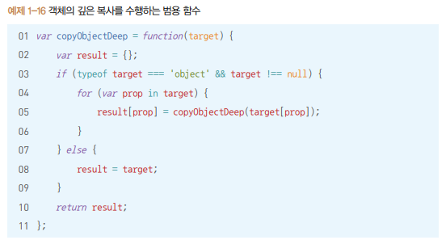

혹은 JSON을 활용해 간단한 깊은 복사 수행 구현 가능하다.

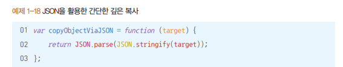

## 06) undefined와 null

> 둘다 '없음'을 나타낸다.

undefined: 사용자가 명시적으로 지정 가능하지만, 값이 존재하지 않을 때 자바스크립트 엔진이 자동으로 부여하는 경우가 있다.

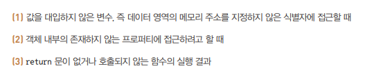

배열의 경우엔 조금 특이하게 동작

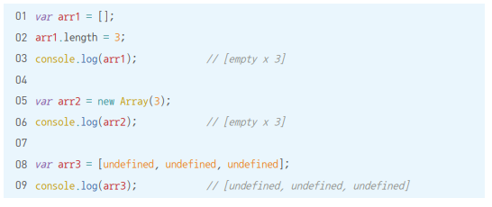

배열에 3개의 빈 요소를 확보했지만 해당 요소에는 어떤 값도, undefined도 할당되어 있지 않다.


'비어있는 요소'와 'undefined를 할당한 요소'는 많이 다르다.

'비어있는 요소'는 순회와 관련된 많은 배열 메서드들의 순회대상에서 제외된다.

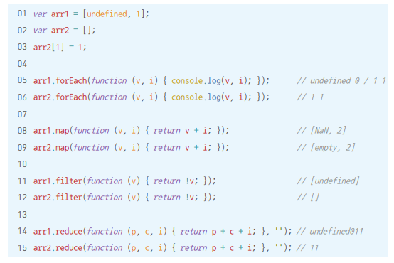

#### 왜 배열 메서드가 비어있는 요소는 건너 뛸까?

배열도 객체이기 때문이다.

존재하지 않는 프로퍼티에 대해서는 순회할 수 없다.

배열은 length 프로퍼티의 개수만큼 빈공간을 확보하고 각 공간에 인덱스를 이름으로 지정하지 않는다.

<b>객체와 마찬가지로 특정 인덱스에 값을 지정할 때 비로소 빈 공간을 확보하고 인덱스를 이름으로 지정하고 데이터의 주솟값을 저장하는 등의 동작을 한다.</b>


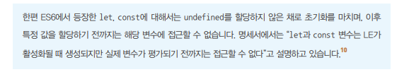


비어있음을 나타내고 싶으면 undefined말고 <b>null</b>을 써라.

#### null 사용시 주의할 점

type of null이 object이다.

따라서 어떤 변수의 값이 null인지 여부를 판별하기 위해서는 typeof대신 다른 방식으로 접근해야 한다.

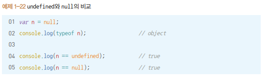

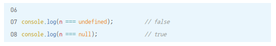

## 07) 정리

자바스크립트 데이터 타입에는 크게 기본형과 참조형이 있다. 기본적으로 기본형은 불변값이고 참조형은 가변값이다.

변수는 변경 가능한 데이터가 담길 수 있는 공간이고, 식별자는 그 변수의 이름을 말한다.

변수를 선언하면 컴터는 우선 메모리의 빈 공간에 식별자를 저장하고, 그 공간에 자동으로 undefined를 할당한다. 이후 그 변수에 기본형 데이터를 할당하려 하면 별도의 공간에 데이터를 저장하고, 그 공간의 주소를 변수의 값 영역에 할당한다.

참조형 데이터를 할당하고자 할 경우 컴터는 참조형 데이터 내부 프로퍼티들을 위한 변수 영역을 별도로 확보해 확보된 주소를 변수에 연결하고, 다시 앞서 확보한 변수 영역에 각 프로퍼티의 식별자를 저장하고, 각 데이터를 별도의 공간에 저장해서 그 주소를 식별자들과 매칭시킨다. 이처럼 할당 과정에서 기본형과 차이가 생긴 이유는 참조형 데이터가 여러 개의 프로퍼티(변수)를 모은 '그룹'이기 때문이다. 그리고 이 차이로 인해 참조형 데이터를 '가변값'으로 여겨야만 하는 상황이 발생한다.

참조형 데이터를 가변값으로 여겨야 하는 상황임에도 이를 불변값으로 사용하는 방법이 있다. 이 경우 내부 프로퍼티들을 일일이 복사하면 된다(깊은 복사) 혹은 라이브러리를 사용하면 된다. 불변 객체는 최근 JS에서 가장 중요한 개념 중 하나이다.

'없음'을 나타내는 값은 두 가지가 있는데, undefined는 어떤 변수에 값이 존재하지 않을 경우를 의미하고 null은 사용자가 명시적으로 '없음'을 표현하기 위해 대입한 값이다. 따라서 undefined를 대입하지 마라