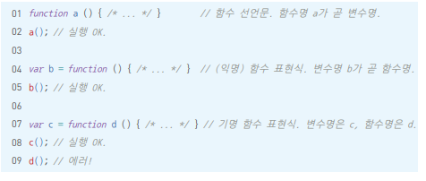

# 02.실행 컨텍스트

[TOC]

## 01) 실행 컨텍스트란?

<b>실행할 코드에 제공할 환경 정보들을 모아놓은 객체</b>

동일한 환경에 있는 코드들을 실행할 때 필요한 환경 정보들을 모아 컨텍스트를 구성하고, 이를 콜스택에 쌓아올렸다가, 가장 위에 쌓여있는 컨텍스트와 관련 있는 코드들을 실행하는 식으로 전체 코드의 환경과 순서를 보장

컨텍스트를 구성하는 방법: <b>함수를 실행</b>


#### 실행 컨텍스트에 담기는 정보들

- VariableEnvironment: 현재 컨텍스트 내의 식별자들에 대한 정보 + 외부 환경 정보, 선언 시점의 LexicalEnvironment의 스냅샷으로, 변경사항은 반영되지 않음
- LexicalEnvironment: 처음에는 VariableEnvironment와 같지만 변경 사항이 실시간으로 반영됨
- ThisBinding: this 식별자가 바라봐야 할 대상 객체


## 02) VariableEnvironment

> 실행 컨텍스트 생성할 때 VariableEnvironment에 정보를 먼저 담은 다음, 이를 그대로 복사해서 LexicalEnvironment를 만들고, 이후에는 LexicalEnvironment를 주로 활용


## 03) Lexical Environment

> 컨텍스트를 구성하는 환경 정보들을 사전에서 접하는 느낌으로 모아놓은 것


#### VariableEnvironment와 LexicalEnvironment의 구성

- environmentRecord
- outer-EnvironmentReference


### 2-3-1 environmentRecord와 호이스팅

> environmentRecord에는 현재 컨텍스트와 관련된 코드의 식별자 정보들이 저장

매개변수 식별자, 함수, 변수 식별자

컨택스트 내부를 처음부터 끝까지 훑으며 순서대로 수집


#### 전역 실행 컨텍스트

자바스크립트 구동환경이 별도로 제공하는 전역 객체 활용

브라우저의 window, Node.js의 global 객체

얘네는 자바스크립트 내장 객체가 아닌 호스트 객체로 분류


#### 호이스팅

코드 실행 전에 변수 정보들을 먼저 수집함

변수를 호이스팅할 때 변수명만 끌어올리고 할당 과정은 원래 자리에 둠

변수는 선언부와 할당부를 나누어 선언부만 끌어올리고 함수 선언은 함수 전체를 끌어올림

##### 매개변수와 변수 호이스팅 예시


코드를 실행 순서대로 변경하면,


##### 함수 선언 호이스팅 예시

```js
function a() {
	console.log(b);
    var b = 'bbb';
    console.log(b);
    function b() {}
    console.log(b);
}
```


##### 함수를 정의하는 3가지 방식



##### 호이스팅에서 함수 선언문과 함수 표현식 차이


### 2-3-2 스코프, 스코프 체인, outerEnvironmentReference

<b>스코프</b>: 식별자에 대한 유효범위

어떤 경계 A의 외부에서 선언한 변수는 A의 내부에서 접근 가능, A의 내부 선언 변수는 A의 내부에서만 접근 가능

<b>스코프 체인</b>: 스코프를 안에서부터 바깥으로 차례로 검색하는 것

<b>outerEnvironmentReference</b>: 스코프 체인을 가능하게 하는 것


#### 스코프 체인

A 함수 내부에 B 함수를 선언하고 B 함수 내부에 C 함수를 선언할 경우,  C의 outerEnvironmentReference(이하 oER)은 B의 LexicalEnvironment(LE)를 참조한다. 함수 B의 LE의 oER는 함수 A의 LE를 참조

oER은 연결리스트 형태를 띈다.

각 oER은 자신이 선언된 시점의 LE만 참조하므로, 가장 가까운 요소부터 차례대로 접근

-> 여러 스코프에서 동일한 식별자를 선언한 경우 <b>무조건 스코프 체인 상에서 가장 먼저 발견된 식별자에만 접근 가능</b>


#### 변수 은닉화

내부함수 와 전역에서 동일한 이름의 a변수를 선언하면, 내부함수에서는 전역의 a에 접근 못하고 내부 함수에서 선언한 a에만 접근할 수 있다.


#### 전역변수와 지역변수

전역변수: 전역 공간에서 선언한 변수

지역변수: 함수 내부에서 선언한 변수


전역변수가 아니라 지역변수로 코드를 짜면, 협업 시 다른 사람의 코드를 망가트릴 우려가 없다.

<b>코드의 안전성을 위해 가급적 전역변수 사용을 최소화해야 한다.</b>


## 04) this

thisBinding에는 this로 지정된 객체 저장

실행 컨텍스트 활성화 당시에 this가 지정되지 않은 경우 this에는 전역 객체 저장

함수 호출 방법에 따라 this에 저장되는 대상이 다름


## 05) 정리

실행 컨텍스트는 실행할 코드에 제공할 환경 정보들을 모아놓은 객체이다. 실행 컨텍스트는 전역 공간에서 자동으로 생성되는 전역 컨텍스트와 eval 및 함수 실행에 의한 컨텍스트 등이 있다. 실행 컨텍스트 객체는 활성화되는 시점에 VariableEnvironment, LexcialEnvironment, ThisBinding의 3가지 정보를 수집한다.

실행 컨텍스트를 생성할 때는 VariableEnvironment와 LexicalEnvironment가 동일한 내용으로 구성되지만 LexicalEnvironment는 함수 실행 도중에 변경되는 사항이 즉시 반영되는 반면 VariableEnvironment는 초기상태를 유지한다. Variable Environment와 LexicalEnvironment는 매개변수명, 변수의 식별자, 선언한 함수의 함수명 등을 수집하는 environmentRecord와 바로 직전 컨텍스트의 LexicalEnvironment 정보를 참조하는 outerEnvironmentReference로 구성돼 있다.

호이스팅은 코드 해석을 좀 더 수월하게 하기 위해 environmentRecord의 수집 과정을 추상화한 개념으로, 실행 컨텍스트가 관여하는 코드 집단의 최상단으로 이들을 '끌어올린다'고 해석하는 것이다. 변수 선언과 값 할당이 동시에 이뤄진 문장은 '선언부'만을 호이스팅하고, 할당 과정은 원래 자리에 남아있게 되는데, 여기서 함수 선언문과 함수 표현식의 차이가 발생한다.

스코프는 변수의 유효범위를 말한다. outerEnvironmentReference는 해당 함수가 선언된 위치의 LexicalEnvironment를 참조한다. 코드 상에서 어떤 변수에 접근하려고 하면 현재 컨텍스트의 LexicalEnvironment를 탐색해서 발견되면 그 값을 반환하고, 발견하지 못할 경우 다시 outerEnvironmentReference에 담긴 LexicalEnvironment를 탐색하는 과정을 거친다. 전역 컨텍스트의 LexicalEnvironment까지 탐색해도 해당 변수를 찾지 못하면 undefined를 반환한다.

전역 컨텍스트의 LexicalEnvironment에 담긴 변수를 전역변수라 하고, 그 밖의 함수에 의해 생성된 실행 컨텍스트의 변수들은 모두 지역변수이다. 안전한 코드 구성을 위해 가급적 전역변수의 사용은 최소화 해라

this에는 실행 컨텍스트를 활성화하는 당시에 지정된 this가 지정된다. 함수를 호출하는 방법에 따라 그 값이 달라지는데, 지정되지 않은 경우에는 전역 객체가 저장된다.

