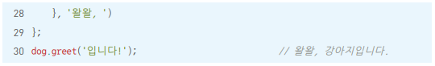
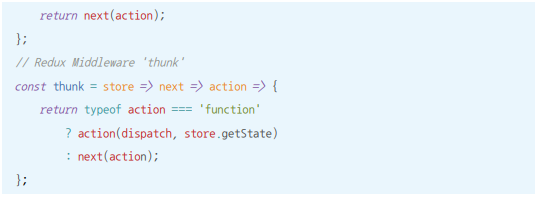

# 05.클로저

[TOC]

## 01) 클로저의 의미 및 원리 이해

클로저는 함수와 그 함수가 선언될 당시의 lexical environment의 상호관계에 따른 현상

어떤 함수에서 선언한 변수를 참조하는 내부함수에서만 발생하는 현상

예제 5-1과 5-2는 outer 함수의 실행 컨텍스트가 종료되기 이전에 inner함수의 실행 컨텍스트가 종료, 이후 별도로 inner 함수를 호출할 수 없다

inner 함수의 실행 결과가 아닌 inner 함수 자체를 반환하면?

outer2를 호출하면 앞서 반환된 함수인 inner가 실행

inner 함수의 outer-EnvironmentReference에는 inner 함수가 선언된 위치의 LexicalEnvironment가 참조복사된다. 즉, outer 함수의 LexicalEnvironment가 담긴다

실행되면서 스코프 체이닝에 따라 outer에서 선언한 변수 a에 접근해서 1만큼 증가시키고 그 값인 2를 리턴하고 inner함수의 실행 컨텍스트 종료

__inner 함수 실행 시점에 outer 함수는 이미 실행이 종료된 상태인데 어떻게 outer 함수의 Lexcial Environment에 접근할 수 있을까?__

가바지 컬렉터의 동작 방식 때문

GC는 어떤 값을 참조하는 변수가 하나라도 있으면 그 값은 수집 대상에 포함시키지 않는다

예제 5-3의 outer함수는 실행 종료 시점에 inner함수 반환

이는 외부함수 outer 실행이 종료되어도 내부 함수인 inner함수는 outer2를 실행함으로써 호출될 가능성이 있다.

inner함수가 호출되어 inner의 실행 컨텍스트가 활성화되면 outerEnvironmentReference가 outer 함수의 LexcialEnvironment를 필요로 할 것이므로 수집대상에서 제외된다

그 덕에 inner함수가 outer함수의 변수 a에 접근할 수 있다.

__즉 클로저 - 어떤 함수에서 선언한 변수를 참조하는 내부함수에서만 발생하는 현상 이란 외부 함수의 LexicalEnvironment가 가비지 컬렉팅되지 않는 현상이다.__

클로저란 어떤 함수 A에서 선언한 변수 a를 참조하는 내부함수 B를 외부로 전달할 경우 A의 실행 컨텍스트가 종료된 이후에도 변수 a가 사라지지 않는 현상

### return 없이도 클로저가 발생하는 다양한 경우

(1) 외부 객체인 window의 메서드(setTimeout 또는 setInterval)에 전달할 콜백 함수 내부에서 지역 변수를 참조

(2) 외부 객체인 DOM의 메서드(addEventListener)에 등록할 handler함수 내부에서 지역변수 참조

## 02) 클로저와 메모리 관리

클로저는 어떤 필요에 의해 의도적으로 함수의 지역변수를 메모리를 소모하도록 함으로써 발생

그 필요성이 사라지면 메모리를 소모하지 않게 해주면 된다.

식별자에 참조형이 아닌 기본형 데이터(보통 null 이나 undefined)를 할당하여 참조 카운트를 0으로 만들어 GC가 회수해 가게 한다.

## 03) 클로저 활용 사례

### 5-3-1 콜백 함수 내부에서 외부 데이터를 사용하고자 할 때

이벤트 리스너에 관한 예시

이렇게 하면 각 li를 클릭했을 때 과일 이름이 아니라 [object MouseEvent] 출력

addEventlistener는 콜백함수에 첫번째 인자로 이벤트 객체를 전달하기 때문

-> bind 메서드를 활용해 해결한다

이렇게 하면 이밴트 객체가 인자로 넘어오는 순서가 바뀌고 함수 내부에서의 this가 원래의 그것과 달라진다.

변경점을 없애기 위해서 고차 함수를 활용한다

### 5-3-2 접근 권한 제어(정보 은닉)

정보 은닉은 어떤 모듈의 내부 로직에 대해 외부로의 노출을 최소화해 모듈 간의 결합도를 낮추고 유연성을 높이고자 하는 것이다

접근 권한에는 public,private,protected의 3종류가 있다.

JS 는 변수 자체에 접근 권한을 직접 부여할 수 없다. -> 클로저를 활용해 함수 차원에서 public한 값과 private한 값을 구분하는 것이 가능하다

outer 함수를 종료할 때 inner 함수를 반환함으로써 outer 함수의 지역변수인 a의 값을 외부에서도 읽을 수 있다.

이처럼 클로저를 활용해 외부 스코프에서 함수 내부의 변수들 중 선택적으로 일부의 변수에 대한 접근 권한을 부여할 수 있다. return을 활용하면 된다

outer함수는 outer라는 변수를 통해 함수 실행은 가능하지만 outer함수 내부에 접근할 수 없다. 외부에서는 outer 함수가 return한 정보에만 접근할 수 있다.

그러므로 외부에 제공하고자 하는 정보들을 모아 return 하고, 내부에서만 사용할 정보들을 return하지 않음으로써 접근 권한 제어가 가능하다

예시) 자동차 게임

자동차 게임할 때 car.run만하면 정당한 승부

그러나 car.fuel = 10000; 이런식으로 바꿈으로써 치팅이 가능

클로져를 활용해 정보를 은닉할 수 있다.

이러면 car.run 을 다른 함수로 덮어씌워서 어뷰징 가능. 이를 막기 위해서는

__클로저를 활용해 접근권한을 제어하는 방법__

### 5-3-3 부분 적용 함수

부분 적용함수 : n개의 인자를 받는 함수에 미리 m개의 인자만 넘겨 기억 시켰다가, 나중에 (n-m)개의 인자를 넘기면 비로소 원래 함수의 실행결과를 얻을 수 있는 함수

부분 적용함수에 넘길 인자를 반드시 앞에서부터 차례로 전달해야 되서 아쉽다

인자들을 원하는 위치에 미리 넣어놓고 나중에 빈 자리에 인자를 채워넣어 실행하자

#### 디바운스

> 짧은 시간동안 동일한 이벤트가 많이 발생할 경우 이를 전부 처리하지 않고 처음 또는 마지막에 발생한 이벤트에 대해 한번만 처리하는 것

scroll, wheel, mousemove, resize 등에 적용하기 좋다

### 5-3-4 커링 함수

> 여러 개의 인자를 받는 함수를 하나의 인자만 받는 함수로 나눠서 순차적으로 호출될 수 있게 체인 형태로 구성한 것

1. 한번에 하나의 인자만 전달하는 것을 원칙
2. 중간 과정상의 함수를 실행한 결과는 그 다음 인자를 받기 위해 대기
3. 마지막 인자가 전달되기 전까지는 원본 함수가 실행 되지 않는다 (부분 적용 함수는 여러 개의 인자를 전달할 수 있고, 실행 결과를 재실행할 때 원본 함수가 무조건 실행)

가독성이 떨어진다. 화살표 함수를 써서 가독성을 높일 수 있다.

각 단계에서 받은 인자들은 모두 마지막 단계에서 참조할 것이므로 GC되지 않고 메모리에 쌓였다가 마지막 호출로 실행 컨텍스트가 종료된 후에야 한꺼번에 GC의 수거대상이 된다.

#### 커링 함수가 유용한 경우

- 원하는 시점까지 지연시켰다가 실행하는 것이 요긴한 상황

- 프로젝트 내에서 자주 쓰이는 함수의 매개변수가 항상 비슷하고 일부만 바뀌는 경우

최근의 여러 프레임워크나 라이브러리 등에서 커링을 상당히 광범위하게 사용한다.

예시) Flux 아키텍처의 구현체 중 하나인 Redux의 미들웨어

## 04) 정리

클로저란 어떤 함수에서 선언한 변수를 참조하는 내부함수를 외부로 전달할 경우, 함수의 실행 컨텍스트가 종료된 후에도 해당 변수가 사라지지 않는 현상

내부 함수를 외부로 전달하는 방법에는 함수를 return하는 경우뿐 아니라 콜백으로 전달하는 경우도 포함된다

클로저는 그 본질이 메모리를 계속 차지하는 개념이므로 더는 사용하지 않게 된 클로저에 대해서는 메모리를 차지하지 않도록 관리해줄 필요가 있다

클로저는 다양한 곳에서 활용할 수 있다. 엄청 중요하다