# 06.프로토타입

[TOC]

JS는 프로토타입 기반 언어

어떤 객체를 원형(Prototype)으로 삼고 이를 복제(참조)함으로써 상속과 비슷한 효과를 얻는다

## 01) 프로토타입의 개념 이해

### 6-1-1 constructor, prototype, instance

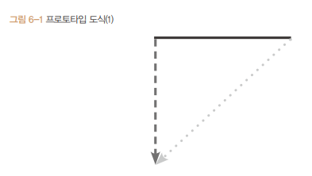

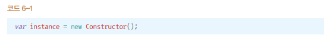

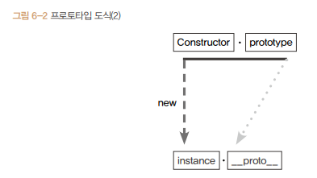

- 어떤 생성자 함수(Constructor)를  new 연산자와 함께 호출하면
- Constructor에서 정의된 내용을 바탕으로 새로운 Instance가 생성
- 이 때 instance에는 `__proto__`라는 프로퍼티가 자동으로 부여되는데,
- 이 프로퍼티는 Constructor의 prototype이라는 프로퍼티를 참조

prototype 객체 내부에는 인스턴스가 사용할 메서드 저장, 인스턴스의 `__proto__` 를 통해 이 메서드에 접근

__중요) `__proto__`는 생략 가능하다__

### 6-1-2 constructor 프로퍼티

prototype, `__proto__` 객체 내부에는 constructor라는 프로퍼티가 있다.

얘는 원래의 생성자 함수(자기 자신)을 참조한다

인스턴스로부터 그 원형이 무엇인지를 알 수 있는 수단이다

constructor는 읽기 전용 속성이 부여된 예외적인 경우(기본형 리터럴 변수 - number, string, boolean)를 제외하고는 값을 바꿀 수 있다.

constructor를 변경하더라도 참조하는 대상이 변경될 뿐 이미 만들어진 인스턴스의 원형이 바뀐다거나 데이터 타입이 변하지는 않는다 -> 어떤 인스턴스의 생성자 정보를 알아내기 위해 constructor 프로퍼티에 의존하는 것이 항상 안전하지는 않다

## 02) 프로토타입 체인

### 6-2-1 메서드 오버라이드

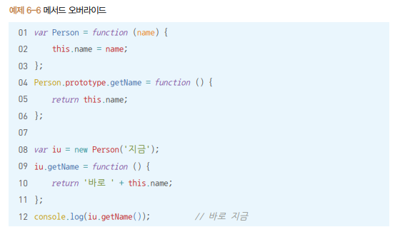

JS엔진은 getName이라는 메서드를 자신의 프로퍼티를 검색하고 없으면, 그다음으로 가까운 `__proto__`를 검색해서 찾는다.

그 담으로 가까운 `__proto__`의 메서드도 우회해서 접근할 수 있다.

### 6-2-2 프로토타입 체인

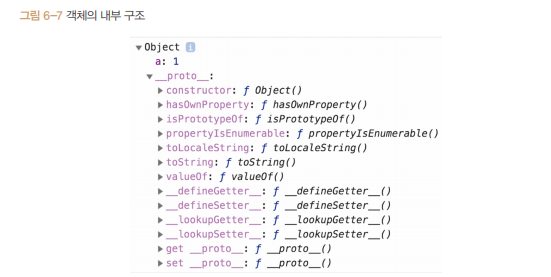

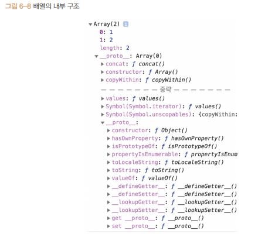

특이한 점:  `__proto__` 안에 `__proto__` 가 또 있다. 얘는 객체의 `__proto__`와 동일하다

왜냐면 prototype 객체가 '객체'이기 때문이다. 모든 객체의 `__proto__`에는 object.prototype이 연결된다

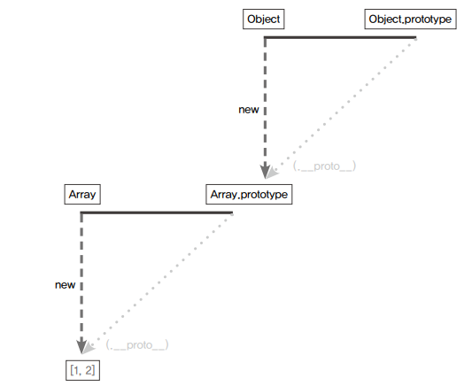

배열은 Object.prototype 내부의 메서드도 자신의 것처럼 실행할 수 있다. `__proto__`는 생략가능하기 때문에 2번 생략된 얘를 따라가면 Object.prototype을 참조할 수 있다

__중요) 어떤 데이터의 `__proto__` 프로퍼티 내부에 다시 `__proto__` 프로퍼티가 연쇄적으로 이어진 것을 프로토타입 체인이라 하고, 이 체인을 따라가며 검색하는 것을 프로토타입 체이닝이라고 한다__

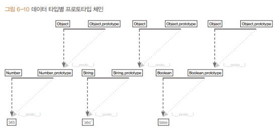

### 6-2-3 객체 전용 메서드의 예외사항

어떤 생성자 함수이든 prototype은 반드시 객체이기 때문에 Object.prototype이 언제나 프로토타입 체인의 최상단에 존재

따라서 객체에서만 사용할 메서드는 프로토타입 객체 안에 정의할 수 없다.( 다른 데이터 타입도 해당 메서드를 사용할 수 있게 된다)

이 같은 이유로 객체만을 대상으로 동작하는 객체 전용 메서드들은 부득이 Object.prototype이 아닌 Object에 스태틱 메서드로 부여할 수 밖에 없다

생성자 함수인 Object와 인스턴스인 객체 리터럴 사이에 this를 통한 연결이 불가능해서 this의 사용을 포기하고 대상 인스턴스를 인자로 직접 주입해야 하는 방식으로 구현

ex) `Object.freeze(instance)`

같은 이유에서 Object.prototype에는 어떤 데이터에서도 활용할 수 있는 범용적 메서드들만 있다.

ex) toString, hasOwnProperty, valueOf, isPrototypeOf

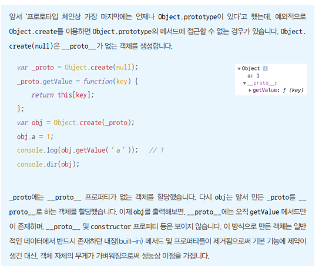

### 6-2-4 다중 프로토타입 체인

`__proto__`를 여러 개 연결해서 다중 프로토타입 체인을 만들 수 있다.

`__proto__`가 가리키는 대상인 생성자 함수의 prototype이 연결하고자 하는 상위 생성자 함수의 인스턴스를 바라보게 하면 된다

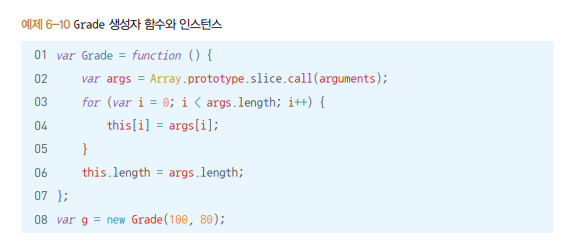

Grade의 인스턴스에서 배열메서드를 쓰게 하려면, `g.__proto__ ,즉 Grade.prototype`이 배열의 인스턴스를 바라보게 하면 된다

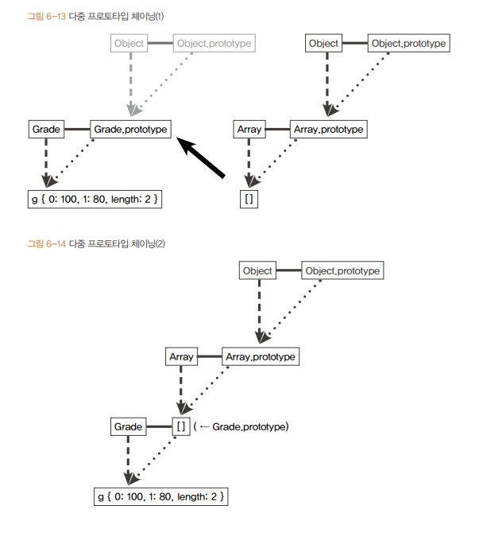

## 03) 정리

어떤 생성자 함수를 new 연산자와 함께 호출하면 Constructor에서 정의된 내용을 바탕으로 새로운 인스턴스가 생성되는데, 이 인스턴스에는 `__proto__`라는 Constructor의 prototype 프로퍼티를 참조하는 프로퍼티가 자동으로 부여된다. `__proto__` 는 생략 가능한 속성이라서, 인스턴스는 Constructor.prototype의 메서드를 마치 자신의 메서드인 것처럼 호출할 수 있다.

Constructor.prototype에는 constructor라는 프로퍼티가 있는데, 이는 다시 생성자 함수 자신을 가리킨다. 이 프로퍼티는 인스턴스가 자신의 생성자 함수가 무엇인지를 알고자 할 때 필요한 수단이다.

직각삼각형의 대각선 방향, 즉 `__proto__` 방향을 계속 찾아가면 최종적으로는 Object.prototype에 당도하게 된다. 이런식으로 `__proto__` 안에 다시 `__proto__`를 찾아가는 과정을 프로토타입 체이닝이라고 하며, 이 프로토타입 체이닝을 통해 각 프로토타입 메서드를 자신의 것처럼 호출할 수 있다. 이 때 접근 방식은 자신으로부터 가장 가까운 대상부터 점차 먼 대상으로 나아가며, 원하는 값을 찾으면 검색을 중단한다.

Object.prototype에는 모든 데이터 타입에서 사용할 수 있는 범용적인 메서드만이 존재하며, 객체 전용 메서드는 여느 데이터 타입과 달리 Object 생성자 함수에 스태틱하게 담겨 있다.

프로토타입 체인은 반드시 2단계로만 이뤄지는 것이 아니라 무한대의 단계를 생성할 수도 있다.