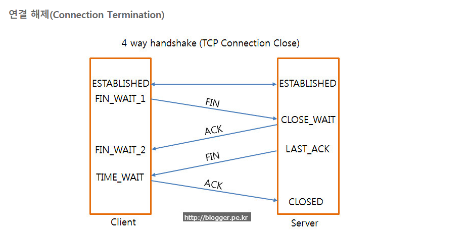

# TCP 3-way Handshake

### 연결 성립

1) 클라이언트는 서버에 접속을 요청하는 SYN(a) 패킷을 보낸다.

2) 서버는 클라이언트의 요청인 SYN(a)을 받고 클라이언트에게 요청을 수락한다는 ACK(a+1)와 SYN(b)이 설정된 패킷을 발송한다.

3) 클라이언트는 서버의 수락 응답인 ACK(a+1)와 SYN(b) 패킷을 받고 ACK(b+1)을 서버로 보내면

<b>연결 성립(establish)</b>된다.

### 연결 해제

1) 클라이언트가 연결을 종료하겠다는 FIN플래그를 전송

2) 서버는 클라이언트의 요청(FIN)을 받고 알겠다는 확인 메세지로 ACK를 보낸다.

2-1) 데이터를 모두 보낼 때까지 잠깐 TIME_OUT

3) 데이터를 모두 보내고 통신이 끝났으면 연결이 종료되었다고 클라이언트에게 FIN 플래그 전송

4) 클라이언트는 FIN 메세지를 확인했다는 메세지(ACK)를 보낸다.

5) 클라이언트의 ACK 메세지를 받은 서버는 소켓 연결을 close한다.

6) 클라이언트는 아직 서버로부터 받지 못한 데이터가 있을 것을 대비해 일정 시간 동안 세션을 남겨놓고 잉여 패킷을 기다린다.(TIME_WAIT)

### SYN,ACK?

> SYN: synchronize sequence number

> ACK: acknowledgement

TCP Header에는 Code Bit(Flag bit)라는 부분이 존재. 이 부분은 총 6Bit로 이루어져 있으며 각각 한 bit들이 의미를 갖고있다. Urb-Ack-Psh-Rst-Syn-Fin 순서로 되어 있으며 해당 위치의 비트가 1이면 해당 패킷이 어떠한 내용을 담고 있는 패킷인지를 나타낸다. SYN이면 000010, ACK면 010000이다.

### 연결 수립 과정에 위 2가지를 쓰는 이유?

요청과 응답에 대한 패킷을 주고 받아야 하기 때문에 위 2가지를 쓴다.

### 왜 3-way일까?

1) 클라이언트는 서버에 잘 들리냐고 묻는다.

2) 서버는 클라이언트 목소리가 잘들린다 한다.

3) 클라이언트는 서버 목소리가 들린다고 한다.

이렇게 3가지 단계이다.

### 왜 Sequence Number에 랜덤한 숫자 담을까?

Connection을 맺을 때 사용하는 port는 유한 범위 내에서 사용하고 시간이 지남에 따라 재사용된다. 따라서 옛날에 쓴 포트 번호를 다시 쓸 가능성이 있다. 서버에서는 패킷의 SYN을 보고 패킷을 구분하는데 순차적 number가 전송되면 이전의 connection으로부터 오는 패킷으로 인식할 수 있다. 이런 문제가 발생할 가능성을 줄이기 위해 랜덤한 숫자를 쓴다.

> 사실 뭔 소리인지 잘 모르겠다.