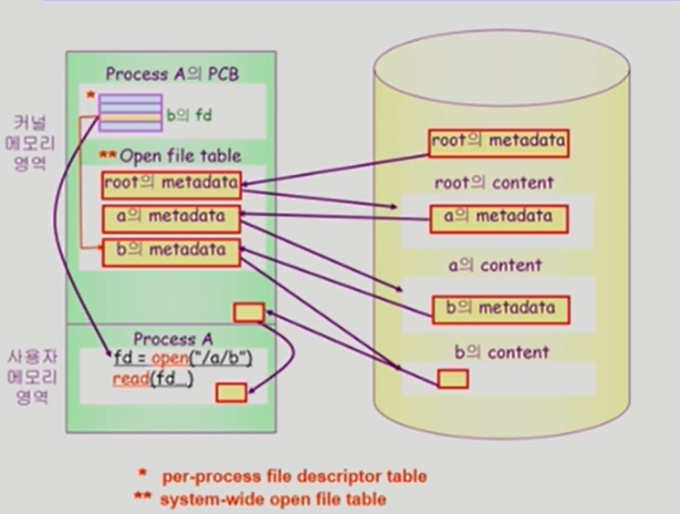
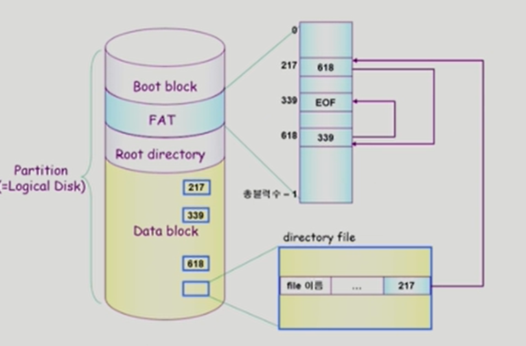

# 10. File Systems

[TOC]

## File and File System

## Directory and Logical Disk

## open()

## File Protection

## File System의 Mounting

## Access Methods

## Allocation of File Data in Disk

## Contiguous Allocation

## Linked Allocation

## Indexed Allocation

## UNIX 파일 시스템의 구조

## FAT File System

FAT 복사본 여러개 저장해서 reliability 문제 해결

FAT 통해 random access 배열에서 따라가기로 구현

## Free-Space Management

## Directory Implementation

## VFS and NFS

## Page Cache and Buffer Cache

## 프로그램의 실행

