# 11. Disk Management & Scheduling

[TOC]

## Disk Structure

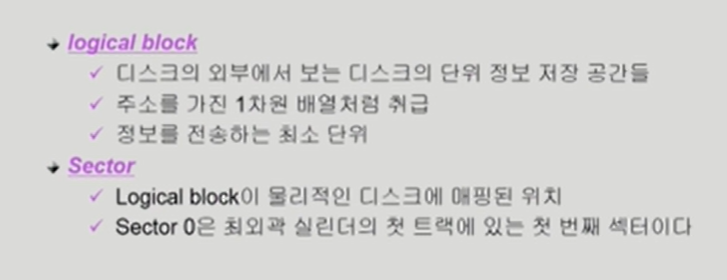

## Disk Scheduling

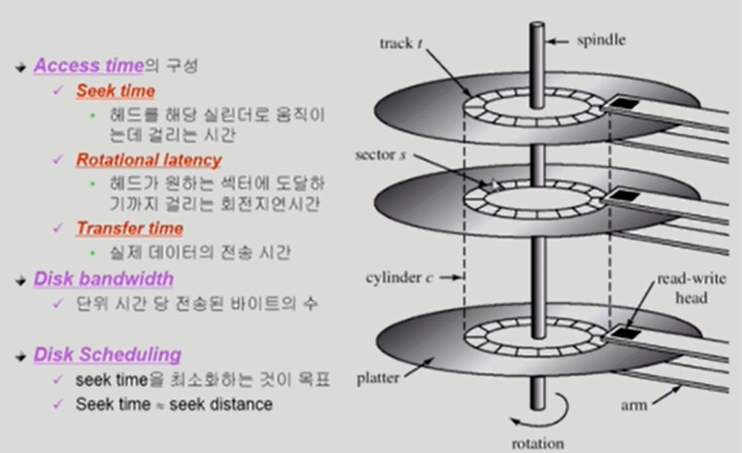

## Disk Management

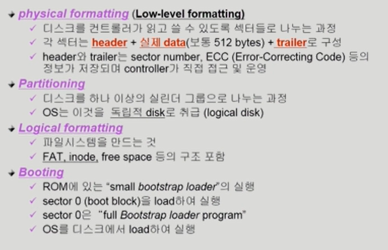

## Disk Scheduling Algorithm

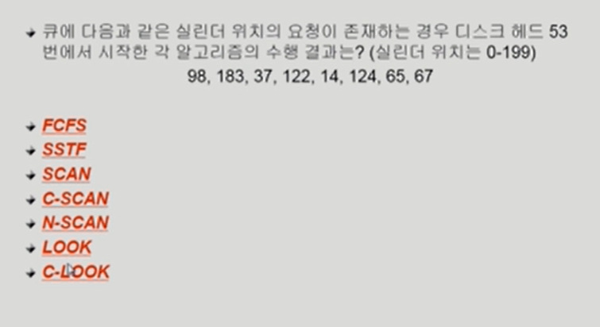

### FCFS

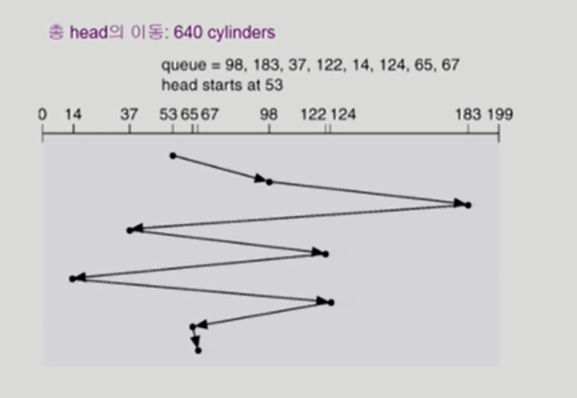

### SSTF

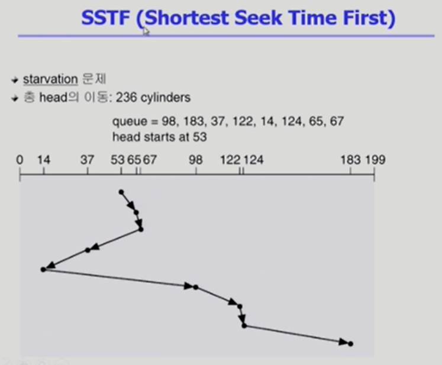

### SCAN

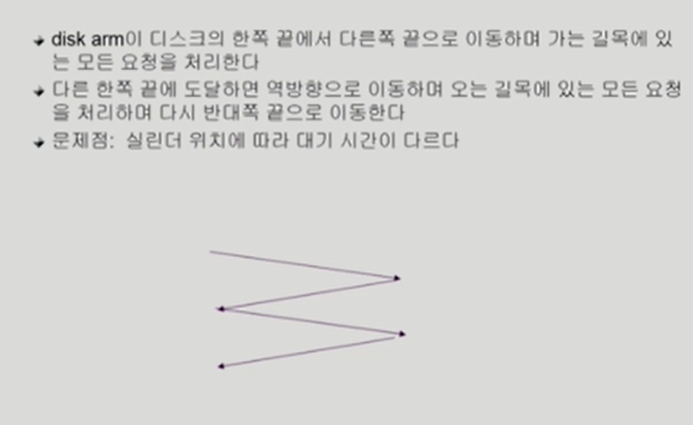

### C-SCAN

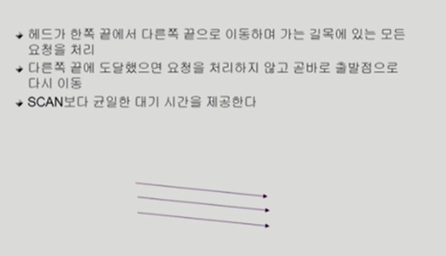

### Other algorithms

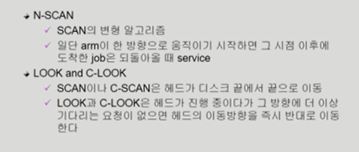

### C-LOOK

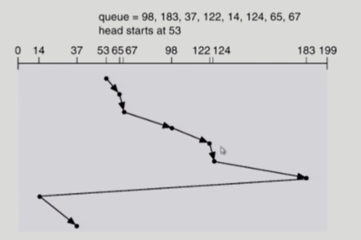

## Disk-Scheduling Algorithm의 결정

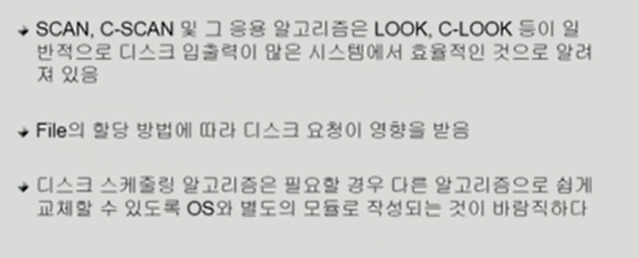

## Swap-Space Management

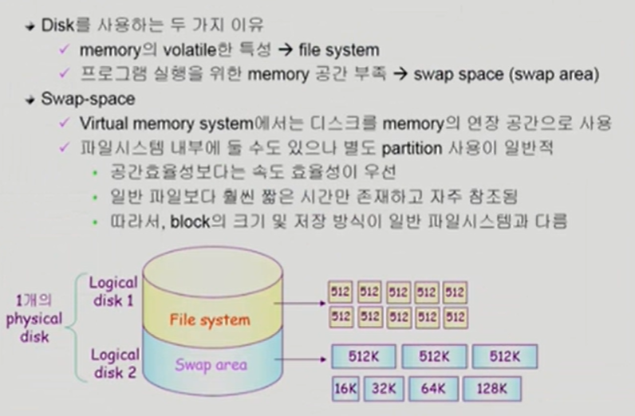

## RAID

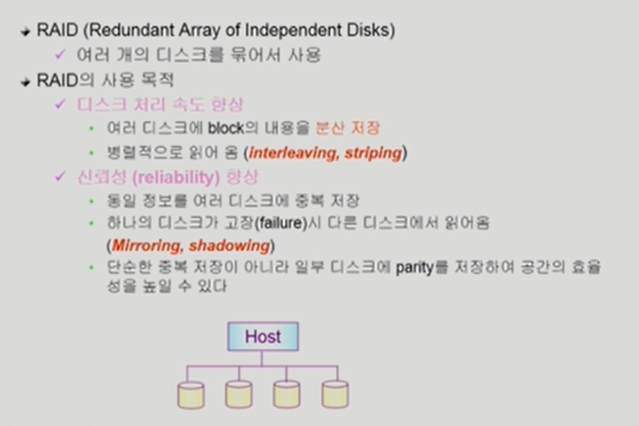

