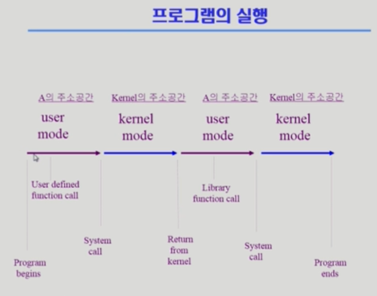

# 2.System structure & Program Execution

[TOC]

CPU는 매 클락 사이클마다 메모리에서 instruction을 읽어서 실행시킨다

## 컴퓨터 시스템 구조

## Mode bit

- 사용자 프로그램의 잘못된 수행으로 다른 프로그램 및 운영체제에 피해가 가지 않도록 하기 위한 보호 장치 필요
- Mode bit을 통해 하드웨어적으로 2가지 모드의 operation 지원
  - 1 사용자 모드: 사용자 프로그램 수행
  - 0 모니터 모드: OS코드 수행
    - 보안을 해칠 수 있는 중요한 명령어는 모니터 모드에서만 수행 가능한 특권명령으로 규정
    - Interrupt나 Exception 발생 시 하드웨어가 mode bit을 0으로 바꿈
    - 사용자 프로그램에게 CPU를 넘기기 전에 mode bit을 1로 셋팅
- 모니터 모드 (= 커널 모드, 시스템 모드)

## Timer

- 타이머
  - 정해진 시간이 흐른 뒤 운영체제에게 제어권이 넘어가도록 인터럽트를 발생시킴
  - 타이머는 매 클럭 틱 때마다 1씩 감소
  - 타이머 값이 0이 되면 타이머 인터럽트 발생
  - CPU를 특정 프로그램이 독점하는 것으로부터 보호
- time sharing을 구현하기 위해 널리 이용, 현재 시간을 계산하기 위해서도 사용

## Device Controller

- I/O device controller
  - 해당 I/O 장치유형을 관리하는 일종의 작은 CPU
  - 제어 정보를 위해 control register, status register를 가짐
  - local buffer를 가짐 (일종의 data register)
- I/O는 실제 device와 local buffer 사이에서 일어남
- Device controller는 I/O가 끝났을 경우 interrupt로 CPU에 그 사실을 알림

- device driver (장치 구동기) : OS 코드 중 각 장치별 처리루틴 -> software
- device controller (장치 제어기) : 각 장치를 통제하는 일종의 작은 CPU -> hardware

## 입출력(I/O)의 수행

- 모든 입출력 명령은 특권 명령
- 사용자 프로그램은 어떻게 I/O를 하는가?
  - 시스템콜(system call)
    - 사용자 프로그램은 운영체제에게 I/O 요청
  - trap을 사용하여 인터럽트 벡터의 특정 위치로 이동
  - 제어권이 인터럽트 벡터가 가리키는 인터럽트 서비스 루틴으로 이동
  - 올바른 I/O 요청인지 확인 후 I/O 수행
  - I/O 완료시 제어권을 시스템콜 다음 명령으로 옮김

## 인터럽트 (Interrupt)

- 인터럽트
  - 인터럽트 당한 시점의 레지스터와 program counter를 save한 후 CPU의 제어를 인터럽트 처리 루틴에 넘긴다
- Interrupt (넓은 의미)
  - Interrupt (하드웨어 인터럽트) : 하드웨어가 발생시킨 인터럽트
  - Trap (소프트웨어 인터럽트)
    - Exception: 프로그램이 오류를 범한 경우
    - System call: 프로그램이 커널 함수를 호출하는 경우
- 인터럽트 관련 용어
  - 인터럽트 벡터
    - 해당 인터럽트의 처리 루틴 주소를 가지고 있음
  - 인터럽트 처리 루틴 (=Interrupt Service Routine, 인터럽트 핸들러)
    - 해당 인터럽트를 처리하는 커널 함수

__현대의 운영체제는 인터럽트에 의해 구동됨__

## 시스템 콜(System call)

사용자 프로그램이 운영체제의 서비스를 받기 위해 커널 함수를 호출하는 것

## 동기식, 비동기식 입출력

- 동기식 입출력
  - I/O 요청 후 입출력 작업이 완료된 후에야 제어가 사용자 프로그램에 넘어감
  - 구현 방법 1
    - I/O가 끝날 때까지 CPU를 낭비시킴
    - 매시점 하나의 I/O만 일어날 수 있음
  - 구현 방법 2
    - I/O가 완료될 때까지 해당 프로그램에게서 CPU를 빼았음
    - I/O 처리를 기다리는 줄에 그 프로그램을 줄 세움
    - 다른 프로그램에게 CPU를 줌
- 비동기식 입출력
  - I/O가 시작된 후 입출력 작업이 끝나기를 기다리지 않고 제어가 사용자 프로그램에 즉시 넘어감

두 경우 모두 I/O의 완료는 인터럽트로 알려줌

## 서로 다른 입출력 명령어

## 저장장치 계층 구조

## 프로그램의 실행 (메모리 load)

## 커널 주소 공간의 내용

## 사용자 프로그램이 사용하는 함수

- 함수
  - 사용자 정의 함수
    - 자신의 프로그램에서 정의한 함수
  - 라이브러리 함수
    - 자신의 프로그램에서 정의하지 않고 갖다 쓴 함수
    - 자신의 프로그램의 실행 파일에 포함되어 있다
  - 커널 함수
    - 운영체제 프로그램의 함수
    - 커널 함수의 호출 = 시스템 콜

## 프로그램의 실행

