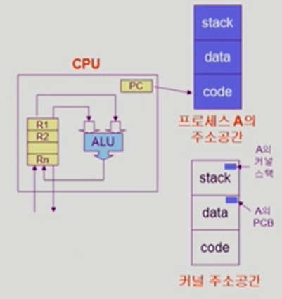
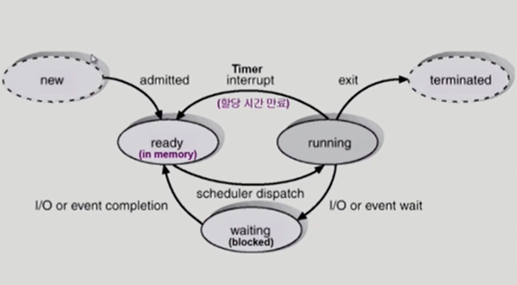
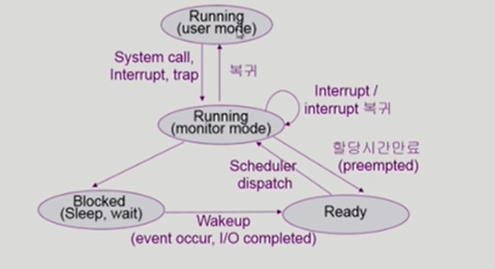
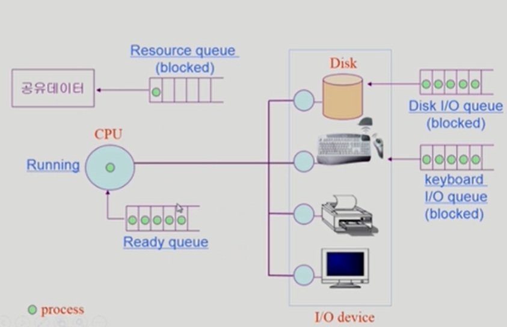
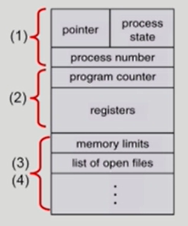
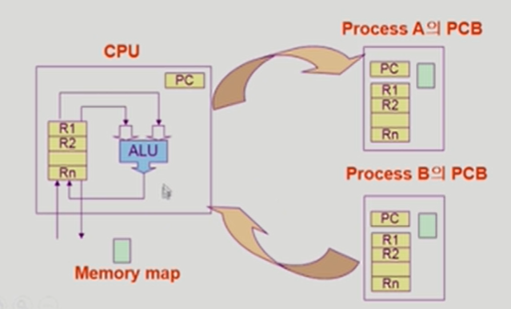
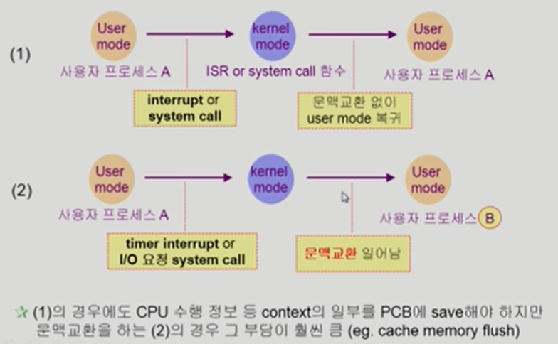
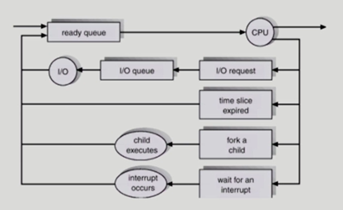
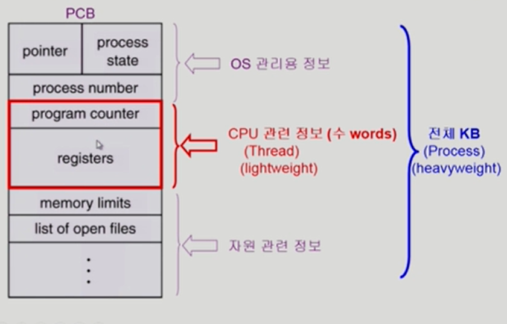
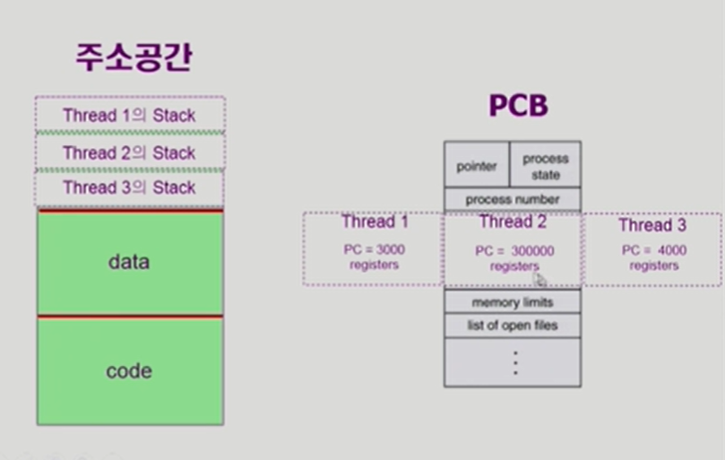

# 3. Process

[TOC]

## 프로세스의 개념

- Process is a program in execution
- 프로세스의 문맥(context)
  - CPU 수행 상태를 나타내는 하드웨어 문맥
    - Program Counter
    - 각종 register
  - 프로세스의 주소 공간
    - code, data, stack
  - 프로세스 관련 커널 자료 구조
    - PCB (Process Control Block)
    - Kernel stack

## 프로세스의 상태 (Process State)

- 프로세스는 상태(state)가 변경되며 수행한다
  - Running
    - CPU를 잡고 instruction을 수행중인 상태
  - Ready
    - CPU를 기다리는 상태(메모리 등 다른 조건을 모두 만족하고)
  - Blocked(wait, sleep)
    - CPU를 주어도 당장 instruction을 수행할 수 없는 상태
    - Process 자신이 요청한 event(예: I/O)가 즉시 만족되지 않아 이를 기다리는 상태
    - (예)디스크에서 file을 읽어와야 하는 경우
  - Suspended (stopped)
    - 외부적인 이유로 프로세스의 수행이 정지된 상태
    - 프로세스는 통째로 디스크에 swap out 된다
    - (예) 사용자가 프로그램을 일시 정지시킨 경우 (break key), 시스템이 여러 이유로 프로세스를 잠시 중단( 메모리에 너무 많은 프로세스가 올라와 있을 때)
  - New: 프로세스가 생성중인 상태
  - Terminated: 수행(execution)이 끝난 상태

## 프로세스 상태도

## 프로세스의 상태 (컴터 입장)

## Process Control Block (PCB)

- PCB
  - 운영체제가 각 프로세스를 관리하기 위해 프로세스당 유지하는 정보
  - 다음의 구성 요소를 가진다(구조체로 유지)
    - OS가 관리상 사용하는 정보
      - Process state, Process ID
      - scheduling information, priority
    - CPU 수행 관련 하드웨어 값
      - Program counter, registers
    - 메모리 관련
      - Code, data, stack의 위치 정보
    - 파일 관련
      - Open file descriptors...

## 문맥 교환 (Context Switch)

- CPU를 한 프로세스에서 다른 프로세스로 넘겨주는 과정
- CPU가 다른 프로세스에게 넘어갈 때 운영체제는 다음을 수행
  - CPU를 내어주는 프로세스의 상태를 그 프로세스의 PCB에 저장
  - CPU를 새롭게 얻는 프로세스의 상태를 PCB에서 읽어옴

- System call 이나 Interrupt발생시 반드시 context switch가 일어나는 것은 아님

## 프로세스를 스케줄링하기 위한 큐

- Job queue
  - 현재 시스템 내에 있는 모든 프로세스의 집합
- Ready queue
  - 현재 메모리 내에 있으면서 CPU를 잡아서 실행되기를 기다리는 프로세스의 집합
- Device queues
  - I/O device의 처리를 기다리는 프로세스의 집합
- 프로세스들은 각 큐들을 오가며 수행된다

## 스케줄러 (Scheduler)

- Long-term scheduler (장기 스케줄러, job scheduler)
  - 시작 프로세스 중 어떤 것들을 ready queue로 보낼지 결정
  - 프로세스에 memory(및 각종 자원)을 주는 문제
  - degree of Multiprogramming(메모리에 프로그램 몇개 올라가 있는지)을 제어
  - time sharing system에는 보통 장기 스케줄러가 없음 ( 무조건 ready )
- Short-term scheduler (단기 스케줄러 or CPU scheduler)
  - 어떤 프로세스를 다음번에 running시킬지 결정
  - 프로세스에 CPU를 주는 문제
  - 충분히 빨라야 함 (ms 단위)
- Medium-term scheduler (중기 스케줄러 or Swapper)
  - 여유 공간 마련을 위해 프로세스를 통째로 메모리에서 디스크로 쫓아냄
  - 프로세스에게서 memory를 뺏는 문제
  - degree of Multiprogramming을 제어

## Thread

- A thread (or lightweight process) is a basic unit of CPU utilization
- Thread의 구성
  - program counter
  - register set
  - stack space
- Thread가 동료 thread와 공유하는 부분(=task)
  - code section
  - data section
  - OS resources
- 전통적인 개념의 heavyweight process는 하나의 thread를 가지고 있는 task로 볼 수 있다

- 다중 스레드로 구성된 태스크 구조에서는 하나의 서버 스레드가 blocked (wating) 상태인 동안에도 동일한 태스크 내의 다른 스레드가 실행(running)되어 빠른 처리를 할 수 있다.
- 동일한 일을 수행하는 다중 스레드가 협력하여 높은 처리율(throughput)과 성능 향상을 얻을 수 있다
- 스레드를 사용하면 병렬성을 높일 수 있다

## Benefits of Threads

- Responsiveness
  - eg) multi-threaded web - if one thread is blocked (eg network) another thread continues (eg display)
- Resource Sharing
  - n threads can share binary code, data, resource of the process
- Economy
  - creating & CPU switching thread (rather than a process)
  - Solaris의 경우 위 두가지 overhead가 각각 30배, 5배
- Utilization of MP Architectures
  - each thread may be running in parallel on a different processor

## Implementation of Threads

- some are supported by kernel -> Kernel Threads
  - Windows 95/98/NT, Solaris, Digital UNIX, Mach
- Others are supported by library -> User Threads
  - POSIX Pthreads, Mach C-threads, Solaris threads
- Some are real-time threads