# 5. CPU Scheduling

[TOC]

## CPU & I/O Bursts in Program Execution

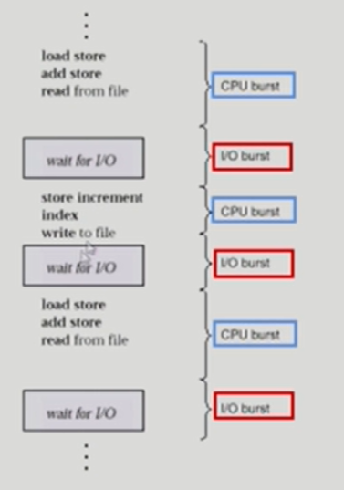

Interactive한 job들이 CPU, I/O Burst가 많이 나온다 (사용자와 상호작용하며)

## CPU-burst Time의 분포

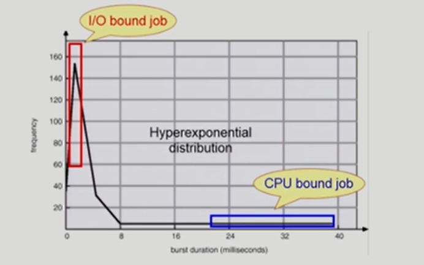

여러 종류의 job(=process)이 섞여 있기 때문에 CPU 스케줄링이 필요하다

- Interactive job에게 적절한 response 제공 요망
- CPU와 I/O 장치 등 시스템 자원을 골고루 효율적으로 사용

## 프로세스의 특성 분류

- 프로세스는 그 특성에 따라 다음 2가지로 나눔
  - I/O-bound process
    - CPU를 잡고 계산하는 시간보다 I/O에 많은 시간이 필요한 job
    - (many short CPU bursts)
  - CPU-bound process
    - 계산 위주의 job
    - (few very long CPU bursts)

## CPU Scheduler & Dispatcher

- CPU Scheduler
  - Ready 상태의 프로세스 중에서 이번에 CPU를 줄 프로세스를 고른다
- Dispatcher
  - CPU의 제어권을 CPU scheduler에 의해 선택된 프로세스에게 넘긴다
  - 이 과정을 context switch(문맥 교환)라고 한다
- CPU 스케줄링이 필요한 경우는 프로세스에게 다음과 같은 상태 변화가 있는 경우이다
  1. Running -> Blocked (ex: I/O 요청하는 시스템 콜)
  2. Running -> Ready (ex: 할당시간 만료로 timer interrupt)
  3. Blocked -> Ready (ex: I/O 완료 후 인터럽트)
  4. Terminate

1,4 에서의 스케줄링은 nonpreemptive (=강제로 빼앗지 않고 자진 반납)

All other schedulling is preemptive (=강제로 빼앗음)

## Scheduling Criteria

> Performance Index = Performance Measure

- CPU utilization (이용률)
  - keep the CPU as busy as possible
- Throughput (처리량)
  - ll of processes that complete their execution per time unit
- Turnaround time (소요시간, 반환시간)
  - amount of time to execute a particular process
- Waiting time (대기 시간)
  - amount of time a process has been waiting in the ready queue
- Response time (응답 시간)
  - amount of time it takes from when a request was submitted until the first response is produced, not output (for time-sharing environment)

## Scheduling Algorithms

- FCFS (First-come First-Served)
- SJF (Shortest-Job-First)
- SRTF(Shortest-Remaining-Time-First)
- Priority Scheduling
- RR (Round Robin)
- Multilevel Queue
- Multilevel Feedback queue

## FCFS (First-Come First-Served)

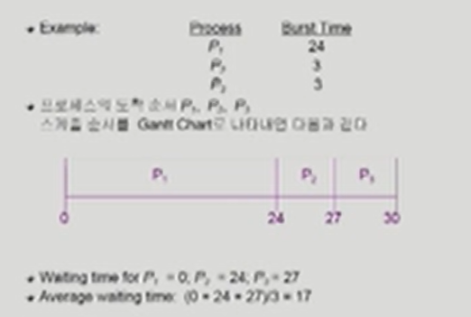

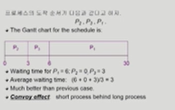

## SJF (Shortest-Job-First)

- 각 프로세스의 다음번 CPU burst time을 가지고 스케줄링에 활용
- CPU burst time이 가장 짧은 프로세스를 제일 먼저 스케줄
- 2 schemes:
  - Nonpreemtive
    - 일단 CPU를 잡으면 이번 CPU burst가 완료될 때까지 CPU를 선점(preemtive)당하지 않음
  - Preemtive
    - 현재 수행중인 프로세스의 남은 burst time보다 더 짧은 CPU burst time을 가지는 새로운 프로세스가 도착하면 CPU을 빼앗김
    - Shortest-Remaining-Time-First(SRTF)라고 부름
- SJF is optimal
  - 주어진 프로세스들에 대해 minimum average waiting time을 보장

- 문제점

  - Starvation

    - long 프로세스가 계속 기다리기만 할 수 있다

  - 다음 CPU Burst time을 어떻게 알 수 있을까? 실제 시스템에서 사용하기 힘들다 ( 추정해서 사용하기는 함 )

    - 과거의 CPU burst time을 이용해서 추정 (exponential averaging)

      1. T(n) = actual length of nth CPU burst

      2. Tau(n+1) = predicted value for the next CPU burst

      3. a, 0 <= a <= 1

      4. Define: T(n+1) = aT(n) + (1-a)Tau(n)

      5. a = 0

         1. tau(n+1) = tau(n)
         2. Recent history does not count

      6. a = 1

         1. tau(n+1) = t(n)
         2. Only the actual last CPU burst counts

      7. 식을 풀면 다음과 같다

      8. tau(n+1) = at(n) + (1-a)at(n-1) + ... + (1-a) **j *at(n-j) + ...+(1-a) `**`n+1 * tau(0)

      9. a와 1-a가 둘다 1이하이므로 후속 term은 선행 term보다 적은 가중치 값을 가진다

         

### Example of Non-Preemptive SJF

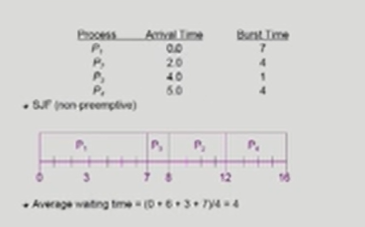

### Example of Preemptive SJF

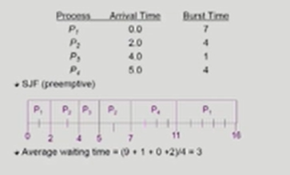

## Priority Scheduling

- A priority number (integer) is associated with each process
- highest priority를 가진 프로세스에게 CPU 할당 (smallest integer = highest priority)
  - Preemptive
  - nonpreemptive
- SJF는 일종의 priority scheduling이다 priority = predicted next CPU burst time
- Problem
  - Starvation(기아 현상) : low priority processes may never execute
- Solution
  - Aging: as time progresses increase the priority of the process

## Round Robin (RR)

- 각 프로세스는 동일한 크기의 할당 시간(time quantum)을 가짐 (일반적으로 10~100ms)

- 할당 시간이 지나면 프로세스는 preemptive당하고 ready queue의 맨 뒤에 가서 다시 줄을 선다

- n 개의 프로세스가 ready queue에 있고 할당 시간이 q time_unit인 경우 각 프로세스는 최대 q time unit 단위로 CPU시간의 1/n을 얻는다

  -> 어떤 프로세스도 (n-1)q time unit 이상 기다리지 않는다

- Performance

  - q large -> FIFO
  - q small -> context switch 오버헤드가 커진다

### Example: RR with Time Quantum = 20

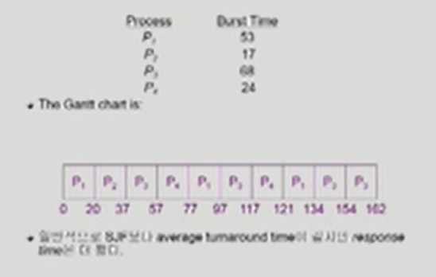

## Multilevel queue

- Ready queue를 여러 개로 분할
  - foreground (interactive)
  - background (batch - no human interaction)
- 각 큐는 독립적인 스케줄링 알고리즘을 가짐
  - foreground - RR
  - background - FCFS
- 큐에 대한 스케줄링이 필요
  - Fixed priority scheduling
    - serve all from foreground the from background
    - Possibility of starvation
  - Time slice
    - 각 큐에 CPU time을 적절한 비율로 할당
    - Eg., 80% to foreground in RR, 20% to background in FCFS

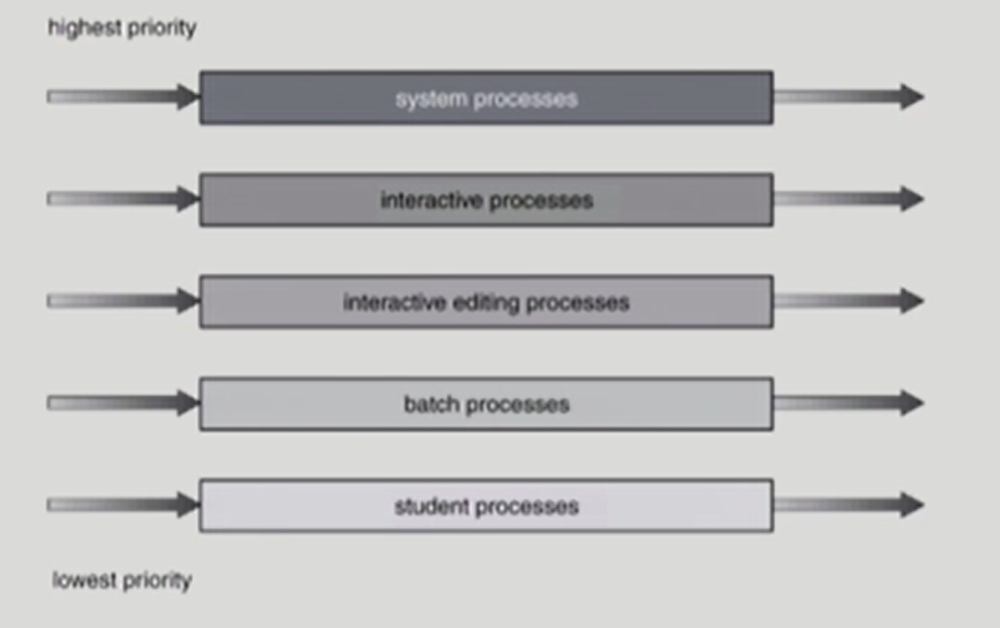

## Multilevel Feedback Queue

- CPU 사용시간 짧은 프로세스들에 우선순위, 긴 애들은 점점 밑에 큐로 쫓겨남

- 프로세스가 다른 큐로 이동 가능
- 에이징(aging)을 이와 같은 방식으로 구현할 수 있다
- Multilevel-feedback-queue scheduler를 정의하는 파라미터들
  - Queue의 수
  - 각 큐의 scheduling algorithm
  - Process를 상위 큐로 보내는 기준
  - Process를 하위 큐로 내쫓는 기준
  - 프로세스가 CPU 서비스를 받으려 할 때 들어갈 큐를 결정하는 기준

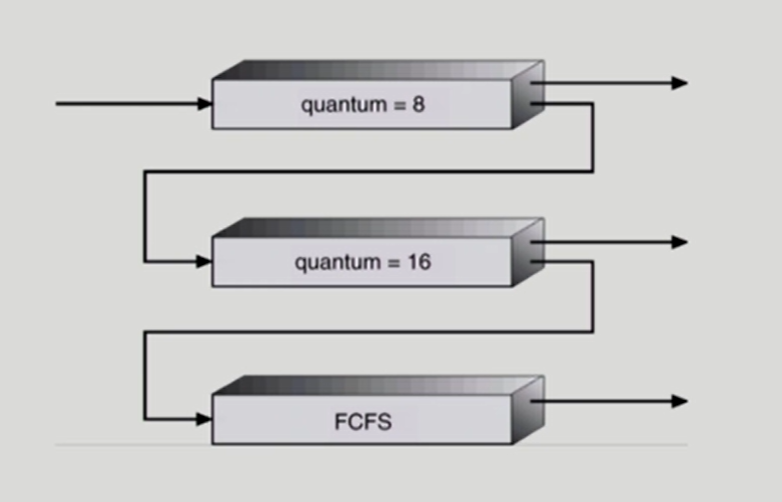

### Example of Multilevel feedback queue

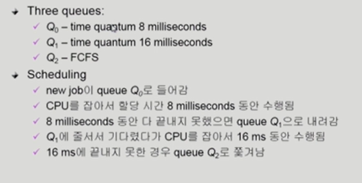

## Multiple-Processor Scheduling

- CPU가 여러 개인 경우 스케줄링은 더욱 복잡해짐
- Homogeneous processor인 경우
  - Queue에 한 줄로 세워서 각 프로세서가 알아서 꺼내가게 할 수 있다
  - 반드시 특정 프로세서에서 수행되어야 하는 프로세스가 있는 경우에는 문제가 더 복잡해짐
- Load sharing
  - 일부 프로세서에 job이 몰리지 않도록 부하를 적절히 공유하는 메커니즘 필요
  - 별개의 큐를 두는 방법 vs. 공동 큐를 사용하는 방법
- Symmetric Multiprocessing (SMP)
  - 각 프로세서가 각자 알아서 스케줄링 결정
- Asymmetric Multiprocessing
  - 하나의 프로세서가 시스템 데이터의 접근과 공유를 책임지고 나머지 프로세서는 거기에 따름

## Real-Time Scheduling

- Hard real-time systems
  - Hard real-time task는 정해진 시간 안에 반드시 끝내도록 스케줄링해야 함
- Soft real-time computing
  - Soft real-time task는 일반 프로세스에 비해 높은 priority를 갖도록 해야 함

## Thread Scheduling

- Local Scheduling
  - User level thread의 경우 사용자 수준의 thread library에 의해 어떤 thread를 스케줄할지 결정
- Global Scheduling
  - Kernel level thread의 경우 일반 프로세스와 마찬가지로 커널의 단기 스케줄러가 어떤 thread를 스케줄할지 결정

## Algorithm Evaluation

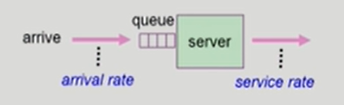

- Queueing models
  - 확률 분포로 주어지는 arrival rate와 service rate 등을 통해 각종 performance index 값을 계산
- Implementation (구현) & Measurement (성능 측정)
  - 실제 시스템에 알고리즘을 구현하여 실제 작업(workload)에 대해서 성능을 측정 비교
- Simulation (모의 실험)
  - 알고리즘을 모의 프로그램으로 작성후 trace를 입력으로 하여 결과 비교

