# 6. Process Synchronization

[TOC]

## 데이터의 접근

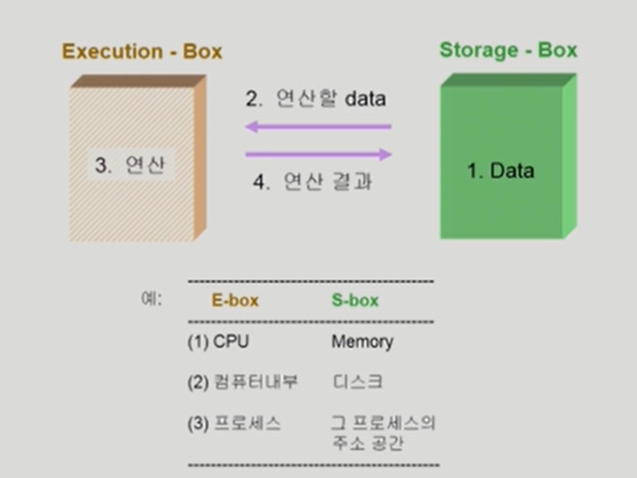


## Race Condition

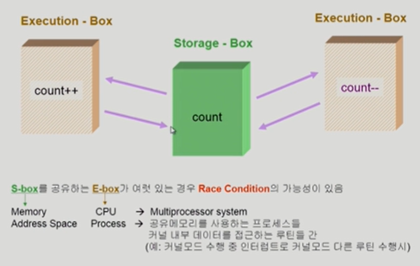


## OS에서 race condition은 언제 발생하는가?

1. kernel 수행 중 인터럽트 발생 시
2. Process가 system call을 하여 kernel mode로 수행 중인데 context switch가 일어나는 경우
3. Multiprocessor에서 shared memory 내의 kernel data


## OS에서의 race condition (1/3)

interrupt handler vs. kernel

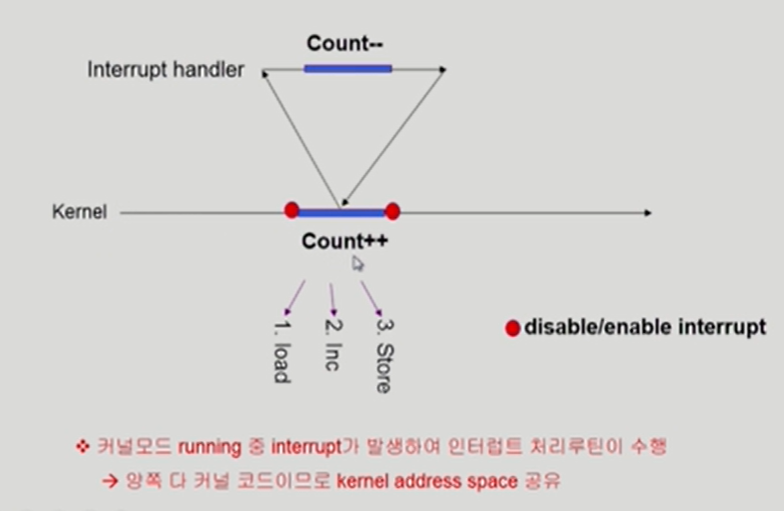

인터럽트 와도 disable 하고 먼저 하던일 다 처리하고 인터럽트 enable하는 방식으로 문제 해결


## OS에서의 race condition (2/3)

preempt a process running in kernel?

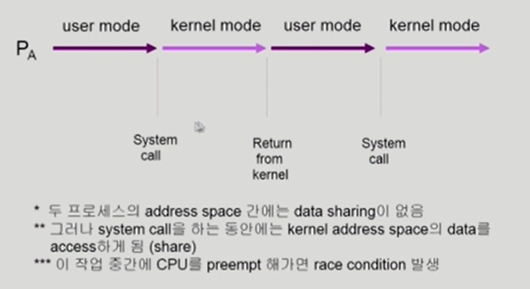


### If you preempt CPU while in kerenl mode...

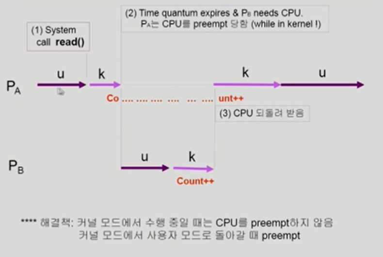


## OS에서의 race condition (3/3)

multiprocessor

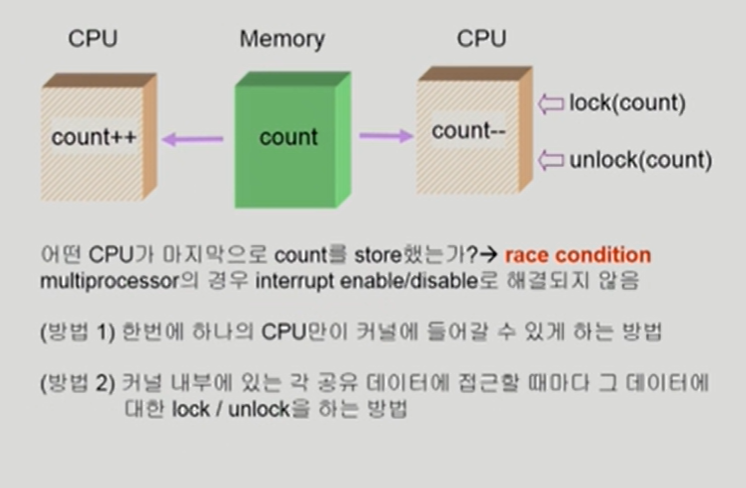


## Process Synchronization 문제

- 공유 데이터(shared data)의 동시 접근(concurrent access)은 데이터의 불일치 문제(inconsistency)를 발생시킬 수 있다
- 일관성(consistency) 유지를 위해서는 협력 프로세스(cooperating process)간의 실행 순서(orderly execution)를 정해주는 메커니즘 필요
- Race condition
  - 여러 프로세스들이 동시에 공유 데이터를 접근하는 상황
  - 데이터의 최종 연산 결과는 마지막에 그 데이터를 다룬 프로세스에 따라 달라짐
- race condition을 막기 위해서는 concurrent process는 동기화(synchronize)되어야 한다

 

### Example of a Race Condition

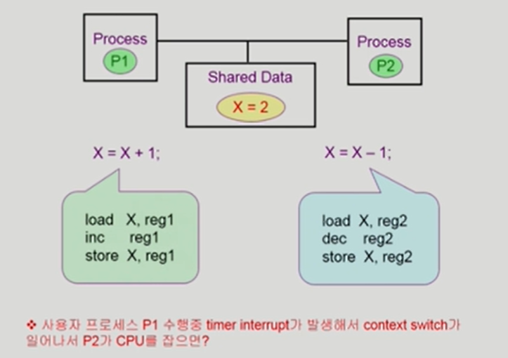


### The Critical-Section Problem

- n개의 프로세스가 공유 데이터를 동시에 사용하기를 원하는 경우
- 각 프로세스의 code segment에는 공유 데이터를 접근하는 코드인 critical section이 존재
- Problem
  - 하나의 프로세스가 critical section에 있을 때 다른 모든 프로세스는 critical section에 들어갈 수 없어야 한다

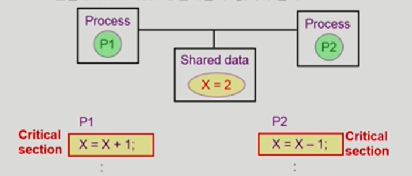


## Initial Attempts to Solve Problem

- 두 개의 프로세스가 있다고 가정 P0, P1
- 프로세스들의 일반적 구조

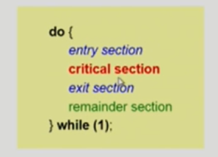

- 프로세스들은 수행의 동기화(synchronize)를 위해 몇몇 변수를 공유할 수 있다 -> synchronization variable


## 프로그램적 해결법의 충족 조건

- Mutual Exclusion
  - 프로세스 Pi가 critical section 부분을 수행 중이면 다른 모든 프로세스들은 그들의 critical section에 들어가면 안 된다
- Progress
  - 아무도 critical section에 있지 않은 상태에서 critical section에 들어가고자 하는 프로세스가 있으면 critical section에 들어가게 해주어야 한다
- Bounded Waiting
  - 프로세스가 critical section에 들어가려고 요청한 후부터 그 요청이 허용될 때까지 다른 프로세스들이 critical section에 들어가는 횟수에 한계가 있어야 한다
- 가정
  - 모든 프로세스의 수행 속도는 0보다 크다
  - 프로세스들 간의 상대적인 수행 속도는 가정하지 않는다


## Algorithm 1

- Synchronization variable

  ​	int turn;

  ​	initially turn = 0; => P(i) can enter its critical section if (turn == i)

	- Process P(0)

```C
do {
    while (turn != 0); /* My turn? */
    critical section
    turn = 1;          /* Now it`s your turn */
    remainder section
} while(1)
```

Satisfies mutual exclusion, but not progress

즉, 과잉양보: 반드시 한번씩 교대로 들어가야만 함 (swap-turn)

​	그가 turn을 내 값으로 바꿔줘야만 내가 들어갈 수 있음

​	특정 프로세스가 더 빈번히 critical section을 들어가야 한다면?


## Algorithm 2

- Synchronization variables

  - boolean flag[2];

    initially flag[모두] = false; /*no one is in CS*/

   - P(i) ready to enter its critical section if (flag[i] == true)

 - Process P(i)

```c
do {
	flag[i] = true;   /*Pretend I am in*/
    while (flag[j]);  /*Is he also in? then wait*/
    critical section
    flag[i] = false;  /*I am out now*/
    remainder section
} while (1);
```

- Satisfies mutual exclusion, but not progress requirement
- 둘다 2행까지 수행 후 끊임 없이 양보하는 상황 발생 가능


## Algorithm 3 (Peterson`s Algorithm)

- Combined synchronization variables of algorithms 1 and 2.
- Process P(i)

```c
do {
	flag[i] = true;   /* My intention is to enter ... */
    turn = j;         /* Set to his turn */
    while (flag[j] && turn == j); /* wait only if ... */
    critical section
    flag[i] = false;
    remainder section
} while (1);
```

- Meets all three requirements; solve the critical section problem for two processes
- Busy Waiting(=spin lock)! (계속 CPU와 memory를 쓰면서 wait)


## Synchronization Hardware

- 하드웨어적으로 Test & modify를 atomic하게 수행할 수 있도록 지원하는 경우 앞의 문제는 간단히 해결

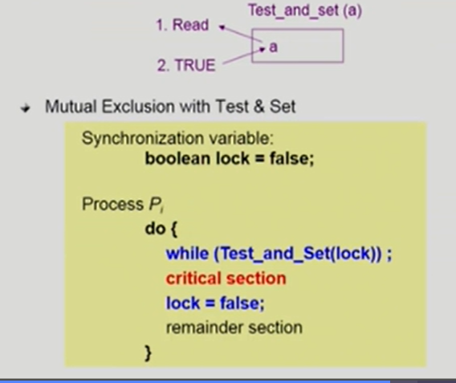


## Semaphores

- 앞의 방식들을 추상화시킴
- Semaphore S
  - integer variable
  - 아래의 두 가지 atomic 연산에 의해서만 접근 가능

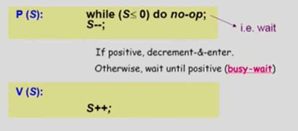


## Critical Section of n Processes

```c
/* Synchronization variable */
semaphore mutex; /* initially 1; 1개가 CS에 들어갈 수 있다 */

Process P(i)
do {
    P(mutex);
    critical section;
    V(mutex);
    remainder section
} while(1);
```

busy-wait는 효율적이지 못함(=spin lock)

Block & Wakeup방식의 구현(=sleep lock)


## Block/ Wakeup Implementation

- Semaphore를 다음과 같이 정의

```c
typedef struct
{
    int value; /* semaphore */
    struct process *L; /* process wait queue */
} semaphore;
```

- block과 wakeup을 다음과 같이 가정
  - block : 커널은 block을 호출한 프로세스를 suspend시킴, 이 프로세스의 PCB를 semaphore에 대한 wait queue에 넣음
  - wakeup(P) : block된 프로세스 P를 wakeup시킴, 이 프로세스의 PCB를 ready queue로 옮김


### block/wakeup version of P() & V()

- Semaphore 연산이 이제 다음과 같이 정의됨

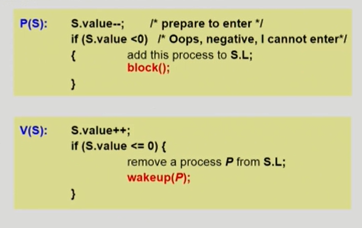


## Which is better?

- Busy-wait vs. Block/wakeup
- Block/wakeup overhead vs. Critical section 길이
  - Critical section의 길이가 긴 경우 Block/Wakeup이 적당
  - Critical section의 길이가 매우 짧은 경우 Block/Wakeup 오버헤드가 busy-wait 오버헤드보다 더 커질 수 있음
  - 일반적으로는 Block/wakeup 방식이 더 좋음


## 2 Types of Semaphores

- Counting semaphore
  - 도메인이 0 이상인 임의의 정수값
  - 주로 resource counting에 사용
- Binary semaphore (=mutex)
  - 0 또는 1 값만 가질 수 있는 semaphore
  - 주로 mutual exclusion (lock / unlock)에 사용


## Deadlock and Starvation

- Deadlock
  - 둘 이상의 프로세스가 서로 상대방에 의해 충족될 수 있는 event를 무한히 기다리는 현상
- S와 Q가 1로 초기화된 semaphore라 하자.

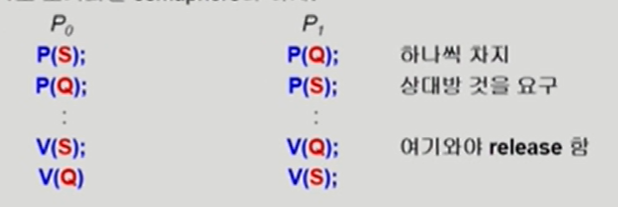

- Starvation
  - indefinite blocking. 프로세스가 suspend된 이유에 해당하는 세마포어 큐에서 빠져나갈 수 없는 현상


## Classical Problems of Synchronization

- Bounded-Buffer Problem (Producer-Consumer Problem)
- Readers and Writers Problem
- Dining-Philosophers Problem


## Bounded-Buffer Problem (Producer-consumer Problem)

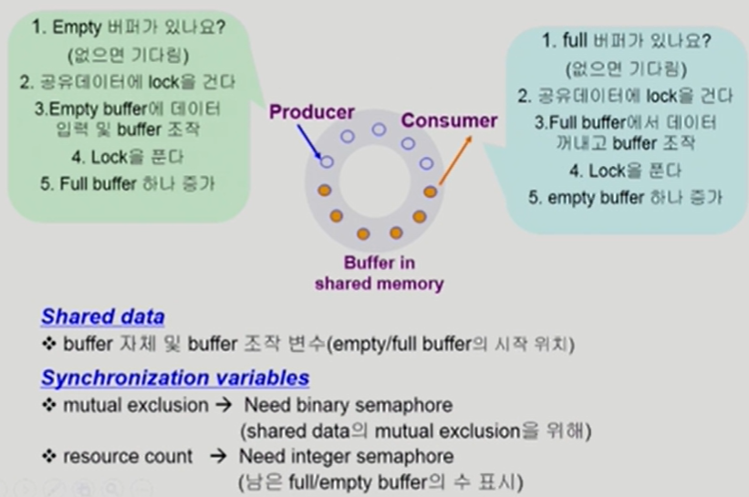

- 문제점
  - 버퍼가 유한하기 때문에 버퍼가 가득 찬 상태에서 다른 생산자가 도착하면, 생산자는 사용할 자원이 없다
  - 또는 버퍼가 비어있는 상태에서 소비자가 도착할 경우 소비할 수 없다. 생산자가 만들 때까지 기다려야 한다
  - 동시에 생산자 2명이 1개의 버퍼를 조준하는 경우 문제가 생긴다

- 해결책
  - 세마포로 1명이 1개 버퍼를 조준하게 하고, 자원을 카운팅해야 한다


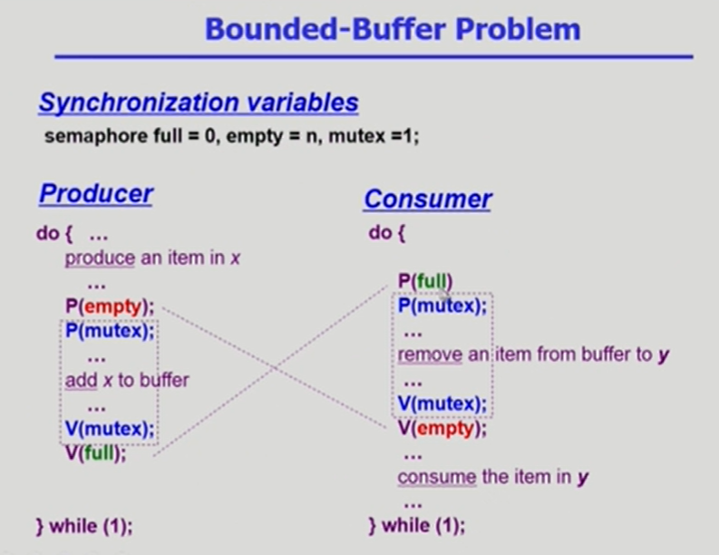


## Readers-Writers Problem

- 한 Process가 DB에 write 중일 때 다른 process가 접근하면 안됨

- read는 동시에 여럿이 해도 됨

- solution

  - Writer가 DB에 접근 허가를 아직 얻지 못한 상태에서는 모든 대기중인 Reader들을 다 DB에 접근하게 해준다
  - Writer는 대기 중인 Reader가 하나도 없을 때 DB 접근이 허용된다
  - 일단 Writer가 DB에 접근 중이면 Reader들은 접근이 금지된다
  - Writer가 DB에서 빠져나가야만 Reader의 접근이 허용된다

- Shared data

  DB 자체

  readcount - 현재 DB에 접근 중인 Reader의 수

- Synchronization variables

  mutex - 공유 변수 readcount를 접근하는 코드(critical section)의 mutual exclusion 보장을 위해 사용

  db - Reader와 writer가 공유 DB 자체를 올바르게 접근하게 하는 역할


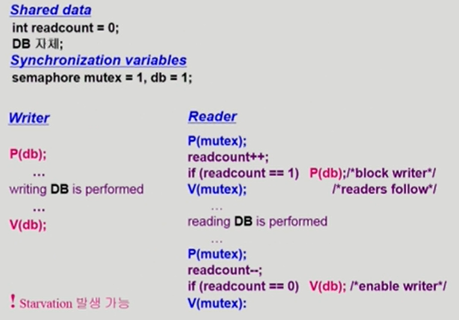


## Dining-Philosophers Problem

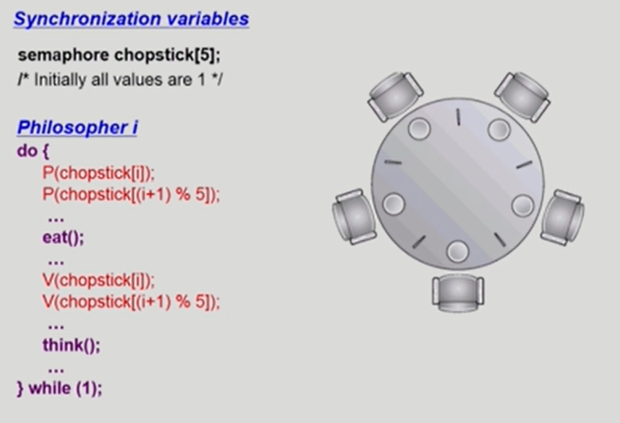

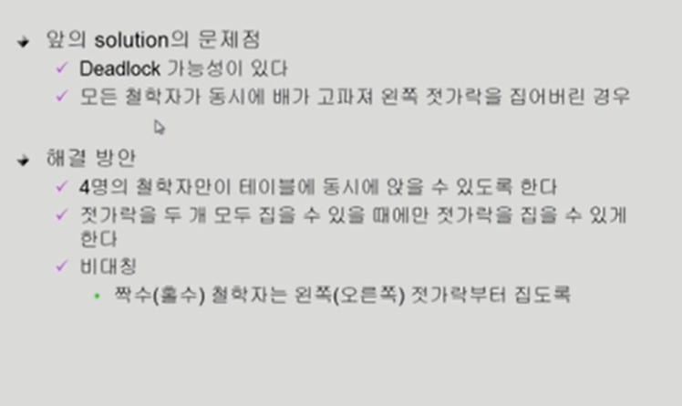

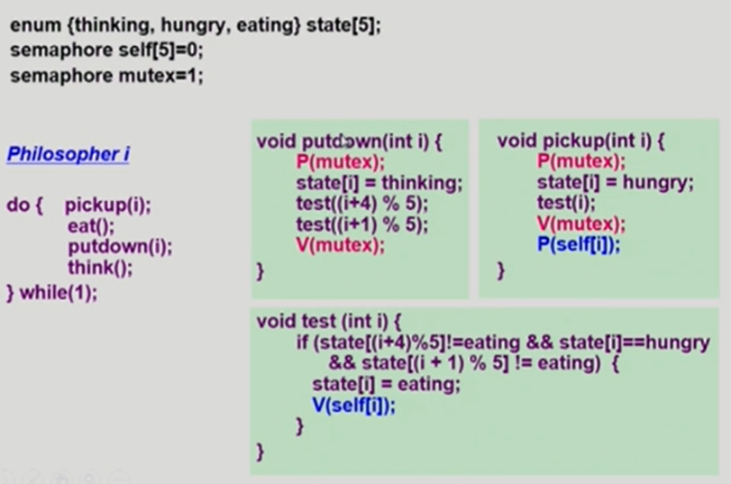


## Monitor

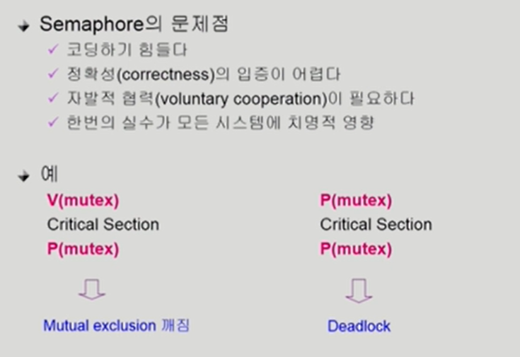

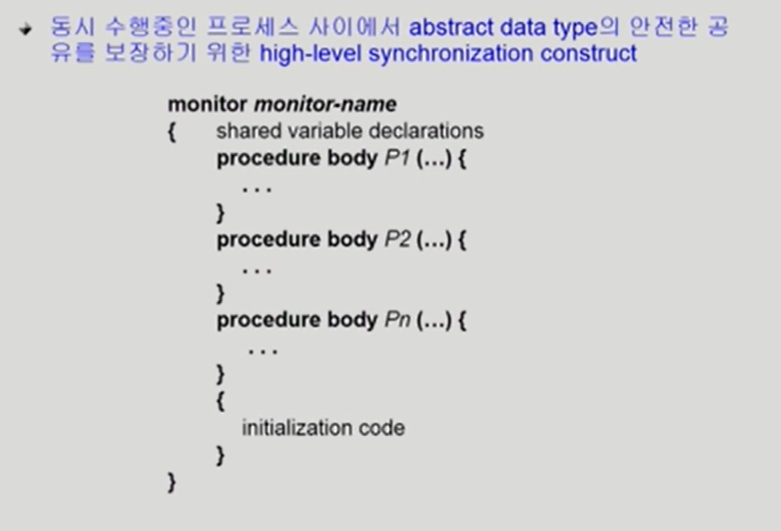

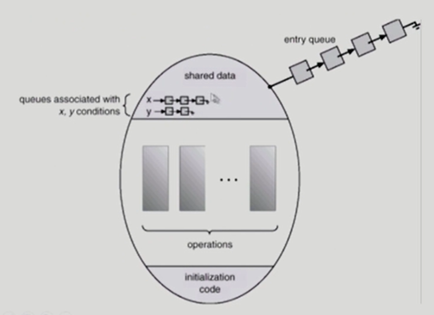

공유자원에 접근할 때 모니터에서 정의한 프로시져로만 접근할 수 있게 하고, 동시에 여러개 실행 안되도록 모니터 내부에서 통제함

-> 세마포랑 다르게 락을 걸 필요가 없음

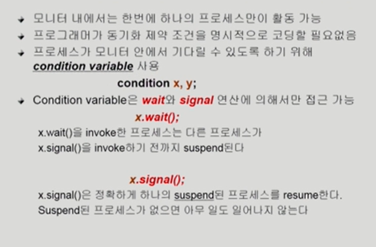

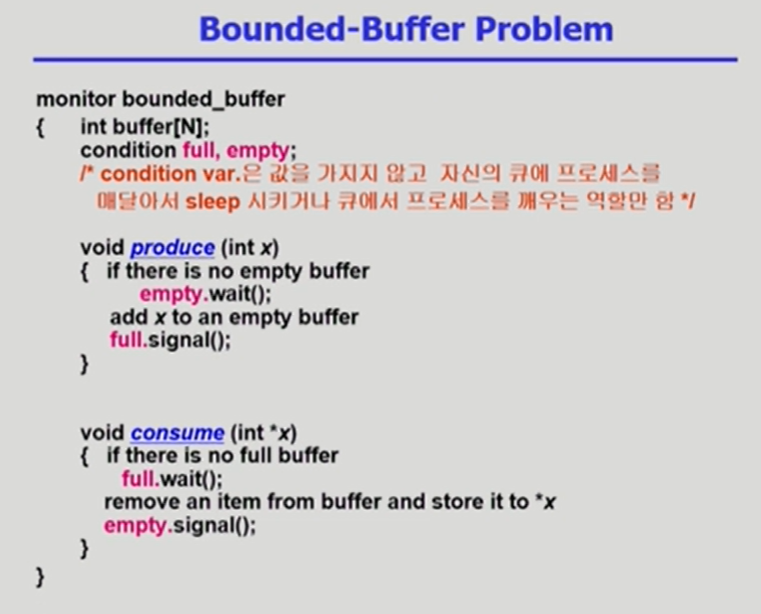


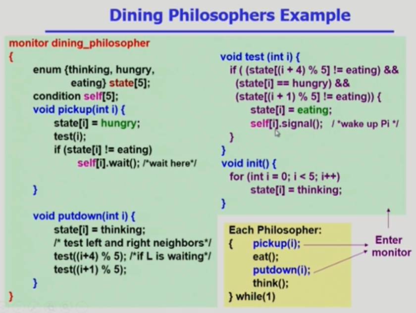

