# 7. Deadlock

[TOC]

## 정의

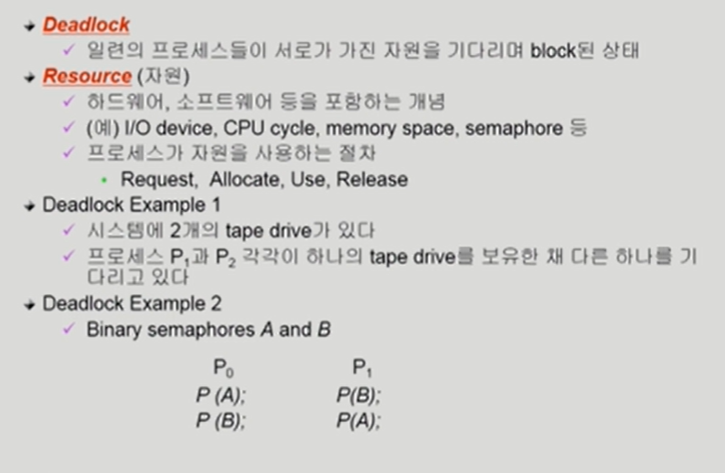

## 데드락 발생 4가지 조건

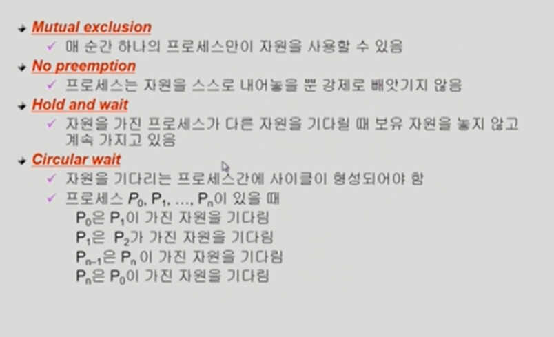

## 자원 할당 그래프

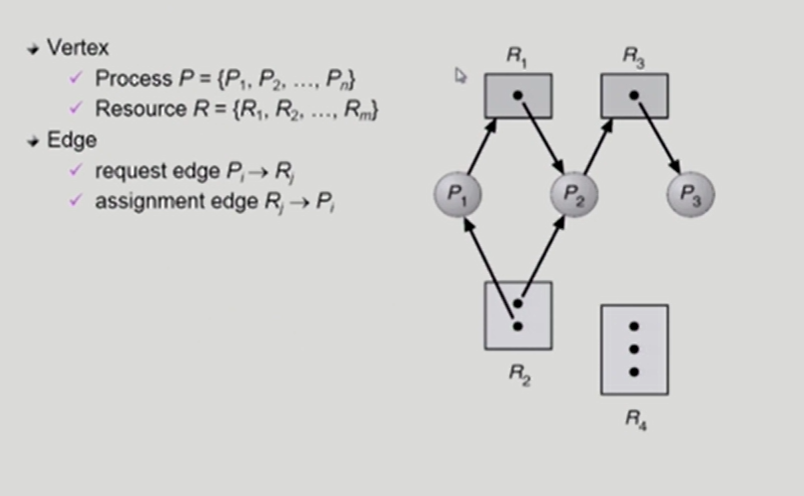

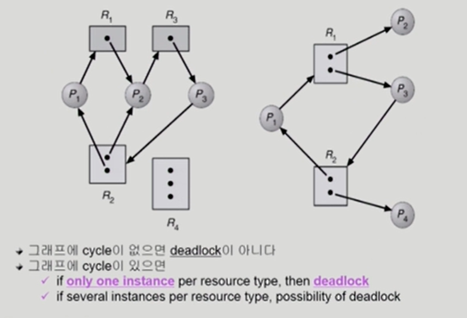

## 데드락의 처리 방법

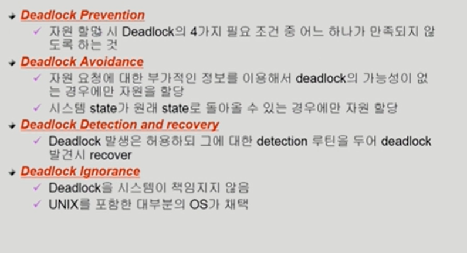

## Deadlock Prevention

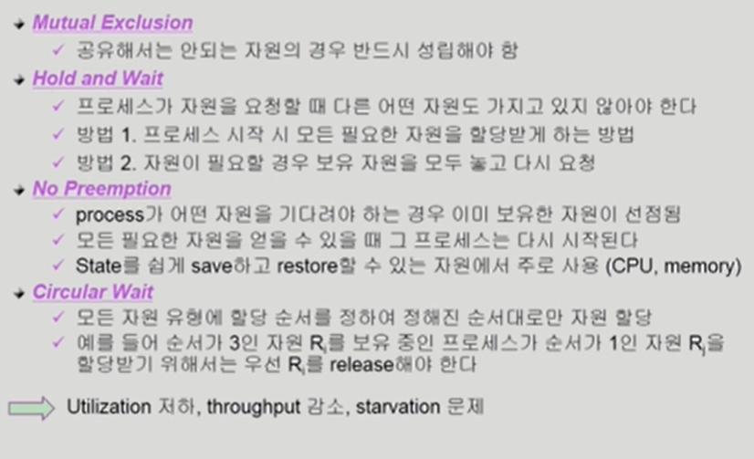

## Deadlock Avoidance

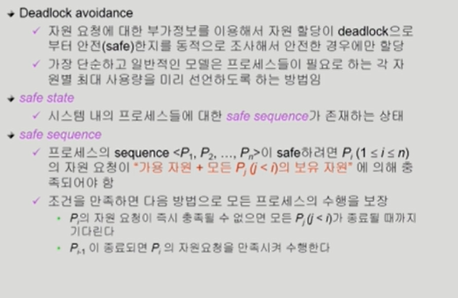

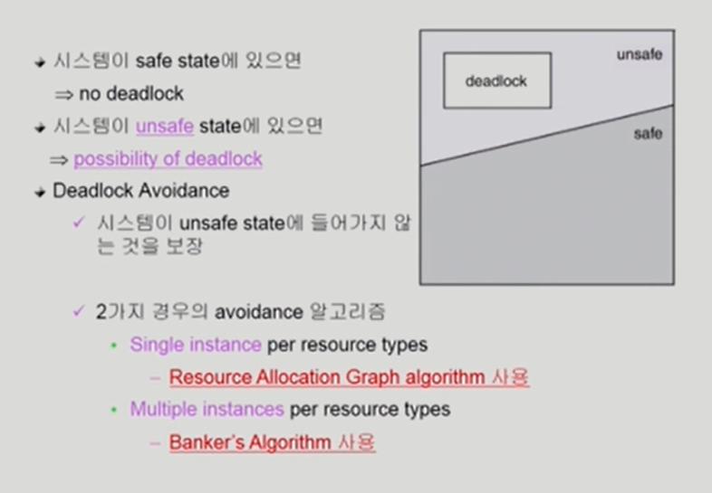

### Resource Allocation Graph algorithm

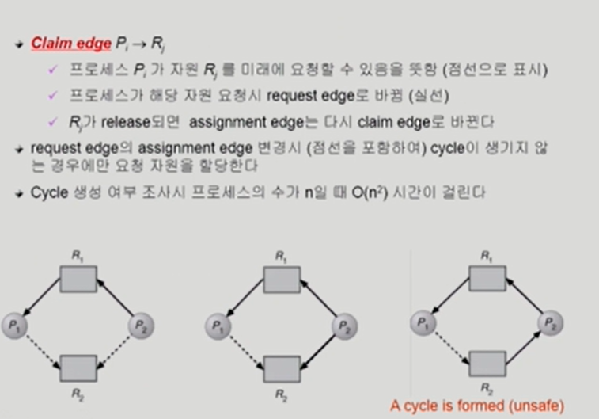

### Banker`s algorithm

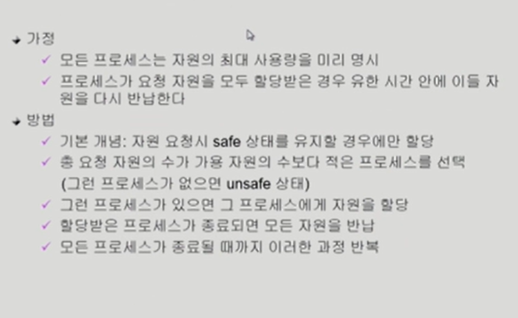

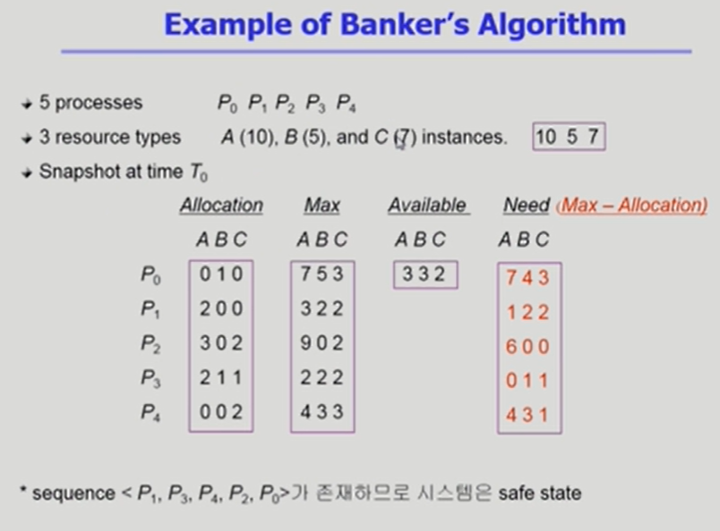

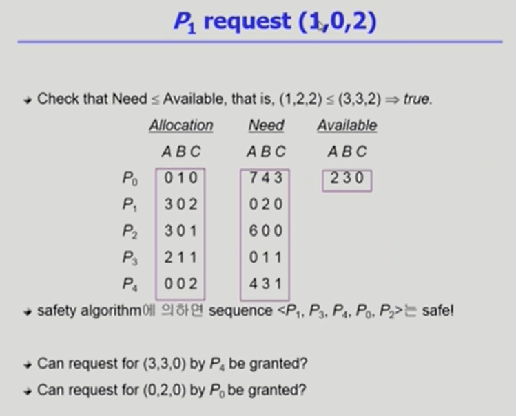

## Deadlock Detection and Recovery

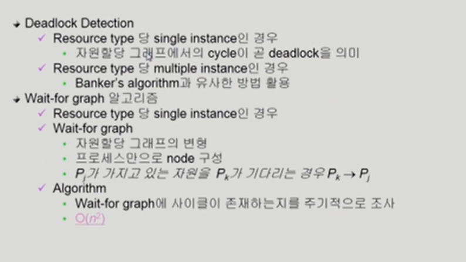

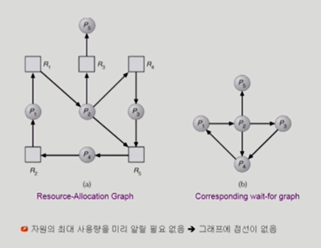

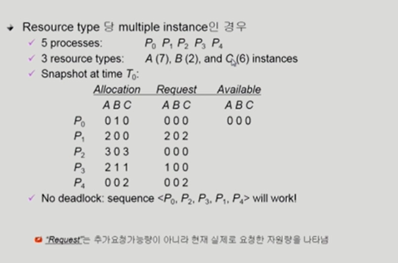

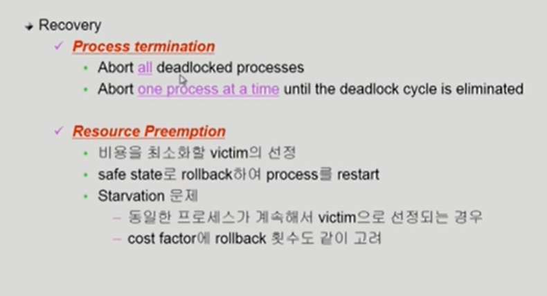

## Deadlock Ignorance

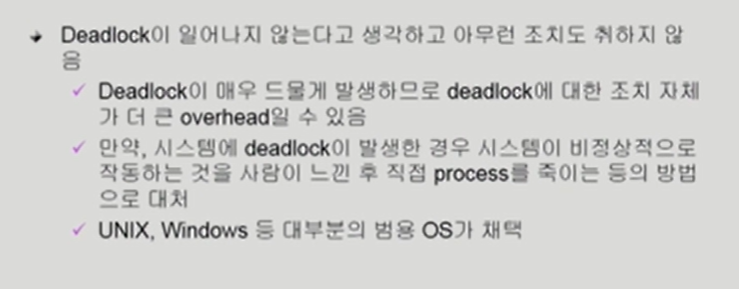

