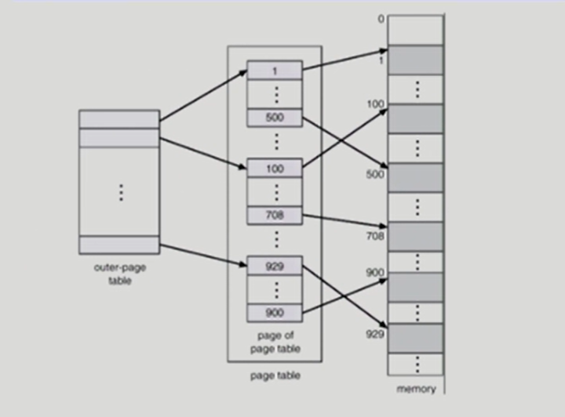
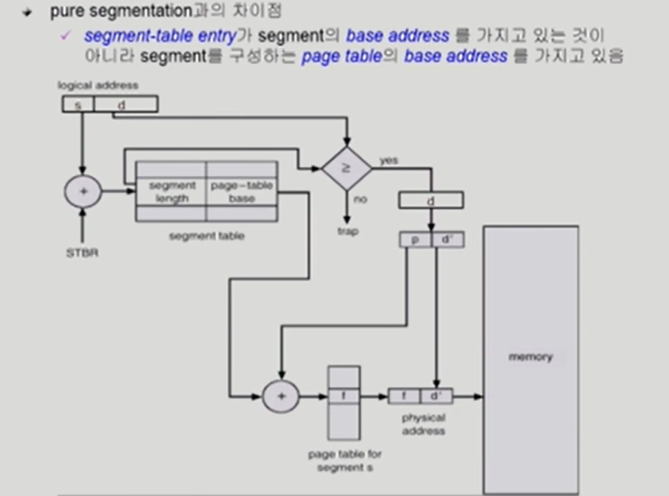

# 8. Memory Management

[TOC]

## Logical vs. Physical Address

## 주소 바인딩

## Memory-Management Unit(MMU)

## Dynamic Relocation

## Hardware Support for Address Translation

## Some Terminologies

## Dynamic Loading

## Overlays

## Swapping

## Dynamic Linking

## Allocation of Physical Memory

## Contiguous Allocation

## Paging

### Paging Example

### Address Translation Architecture

### Implementation of Page Table

### Paging Hardware with TLB

### Associative Register

### Effective Access Time

### 2-Level Page Table

### 2-Level Paging Example

### Address-Translation Scheme

### Multilevel Paging and Performance

## Valid (v) / Invalid (i) Bit in a Page Table

## Memory Protection

## Inverted Page Table

## Shared Page

## Segmentation

## Segmentation Architecture

## Segmentation Hardware

## Segmentation Architecture (Cont.)

## Example of Segmentation

## Segmentation vs Paging

페이징은 테이블을 위한 메모리 낭비가 심하다 페이지가 매우 많기 때문

세그멘테이션은 테이블이 작다 세그먼트가 몇개 안된다

## Segmentation with Paging

