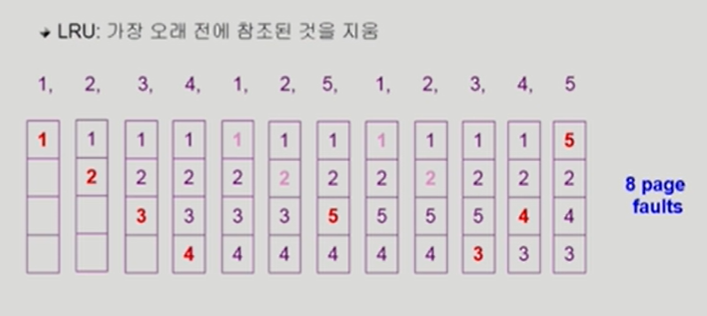
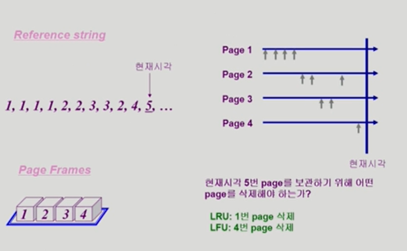

# 9. Virtual Memory

[TOC]

## Demand Paging

## Memory에 없는 Page의 Page Table

## Page Fault

## Steps in Handling a Page Fault

## Performance of Demand Paging

## Free frame이 없는 경우

## Page Replacement

## Optimal Algorithm

## FIFO Algorithm

## LRU Algorithm

## LFU Algorithm

## LRU와 LFU 알고리즘 예제

## LRU와 LFU 알고리즘의 구현

## 다양한 캐슁 환경

## Paging System에서 LRU, LFU 가능한가?

ㄴㄴ, OS는 어떤 페이지의 접근시간, 빈도를 알 수가 없다. 메모리에 이미 올라와 있는 애들은 접근시간, 빈도를 알 수가 없다

메모리에 이미 있는 애들을 참조하면 OS에 CPU가 안넘어오기 때문에

## Clock Algorithm

## Page Frame의 Allocation

## Global vs. Local Replacement

## Thrashing

## Working-Set Model

## Working-Set Algorithm

## PFF(Page-Fault Frequency) Scheme

## Page Size의 결정

