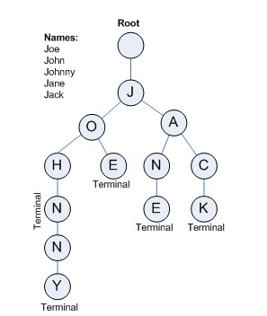

# Trie

> `Trie`는 문자열 검색에 특화된 자료구조이다. 문자열 검색할 때 O(m) (m: 스트링의 길이) 시간 밖에 안걸린다. `Trie`는 `key`, `flag`, `children` 3개의 변수를 가진 node로 구성된 트리이다.
>
> 문자열의 한 글자씩 트리에 저장한다. 이러면, 한 문자열을 검색하거나 할 때 트리를 타고타고 가서 검색하는 시간이 O(m)밖에 안 걸린다. 
>
> 그 다음에 검색어 자동완성 같은데도 쓸 수가 있다. 밑에 쓴 start_with 메쏘드를 활용해서 해당 문자열로 시작하는 친구 중에 검색이 많이 된 애들을 띄우면 된다. 


## Trie 명세서



### Node

멤버 변수

- key : 'T' 이런 식으로 char 하나를 가진다.
- flag : 글자의 끝임을 표시한다.
- children : 해당 Node와 연결된 Node들이다. dict로 만든다.

### Trie

멤버 변수

- head : 트리의 root 노드, 빈 노드로 설정한다.

메쏘드

- insert : 트리에 해당 문자열을 넣는다.
- search : 트리에 해당 문자열 있는지 확인.
- start_with : 트리에 해당 prefix로 시작하는 문자열들 출력.


# Combination

> 조합, DFS로 구현할 수 있다. 부분집합 하는 것이랑 비슷하다.

```python
# N은 전체 애들의 수, r은 몇개를 뽑을지
names = [1,2,3,4,5]
selected = [False for j in range(N)]
def comb(i,cnt): # i는 애들중 몇번째 인지, cnt는 애들의 개수
    
    if i >= N or cnt == r: # N 은 전체 애들의 수
        for j in range(N):
            if selected[j]:
                print(names[j])
        return
    selected[j] = True
    comb(i+1,cnt+1)
    selected[j] = False
    comb(i+1,cnt)
```

- 코테 문제에서 많이 봤다. 