1. 쿠키와 세션
2. 필터로 머하는거
3. render,redirect
4. form, model
5. 왜 auth_user_model? 주관식
6. customusercreationform 이런거
7. static,image,media
8. MTV
9. many to many 필드 이름
10. get_object_or_404 왜 쓰는지?
11. decorator
12. login_required ,require_post 같이 못쓰는거

13. GET,POST 차이
14. template 분리
15. url 분리
16. HTML if 태그
17. redirect(request.GET.get('next') or 'articles:index')
18. admin site 관리할건데 User은 모델이름 

19. media 파일 경로

```django
MEDIA_URL = '/media/'
MEDIA_ROOT = [BASE_DIR/'media']
```


19. on_delete
20. manytomanyfield, related_name 은 역참조할 떄 이름

22. follow할 때 symmetrical = False
23. templates and static - TEMPLATES, STATICFILES_DIRS


----

### 서버 시간을 한국 시간으로 바꾸려면?

>django 서버를 실행하고 첫 페이지에 접속했을 때 터미널에 출력된 서버 시간이 현재
>한국 시간과 다른 시간으로 출력된다. 이를 한국 시간으로 바꾸려면 settings.py의 어떤
>변수에 어떤 값을 할당해야 하는지 작성하시오.

```django
settings.py에서,
USE_TZ = True
TIME_ZONE = 'Asia/Seoul'
```


### urls

>다음은 어떤 django 프로젝트의 urls.py의 모습이다. 주소 ’/ssafy’로 요청이 들어왔을 때
>실행되는 함수가 pages 앱의 views.py 파일 안 ssafy 함수라면, 요청에 응답하기 위해
>빈칸 __(a)__에 추가되어야 할 코드를 작성하시오.


```sh
'ssafy/', views.ssafy
```

### Django Template Language


```sh
(a) menu
```


```sh
(a) forloop.counter
```


```sh
(a) empty
```


```sh
(a) if (b) else
```


```sh
(a) length (b) title
```


```sh
(a) Y년 m월 d일 (D) A h:i
```

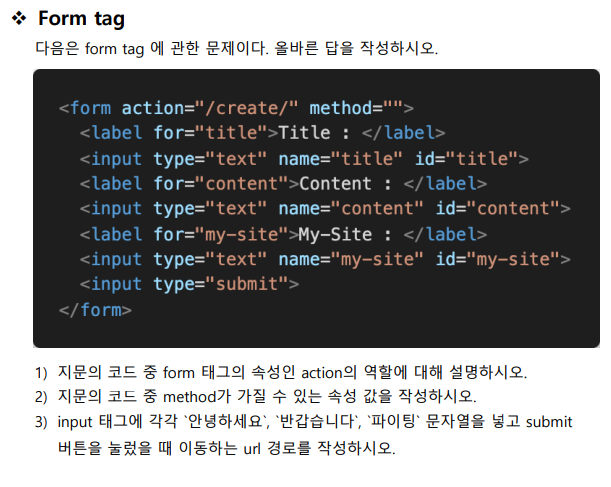

```sh
1) action은 해당 폼을 보낼 곳을 설정하는 역할이다.
2) GET, POST
3) 127.0.0.1:8000/create/?title =안녕하세요&content=반갑습니다&my-site=파이팅
```


### MTV

>Django는 MTV 디자인 패턴으로 이루어진 Web Framework이다. 여기서 MTV는 무엇의
>약자이며 각각 MVC 디자인 패턴과 어떻게 매칭이 되는지 작성하시오.

```sh
M : model - model , 데이터 관리
T: Template - View, 인터페이스(화면)
V: View - Controller, 중간 관리(상호 동작)
```


### URL

> __(a)__는 Django에서 URL 자체를 변수처럼 사용해서 동적으로 주소를 만드는 것을
> 의미한다. __(a)__는 무엇인지 작성하시오.

```sh
variable routing
```


### template

> Django 프로젝트는 render할 template 파일들을 찾을 때, 기본적으로 settings.py에
> 등록된 각 앱 폴더 안의 __(a)__ 폴더 내부를 탐색한다. __(a)__에 들어갈 폴더 이름을
> 작성하시오

```sh
templates
```


### Static web and Dynamic web

> Static web page와 Dynamic web page의 특징을 간단하게 서술하시오.

```sh
static : 서버에 미리 저장된 파일이 그대로 전달되는 웹 페이지

사용자는 고정된 웹 페이지를 보게 됨.

dynamic : 서버에 있는 데이터들을 스크립트에 의해 가공처리한 후 생성되어 전달되는 웹페이지

사용자는 상황,시간,요청에 따라 달라지는 웹 페이지를 보게 됨.
```


### Model 반영하기

> 아래 그림과 같이 Django에서 선언한 Model을 실제 Database에 반영하는 과정을 뜻하
> 는 용어와 이와 관련된 명령어들을 작성하시오.

```sh
makemigrations
migrate
```


### Model 변경사항 저장하기

> 위에서 선언한 Model을 Database에 최종 반영하기 전에 Model의 변경 사항을 저장하
> 고자 한다. 이를 위한 명령어를 수행했을 때 생성되는 파일의 내용을 확인하고, 해당 내
> 용에 대응되는 SQL문을 확인하여 작성하시오.

```sh
SELECT * FROM {항목}
```


### Python Shell

> Django에서 사용 가능한 모듈 및 메서드를 대화식 Python Shell에서 사용하려고 할 때, 
> 어떠한 명령어를 통해 해당 Shell을 실행할 수 있는지 작성하시오.

```sh
python manage.py shell_plus
```


### Django Model Field

> Django에서 Model을 정의할 때 사용할 수 있는 필드 타입을 5가지 이상 작성하시오.

```sh
charField,TextField,DateTimeField,booleanField,binaryField
```


### Django Model

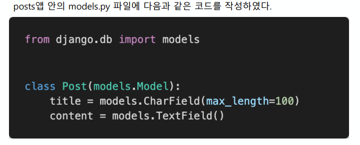

1) models.py를 작성한 후 마이그레이션 작업을 위해 터미널에 작성해야 하는 두 개의
명령어를 작성하시오.

```sh
$ python manage.py makemigrations
$ python manage.py migrate
```


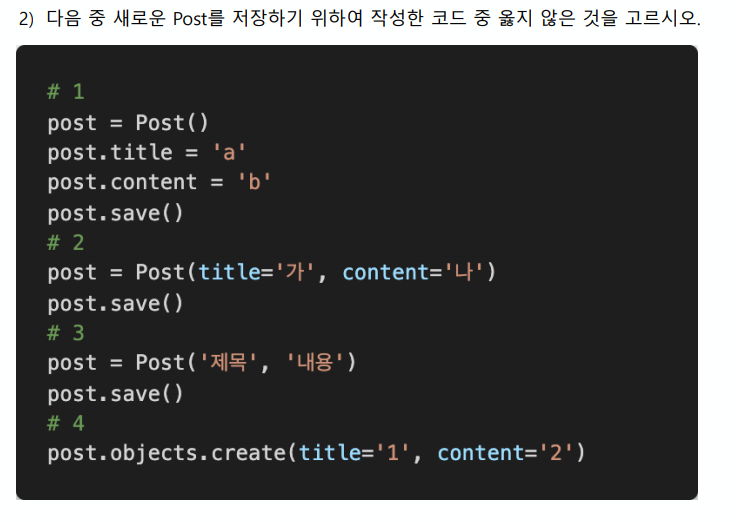

```sh
3
```

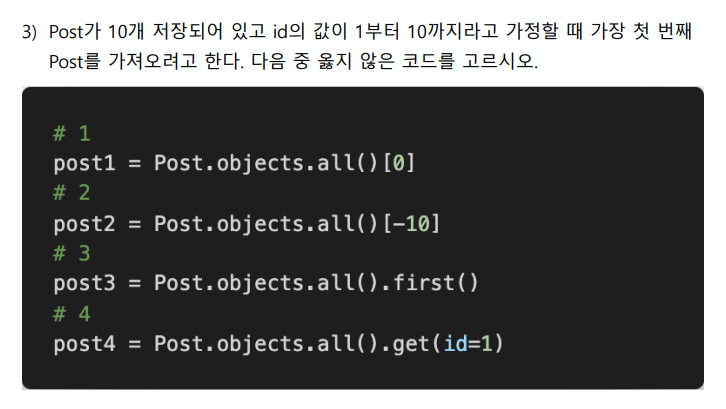

```sh
2
```

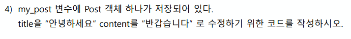

```sh
my_post.title = "안녕하세요"
my_post.title = "반갑습니다"
my_post.save()
```

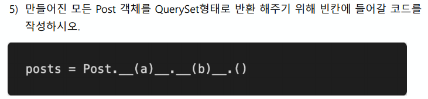

```sh
(a) objects (b) all
```


### Django Model Form

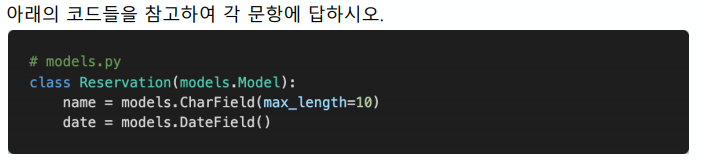

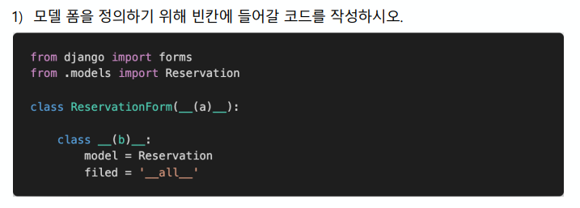

```sh
 (a) forms.ModelForm (b) Meta
```

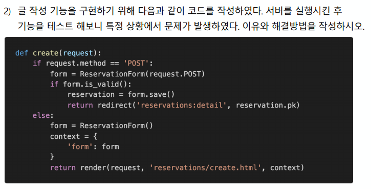

```sh
 method가 POST이고 유효성 검사를 통과하지 못하는 경우 return하질 않는다. context를 선언하는 부분과 return 부분을 else절 밖으로 옮겨야 한다.
```

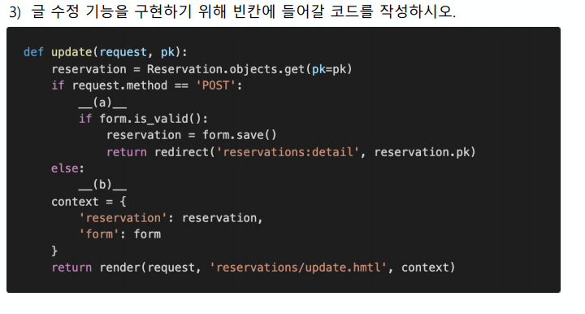

```sh
(a) form = ArticleForm(request.POST, instance=article) (b)  form = ArticleForm(instance=article)
```

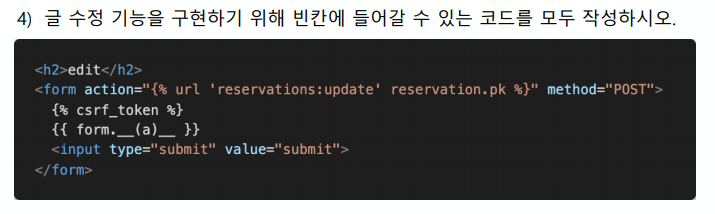

```sh
(a) as_p
```

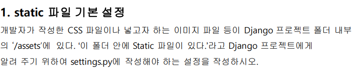

```sh
STATIC_URL = '/static/'
STATICFILES_DIRS = [BASE_DIR / 'static']
```

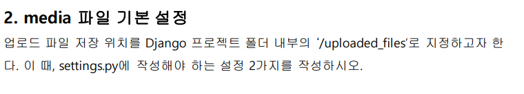

```sh
MEDIA_URL = '/uploaded_files/'
MEDIA_ROOT = BASE_DIR / 'uploaded_files'
```

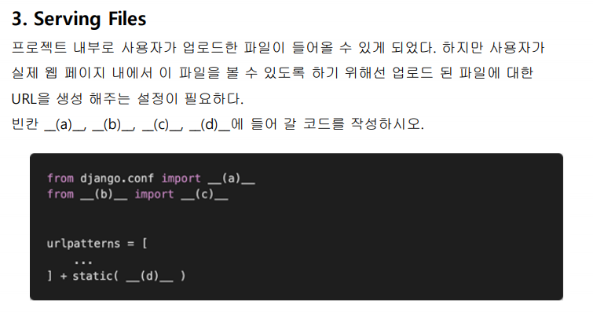

```sh
(a) settings
(b) django.conf.urls.static
(c) static
(d) settings.MEDIA_URL.document_root = settings.MEDIA_ROOT
```

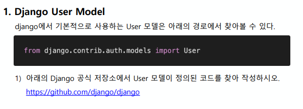

```sh
class User(AbstractUser):
    """
    Users within the Django authentication system are represented by this
    model.
    Username and password are required. Other fields are optional.
    """
    class Meta(AbstractUser.Meta):
        swappable = 'AUTH_USER_MODEL'

```

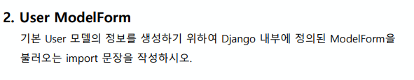

```sh
from django import forms
```

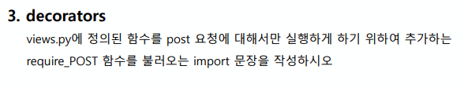

```sh
from django.views.decorators.http import require_POST
```

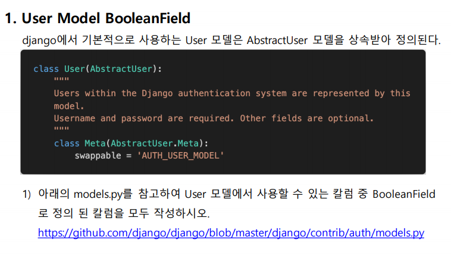

```sh
is_superuser, is_staff, is_active
```

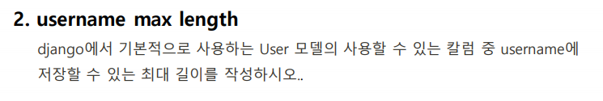

```sh
150
```

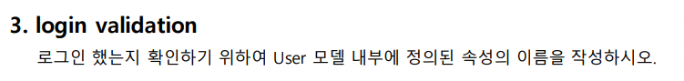

```sh
is_authenticated
```

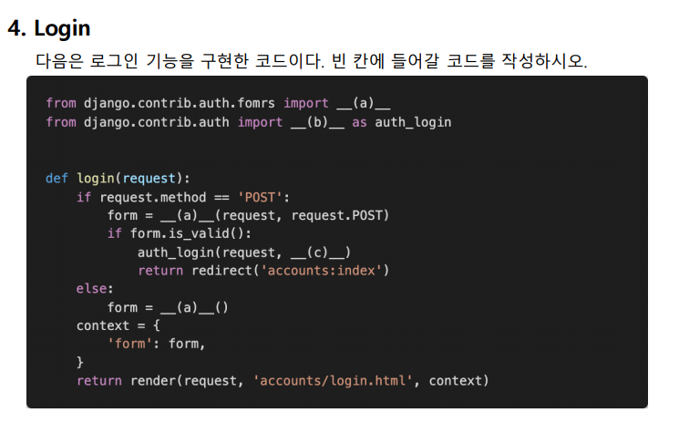

```sh
(a) UserCreationForm, AuthenticationForm
(b) login
```

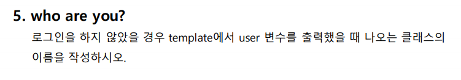

```sh
django.contrib.auth.models.AnonymousUser 클래스
```

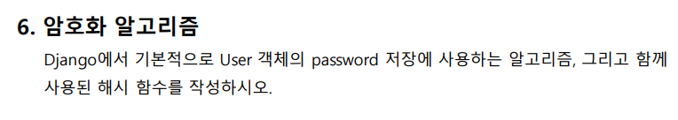

```sh
SHA256
```

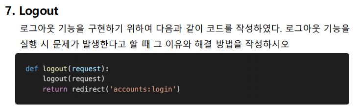

```sh
logout 이름이 겹쳐서 재귀함수로 호출이 된다.
그래서 import할 때 as를 써서 auth_logout으로 불러온 뒤 사용한다.

from django.contrib.auth import logout as auth_logout
# ~~~~

def logout(request):
	auth_logout(request)
	return redirect('accounts:login')
```

