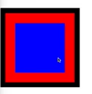

# CSS 중요한거

### - 박스 크기는 기본적으로 컨텐트박스의 크기다. 따라서 거기에 border나 padding을 넣으면 추가적으로 박스가 커진다.



여기서 빨강은 패딩, 검정은 보더


> 만약 보더와 패딩도 사이즈 지정한데에 포함되게 하려면 `box-sizing: border-box` 이렇게 하면 된다.


### - Absolute vs Relative

- Static: position 기본값은 static, top,left 지정해도 변동 없다.

- Relative: 원래자리에서 지정한 top,left,right,bottom값만큼 이동
- Absolute: 원래 있던 자리에서 빠져나와서 주변에 함께 있던 아이템들의 재배치가 일어난다. 근접한 부모중에 기본값이 스태틱이 아닌 부모를 기준으로 포지션을 정한다.

###  

### - sticky와 fixed 차이점

`position: sticky` 만 쓰면 아무 변동이 없다. `top`,`left` 값을 지정하면 부모 기준으로 위치가 정해지고 있던 스크롤링하면 위치가 변동된다.

`fixed`는 뷰포트 안에서 포지션 지정이 일어나기 때문에 부모와 상관없이 화면의 특정 지정 위치에 붙어있다.


### - Centering Trick

> flex박스 아닐 때 어떻게 정렬할까?

`margin-auto`

div는 block레벨이라 한 줄에 하나만 들어감 즉, 그 줄을 자동으로 마진이 채워준다. 그래서 위에 저거를 쓰면 가운데로 간다. 수평적으로만 중간 정렬 가능. 수직은 안돼

`text-align`

텍스트 뿐만 아니라 정렬할 때 많이 쓴다. 블럭 레벨이 아닌 버튼 같은 애들(inline-block)은 이걸로 정렬하면 된다.


-> 위 2개는 수직 정렬은 안됀다.

수직 정렬은 `transform` 사용

`transform: translate(50%, 50%)` 요런 식으로 써서 정가운데 넣을 수 있다.

한줄인 텍스트는 `text-align:center; line-height: (부모 크기)px;` 하면 정가운데로 보낼 수 있다.


### - 반응형 Background

그냥 img로 넣으면 크기 늘이면 반복돼서 나타나는 현상 나옴.

`background-repeat: no-repeat;` 요렇게 하면 반복 안함

`background-position: center;` 요래하면 중간을 보여줘서 잘 나옴

`background-size: cover;` 이거까지 쓰면 반응형 배경처럼 된다.

3개 쓰지말고 

`background: center/cover no-repeat url();` 이렇게 써라


### - Transform

> x,y,z값 움직이고 skew,크기조정 별거 다 된다.

- translate : x,y,z 축 이동
- scale: 크기 조정 `scale(1.2)` 
- rotate: 회전 `rotate(45deg)`
- `transform: translate(100px,100px) scale(2) rotate(46deg)` 이렇게 묶어서 쓰기 가능


### - Transition

부드럽게 요소가 변하도록 할 수 있다.

`transition-property: background-color;`

`transition-duration: 300ms;`

`transition-timing-function: linear;`

`transition: background-color 300ms linear;` 요런식으로 해서 바뀌는 속도를 조절할 수 있다.

`transition: all 300ms ease` 이렇게 간단하게 쓰면 편함

-> 얘는 쫌 더 공부해 놓으면 좋을 듯

cubic-bezier 좀 역동적인 효과 가능


### - CSS properties

> CSS에서는 왜 변수를 사용할까?

css에서 하드코딩 안할라고, 상수를 선언해서 쓴다. custom-properties 사용해서 변수 쓰듯이 할 수 있다.

`--이름;` 이런식으로 정의하면 된다. 아무데서나 정의하고 사용 가능

예제) `--font-size : 32px;`  쓸 때는 

`font-size: var(--font-size);` 이렇게 쓴다. 

이렇게 선언한 변수는 자식 노드에서 쓸 수 있다.

보통은 `:root{ }` 이 안에다가 변수들을 정의해서 어떤 요소에서도 접근할 수 있게 한다.

`:root{--background-color: thistle;}`

@media 쿼리를 쓸 때도 요긴하게 사용 가능

```css
@media 이게 뭔지 모름
```


### - CSS calc()

계산하는 함수 

`margin-left: calc(var(--base-space)*2)` 이런 식으로 사용 가능

