# CS 기본 이론 정리

## 1. 소프트웨어 공학

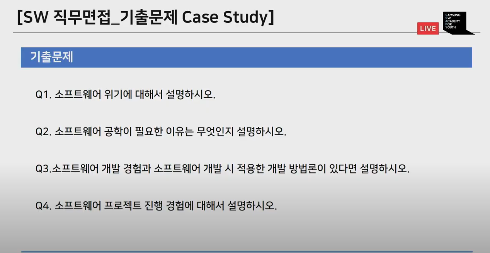

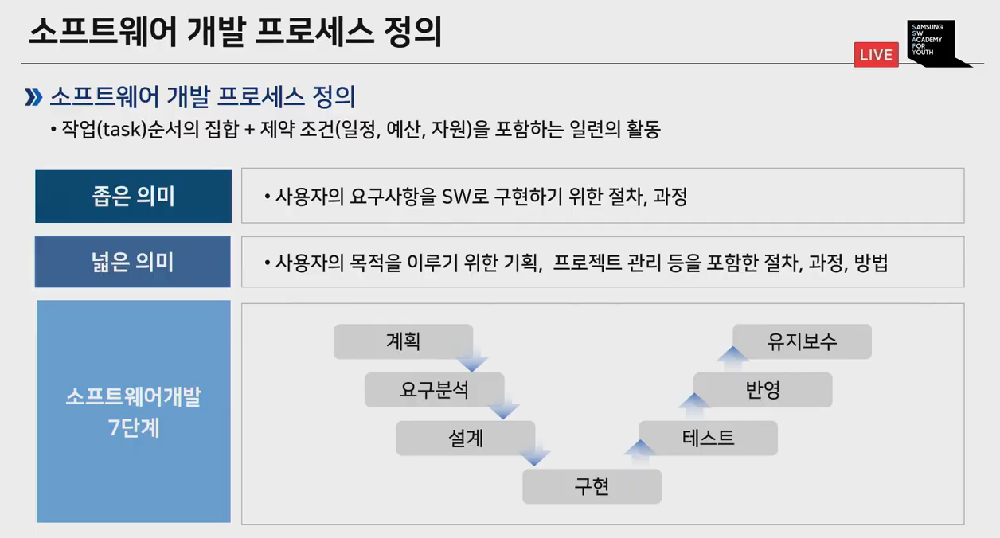

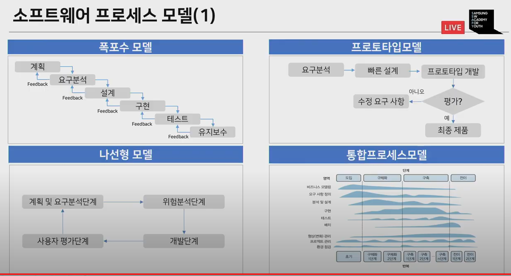

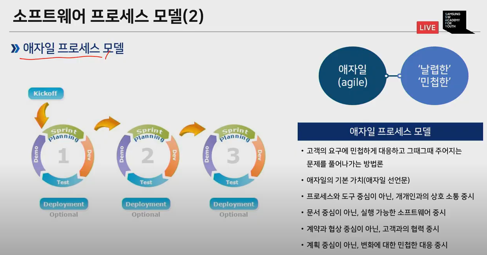

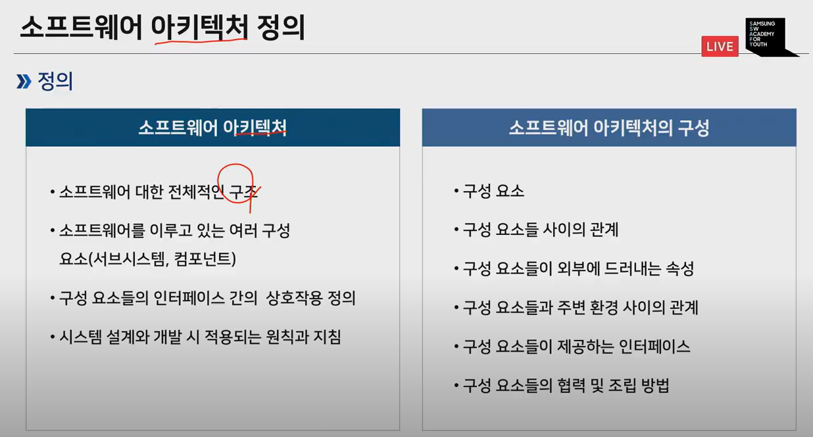

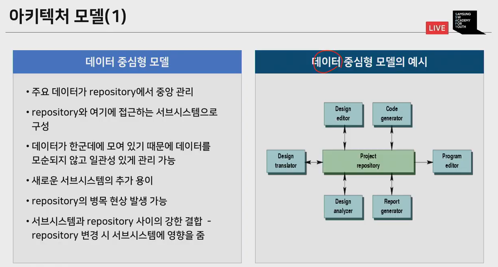

### 아키텍처 모델(2)

>  서버-클라이언트 모델

클라이언트가 정보 요청하면 서버가 제공함.

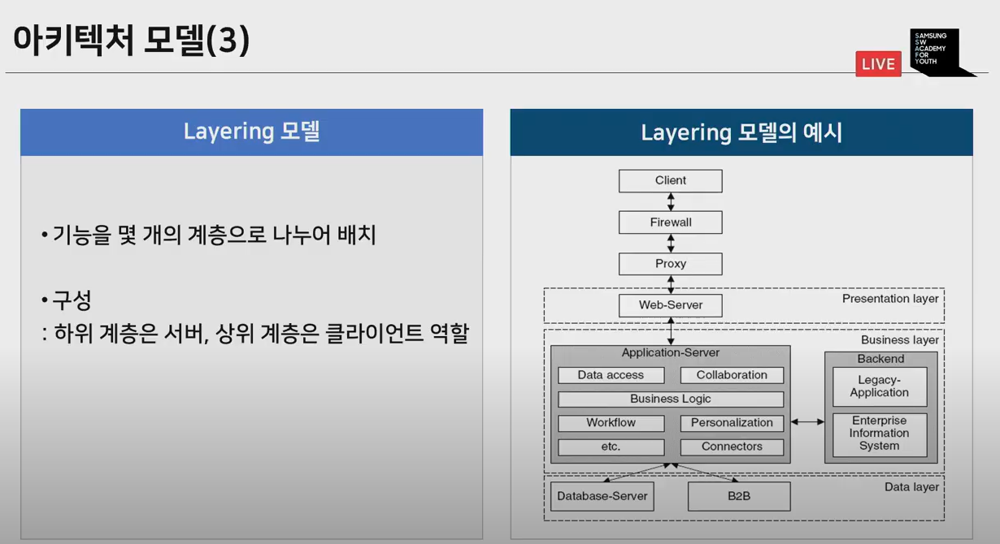

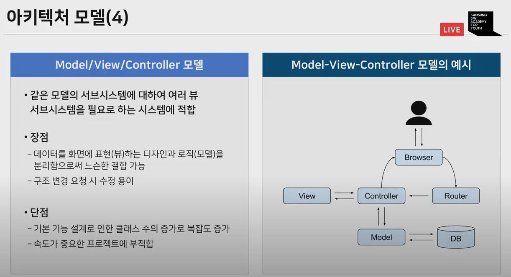

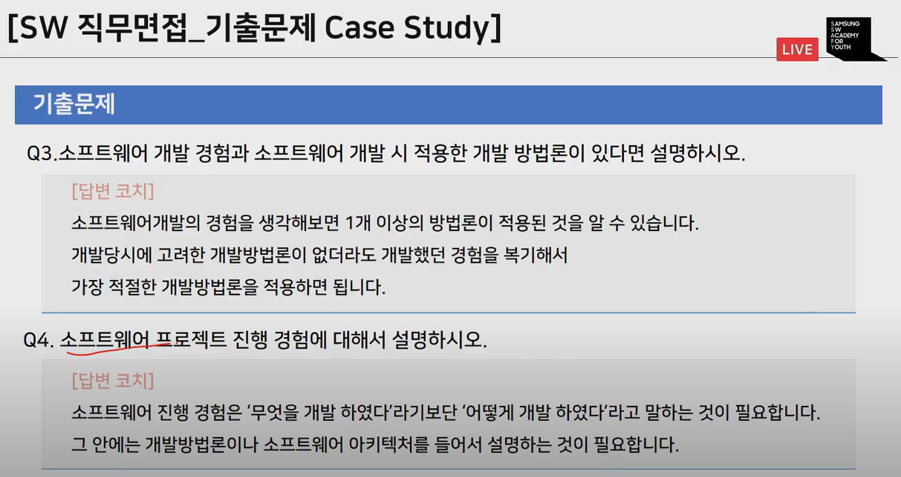

## 2. 프로그래밍

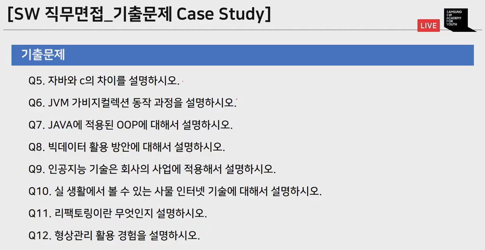

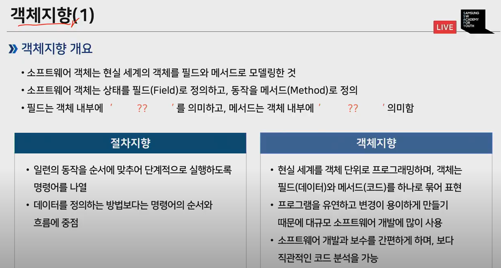

>  객체지향: 현실세계를 그대로 모델링해보자 하는 것.

### 객체지향 주요개념

- 캡슐화 : 필드와 메서드를 하나의 캡슐처럼 포장해서 세부 내용을 외부에서 알 수 없도록 감추는것

- 상속 : 상위 객체를 상속받은 하위 객체가 상위 객체의 메서드와 필드를 사용하는 것

- 다형성 : 대입되는 객체에 따라서 메서드를 다르게 동작하도록 구현하는 기술

  ​			실행 도중 동일한 이름의 다양한 구현체 중에서 메서드를 선택 가능

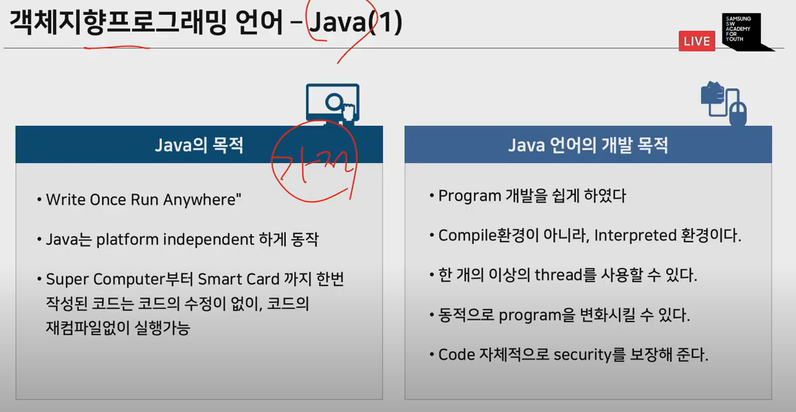

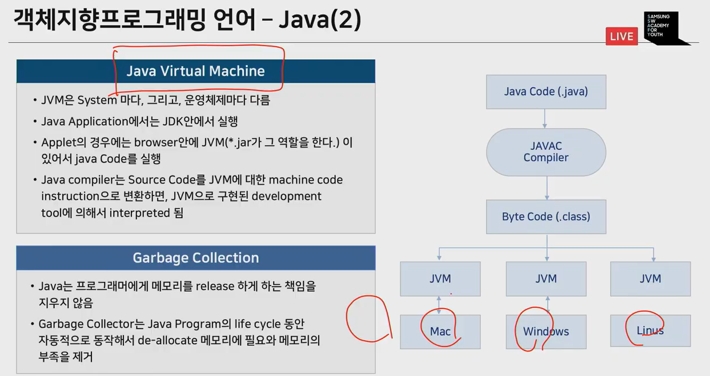

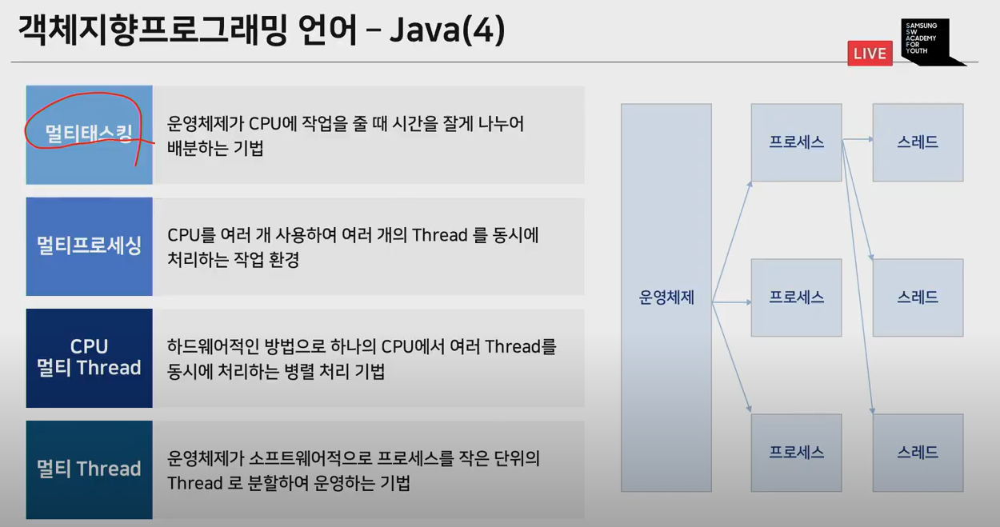