# 22 미리 만나는 카카오 정리

[TOC]

## 영입 프로세스 안내

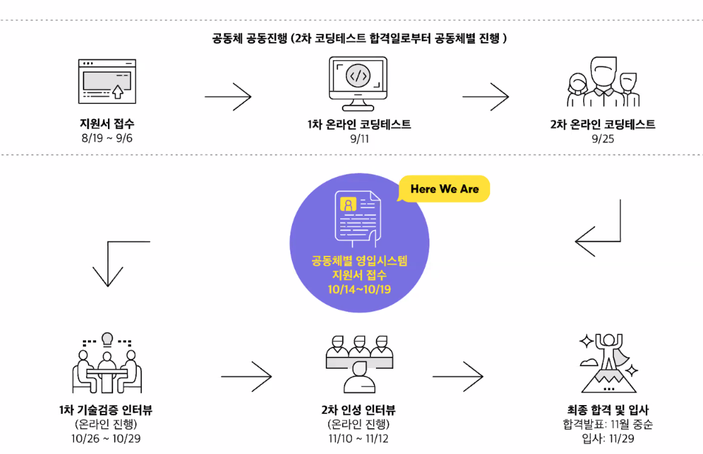

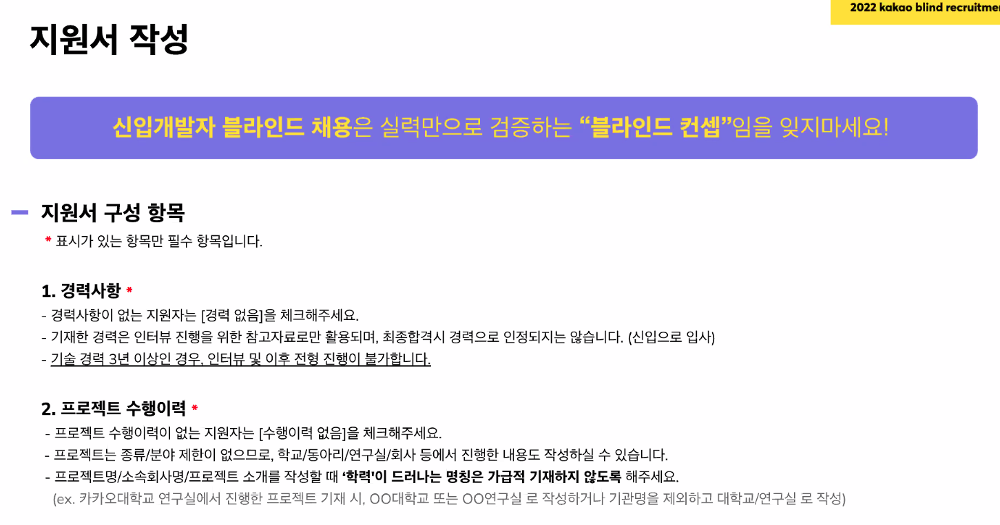

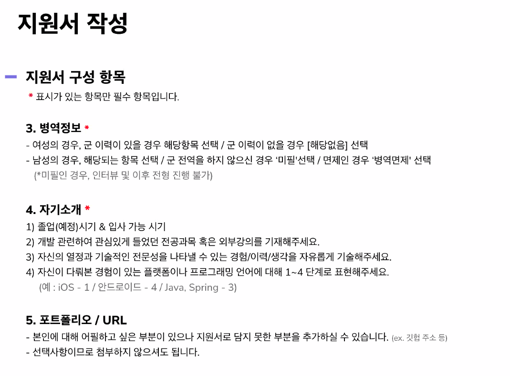

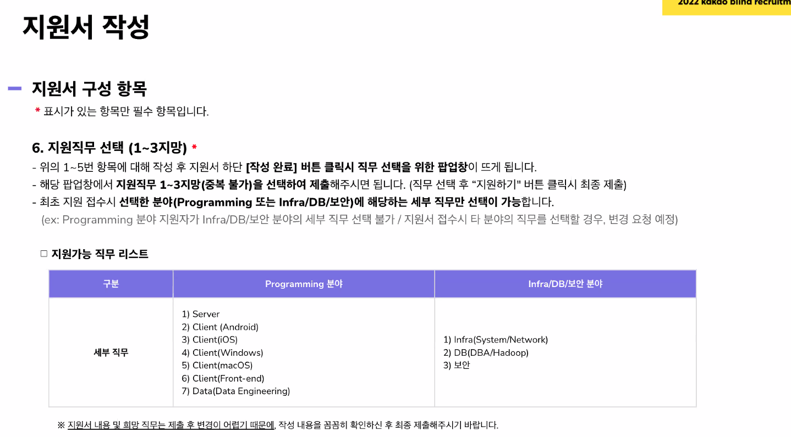

## 면접

직무 보다는 공통 CS 역량, 지원서류 바탕 검증 관련한 인터뷰가 될 것

프로젝트별로 왜 해당 기술을 선택했는지? 해당 기술의 장점? 다른 선택안은 없엇는지?

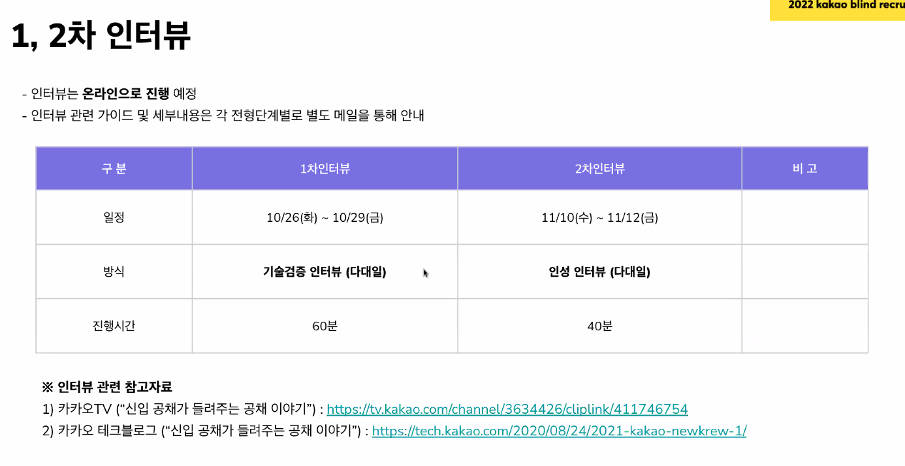

https://tv.kakao.com/channel/3634426/cliplink/411746754

https://tech.kakao.com/2020/08/24/2021-kakao-newkrew-1/

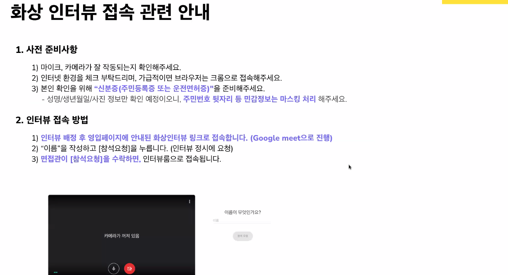

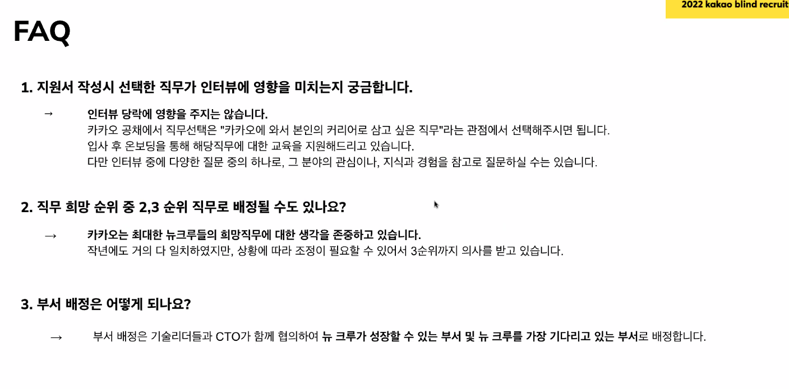

## 프로그래밍 직무

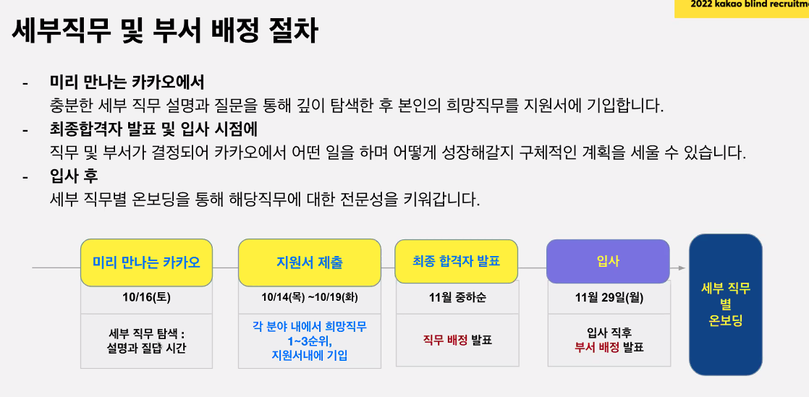

### Server

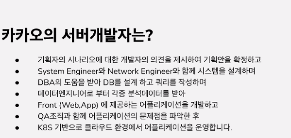

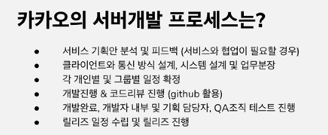

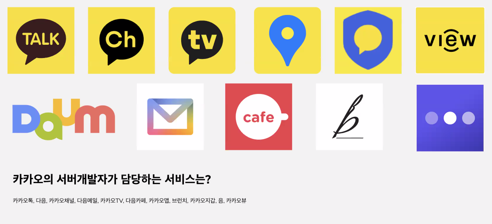

### Client (Front-End)

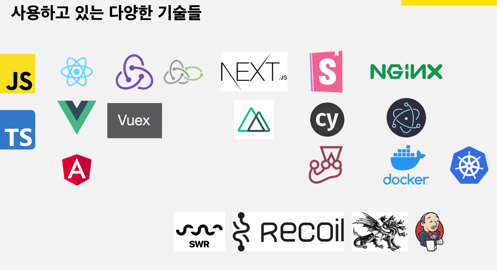

### Client (Android / iOS / Windows / macOS)

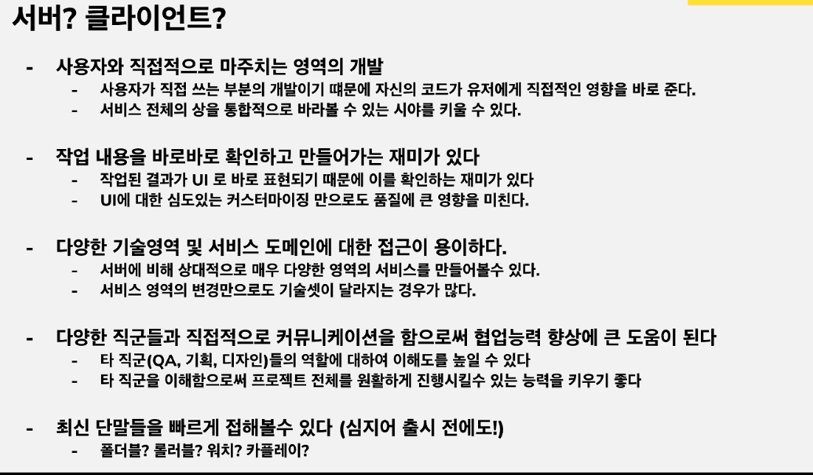

### Data (Data Engineering)

