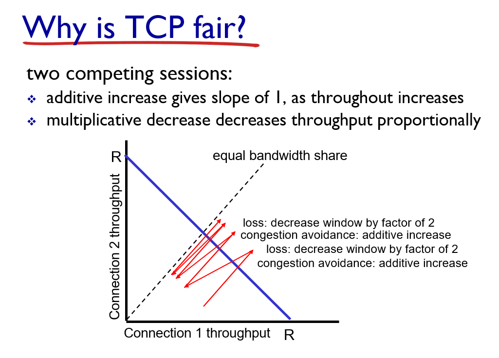

# 네트워크 면접 대비

[TOC]

## OSI 7계층에 대해 설명해주세요.

각 단계의 유지,보수를 용이하게 하기 위해 통신 과정을 단계별로 나눈 것

7) application

사용자가 사용하는 프로그램입니다. ex) 메일, 전자우편 , HTTP, DNS

6) presentation

파일 인코딩, 명령어 포장, 압축, 암호화 하는 계층 ex) SSL, JPEG

5) session

프로세스와 트랜스포트 계층을 연결하는 인터페이스 ex) socket

4) transport

프로세스와 프로세스 간의 논리적 연결,통신을 담당 ex) TCP, UDP

3) network

host와 host간의 통신을 담당 ex) ip, icmp, routing, forwarding

2) link

MAC 주소를 이용해 next hop router로 데이터 전달 , 에러 검출, 재전송, 흐름제어

1) 물리

통신 케이블로 데이터 전송

## 프로토콜 스택에 대해 설명해주세요

5) Application

사용자가 통신 위해 사용하는 프로그램 (http, dns)

사이에  socket

4) Transport

process to process 통신 (tcp,udp)

3) network

host to host 통신 (ip,icmp, routing,forwarding)

2) link

담 라우터로 연결(이더넷, MAC 주소)

1) physical

실제 물리 케이블

## 패킷 스위칭과 서킷 스위칭

1) 패킷스위칭

어플리케이션 계층의 메시지를 패킷으로 분해해서 보냄, 라우터에서 라우팅해서 다음 라우터로 보내고 이 과정 반복

서킷스위칭에 비해 많은 유저들이 네트워크를 사용하게 함, 간단함 (연결 만들 필요 없음)

2) 서킷스위칭

통신 이전 연결 수립, 데이터 주고 받음

주파수 구간으로 분할하거나 시간 간격으로 분할

## 패킷 손실과 딜레이는 어떻게 발생?

라우터에 패킷이 도착하는 속도가 라우터가 패킷을 뽑아내주는 속도보다 빠르면 패킷은 라우터의 버퍼에서 대기를 하는데 버퍼가 넘치면서 손실이 발생

딜레이는 프로세싱하는 과정(에러 체크,아웃풋 링크 결정), 큐(라우터 버퍼)에서 기다리는 과정, 패킷을 링크에 싣는 과정(), 패킷이 물리적 선을 타고 이동하는 과정 때문에 생깁니다.

## Throughput

단위시간당 sender에서 receiver로 전달되는 데이터의 양

bottleneck link에 의해 결정된다 bandwidth가 젤 작은 link

## Socket

어플리케이션과 트랜스포트 계층을 연결하는 문,인터페이스 역할입니다. 프로세스들은 메시지를 소켓으로 보내고 받습니다. 

소켓에 포트 번호를 바인딩해서 프로세스들을 구분합니다.

## HTTP

HyperText Transfer Protocol, 인터넷 통신을 위해 사용되는 프로토콜

Client가 URI를 통해 Request를 보내면, Server가 해당 Request를 받아 처리하여 Client에게 Response함

Transport 계층 프로토콜로 TCP를 사용함

상태가 없습니다. (서버는 이전 Client 요청에 관한 정보를 저장하지 않음)

persistent 응답 주고받고 연결 안끊음, non-persistent tcp 연결 끊음

연결 보통 유지안하기 때문에 리소스 낭비 줄어듬

## HTTP GET과 POST 차이

1) GET

request의 header의 url ?뒤에 데이터가 붙어 전송, url 공간의 크기가 한정적이라 싣을 수 있는 데이터의 크기가 작다. 데이터가 url에 노출된다

서버의 데이터를 조회할 때 사용

브라우저에서 caching 가능

2) POST

request의 body에 데이터가 담겨서 전송

서버의 데이터를 추가,변경할 때 사용

## HTTP와 HTTPS

HTTP는 텍스트 교환인데 중간에서 누가 가로채면 내용이 노출되는 보안적 문제, 완전성을 증명할 수 없어 변조 될수 도 있는 문제가 존재

이를 해결하는 프로토콜이 HTTPS, 소켓 부분을 SSL라는 프로토콜로 대체함

## SSL

보안을 위해 내용을 암호화함 CA라 불리는 제 3자를 활용해 인증을 함

인증서 만드는 과정

1. 서버는 공개키와 개인키 만듬
2. CA에 인증서 생성 요청
3. CA는 서버의 공개키, 암호화 방법을 담은 인증서 만들고 해당 CA의 개인키로 암호화하여 서버에 제공
4. 클라이언트는 SSL로 암호화된 페이지(https://)를 요청시 서버는 인증서를 전송

클라이언트와 서버 통신

1. 클라이언트가 페이지 요청
2. 서버는 클라이언트에 인증서 전송
3. 인증서가 신용있는지 판단. 브라우저는 CA 리스트와 CA 공개키 가지고 있음. 공개키 활용해 인증서가 복호화 가능 시 신뢰할만하다 판단
4. 클라이언트는 cA의 공개키 이용해 인증서 복호화, 서버의 공개키 획득
5. 공개키 사용해 랜덤 대칭 암호화키, 데이터 등을 암호화해 서버로 전송
6. 서버는 자신의 개인키를 이용해 복호화, 랜덤 대칭 암호화키, 데이터 등을 획득
7. 서버는 랜덤 대칭 암호화 키로 클라이언트 요청에 대한 응답을 암호화해 전송
8. 클라이언트는 랜덤 대칭 암호화키를 이용해 복호화하고 데이터를 이용

## 쿠키

쿠키: 서버에서 유저의 상태,정보를 받아와 클라이언트의 브라우저가 지정하는 메모리 or 하드디스크에 저장하는 것

인증,장바구니,로그인 처리 등에서 사용할 수 있다

동작

1) http response에 쿠키 헤더 담겨서 옴

2) 그 쿠키를 클라이언트에 저장함

3) 그 쿠키를 리퀘스트 헤더에 담아서 사용 

## 세션

첫 연결이후 통신 마칠 때까지 서버의 메모리에 유저 상태를 저장

요청오면 서버에서 응답으로 set-cookie값에  session-id를 발행

session-id는 서버와 클라이언트에 저장.

그 다음 요청에 쿠키 잇으면 쿠키에 담겨잇는 session-id를 확인해서 활용

## Web caches

서버까지 요청을 보내는 것은 응답시간이 길기 때문에 줄이기 위해서 서버와 클라이언트 중간에 브라우저 or 중간 네트워크상에 proxy server(ISP등)를 하나 둬서 거기에 정보들을 임시저장합니다.

그래서 요청 왓을 때 캐시에 잇는 정보면 바로 응답하고 아니면 서버에서 받아와서 응답

장점: 응답시간 감소, 네트워크 트래픽 감소, 성능 안좋은 서버도 컨텐츠 잘 전달할 수 있게 함

문제점: 만약 캐시에 저장된 애들이 서버에서 변경되었다면 이를 반영못하고 잘못된 정보를 제공할 수 있음

해결책: Conditional get 

캐시는 요청 받으면 얘가 자기가 가지고 있는 날짜 이후로 업데이트 되었는지 확인하는 요청을 서버에 보냄. 서버는 업뎃 안댓으면 상태로 304와 아무것도 안담아 보내고

업뎃 댓으면 바뀐 애를 보냄

## DNS

url 입력햇을 때 이 url의 실제 ip주소를 확인하기 위해 사용, 부하 분배에도 사용 

계층적인 구조를 사용, 중앙집중형으로 사용하지 않는 이유는 거기서 오류나면 클나고 트래픽도 엄청 커지고 유지하기 힘들기 때문

root(com,kr 이런애들 tld알려줌), tld(com 전체 담당, yahoo.com 담당 dns로 보냄), authroitative dns(실제 주소 알려줌), local dns(첨에 host가 얘한테 물어봄 , 캐싱도 함)

## transport layer

process간 통신

sender에서 socket들로부터 오는 데이터들 받아서 뽑아줌 (multiplex)

receiver에서 헤더인포를 활용해 받은 segments들을 알맞은 socket에 전달(demultiplex)

어떻게? 헤더 인포에 dest port 적힘 

## TCP

연결 수립, 1sender 1receiver

신뢰성 있는 통신, 양방향 통신, 흐름제어(flow control), 혼잡제어(congestion control)

헤더에 ack num, seq num, rwnd 등 담아서 udp보다 헤더가 큼

### 동작

세그먼트 보내고 타이머 안켜있느면 킴 (타이머는 ack 못받은 젤 오래된 segment를 위한 것)

타임아웃 발생시 세그먼트 재전송

ack 못받은애 있으면 timer 다시 켬

ack 받으면 받앗음 기록하고 unacked있으면 timer 다시켜

### fast retransmit

타이머 시간이 상대적으로 길어서 손실패킷 다시보내는데 시간 오래걸릴수도 잇음 -> 똑같은 것에 대한 ack 3개 오면 즉시 unacked 중에 seq # 젤 작은거 다시 보냄

### flow control(흐름제어)

receiver 측 버퍼가 넘치지 않게 receiver가 sender에 rwnd(free buffer space) 알려줌(tcp header에 담음)

sender는 unacked(in -flight) data가 rwnd를 초과하지 않게 조절하면서 보냄

버퍼가 넘치지 않음

### congestion control(혼잡제어)

혼잡: 네트워크에 너무 많은 데이터가 운반되어서 긴 딜레이, 손실이 발생하는 것

1) aimd (additive increase, multiplicative decrease)

sender는 손실이 발생할 때까지 매 RTT마다 cwnd 1 MSS씩 증가시킴

손실 발생시 반으로 줄임

손실 어케암? timeout or 3 duplicate acks

lastbytesent - lastbyteacked <= cwnd

쓰루풋은 보통 3W(손실 발생 window size)/4RTT

2) slow start

sender는 손실이 발생할 때까지 매 ack받을 때마다 cwnd 1 MSS 씪 증가 (매 RTT마다 2배)

손실 발생시 1로 줄임

ssthresh는 손실 발생시 cwnd의 반

ssthresh까지는 매 ack마다 cwnd 1MSS 증가

ssthresh 넘으면 매 RTT마다 cwnd 1MSS 증가

cwnd가 ssthresh를 넘으면 slow start

### 신뢰성있는 통신

pipelined segments, cumulative acks, single retransmission timer

1) segment 헤더의 checksum을 활용해 오류 검출, 오류 발생하면 NACK 보냄, 잘받으면 Ack, Nack 받으면 다시 전송

2) 중간에 손실 발생한 것은 duplicate ack, time out을 통해 다시 전송

3) accumulative ack을 활용해 duplicate ack 동작하게함

순서 맞는 segment받으면 다음거 받을 번호 포함시켜서 ack을 보냄

순서 틀리면 원래 받아야하는 애 번호 포함시켜 ack 보냄

순서 틀린게 3개오면 duplicate ack 3개 오기때문에 손실 발생햇다 판단하고 해당 데이터 재전송

### 연결 수립 (3-way handshaking)

1)client가 syn 보냄

2)server는 syn 받고 synack 보냄,client는 synack 받으면 연결 수립하고 ack 보냄

3)server는 ack받으면 연결 수립

왜 2-way 아닌 3-way?

연결하자고 syn 보내고 synack이 좀 늦어서 syn 다시 보낼 경우 이미 이전 syn을 통해 연결하고 통신 끝남.

그 다음 syn을 받은 서버가 연결 수립을 하면 서버만 연결 수립하는 경우 생김 -> 리소스 낭비

### 연결 해제 (4-way handshaking)

1)client가 FIN 보냄

2)서버가 Ack 보냄

3) 보낼거 다 보내고 FIN 보냄

4) Client는 받고 Ack보내는데 연결을 종료하진 않음 2*max segment lifetime시간 기다리고 종료

왜 바로 안끌까? 

서버의 FIN메시지보다 늦게 도착하는 애들이 있을 수 있기 때문 데이터 유실 피하기 위해

### TCP의 장점: Fair함

aimd방식으로 혼잡제어할 시 2개의 쓰루풋은 기울기 1로 증가함 혼잡발생(loss발생)시 반토막

쓰루풋 2개 비슷해짐 계속 하다보면

## UDP

User Datagram Protocol

손실되고 순서 이런거 상관 안함, 연결 수립 필요 없음, 빠르다

스트리밍, 겜에 사용

신뢰성통신할라면 앱레벨에서 조정해야돼

헤더에 소스포트, 목적지 포트, length, checksum만 담김

헤더 사이즈 작고 혼잡제어 없어서 빨름

## network 계층 

sender: segment들을 datagram으로 포장함

receiver: segment들을 트랜스포트 계층으로 보냄

핵심 기능 2가지

forwarding:라우터에서 받은 패킷을 적절한 output으로 보내는거, routing : 경로를 계산해 포워딩 테이블 만듬

보내는 방식엔 2가지

datagram connectionless

virtual-circuit connection 

### Virtual circuits

데이타 보내기전 call setup

각 패킷 VC id가짐

매 라우터 상태 저장

요새 인터넷에 안씀

### Datagram

no call setup

state 저장 x

패킷은 forward됨 dest host addr로

Longest prefix matching 포워드 테이블에서 prefix가 젤 긴거의 link interface로 감

### router

라우팅,포워딩, 버퍼잇어서 것다가 패킷 담아놈

### ip

ip 주소: subnet 주소 + host 주소

서브넷: 라우터 없이 연결되 있는 작은 네트워크

ip주소는 어떻게 얻을까?

DHCP - Dynamic Host Configuration Protocol 동적으로 서버에서 얻어옴

host가 네트워크에 접속할 때 동적으로 (정해져 있지 않음) IP 주소 얻음

주소 재사용 가능, 주소의 효율적 활용 가능

IP 주소만 받는게 아니고 DNS 서버 IP주소, first-hop 라우터 주소도 받음

### NAT

network address translation

지역 네트워크 떠나는 애는 다 NAT source ip 공용 IP 하나 가짐, 로컬 네트워크 IP를 변환함

그리고 테이블에 저장해놓음 포트랑 매핑해서

 장점: 지역 네트워크가 IP 주소 1개만 써서 한정적 IP 주소 잘 활용할 수 있게함

단점: client가 지역네트워크의 서버에 연결하고 싶을떄 , 그 주소를 알 수가 없음.. -> 서버가 있으면 서버가 지 주소를 광고함, 오버헤드 : 주소변환

### ICMP

internet control message protocol

오류 발생시 알림, 메시지 보내기

### IPv6

32bit -> 128 bit

주소공간 부족해서 늘림

헤더 포맷 간소화해서 프로세싱(checksum 없앰),포워딩 빠르게, 헤더에 우선순위 추가 -> QoS(우선순위에 맞게 데이터 전송) 가능하게

##  대칭키,공개키

대칭키

암호화,복호화에 같은 암호키 사용

동일한 키 사용해 빠름

대칭키 전달 과정에서 해킹 위험

공개키

암호화와 복호화에 사용하는 키가 다름

자신이 갖고있는 고유한 암호화키(비밀키)로만 복호화 할 수 있는 암호키(공개키)를 대중에 공개키

암호화,복호화가 매우 복잡함

## Blocking non-Blocking

blocking 일 시키고 걔 끝날떄까지 암것도못함

non-blocking 일 시키고 내 할일함

## WEB에 naver.com 쳤을 때 일어나는것

naver.com ip주소 알아야함 DNS 서버에 요청해서 ip주소 알아옴

HTTP로 naver.com 정보 받아와야함 메시지 구성하고 소켓으로 transport로 내보냄

TCP로 보냄 연결 수립하고 network로 내보냄 

ip주소 붙이고 link 계층으로 보냄 router타고 쭉감 도착지가면 헤더 쭉 때네면서 위로 올림 받고 응답 똑같은 방식으로 보냄 받으면 브라우저에 네이버 뜸