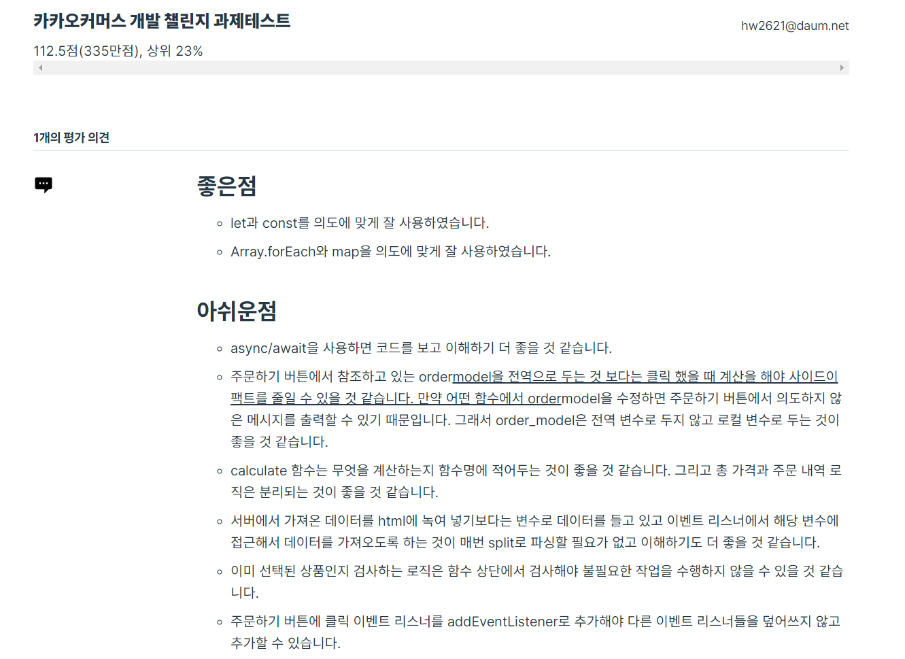
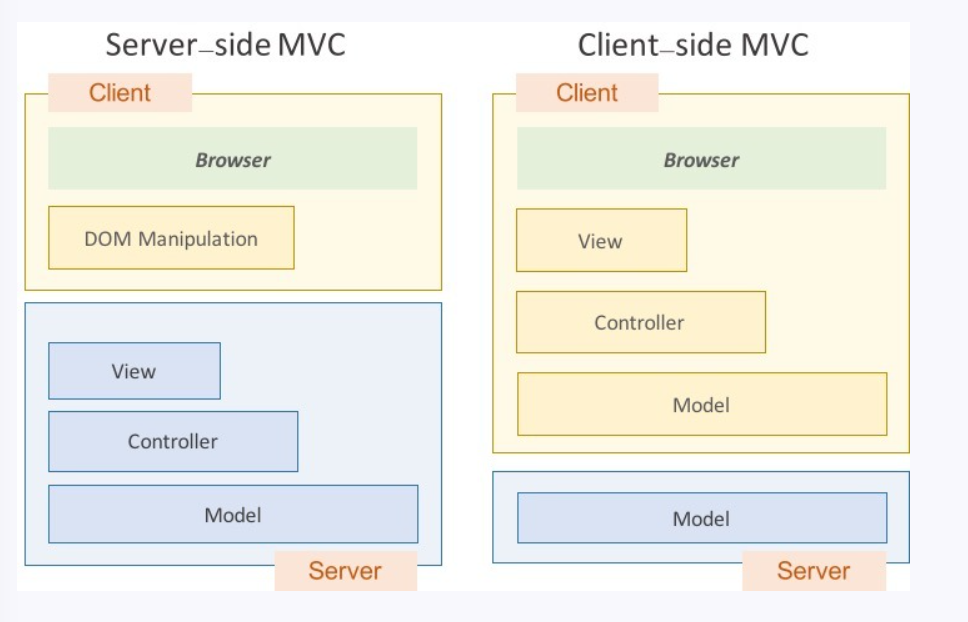
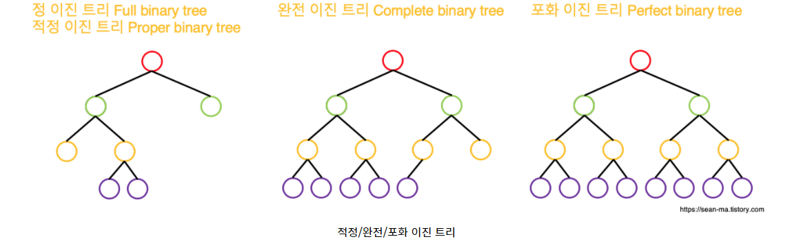
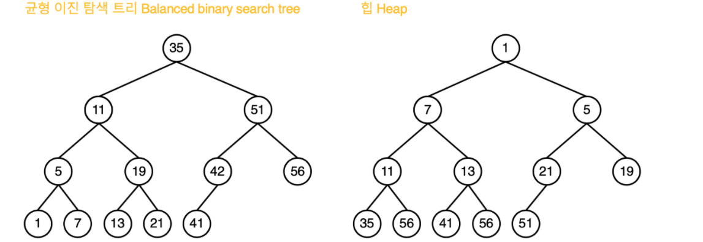

# 프론트 면접 준비

> 참조
>
> https://realmojo.tistory.com/300
>
> https://sunnykim91.tistory.com/121

[TOC]

## 자기소개

안녕하세요, 지원자 정현우입니다. 우주과학,전자공학을 전공했지만 학부때 접한 프로그래밍에 흥미를 느껴 개발자로 진로를 정하고 졸업후 SSSAFY에 입과하여 개발자 교육을 받고 있습니다. html,css,자바스크립트,뷰,파이썬 등 다양한 언어,프레임워크등을 익혔습니다. 주변의 많은 사람들이 카카오커머스를 이용하고 있습니다. 제가 개발에 기여한 기능들이 많은 사람들에게 쓰여지고 또 사용하기 편리하다는 이야기를 들으면 너무 뿌듯할것 같아 카카오 커머스에 지원했습니다.


## 2차 과제 테스트 코드리뷰




## :star::star::star::star::star:

### 1. 브라우저 렌더링 원리

#### 1-1. 홈페이지가 사용자에게 보이는 순서에 대해서 설명해주세요

1) 브라우저 주소창에 www.naver.com 입력

2) 네이버 서버 찾아가서 DNS(실제 서버가 어디 있는지 아는 서버)가 연결해줄곳 찾음

3) 서버에 HTML, CSS , JS, 이미지 파일 등 요청하고 응답 받음

4) HTML,CSS는 렌더링 엔진의 HTML,CSS 파서에 의해 파싱되어 DOM, CSSOM 트리로 변환 후 렌더 트리로 결합

5) 렌더 트리를 기반으로 브라우저는 웹 페이지 표시

6) HTML파서가 중간에 Script태그를 만나면 파싱 중단하고 자바스크립트 엔진에 제어 권한을 준다.

7) 자바스크립트 엔진이 js코드 파싱,실행

### 2. 호이스팅이란?

모든 선언(var,let,const,function) 을 변수 범위의 가장 위로 끌어들인다. 

### 3. 클로저는 뭔가요? 원리와 왜 사용하는지 설명

반환된 내부함수가 자신이 선언됬을 때의 환경인 스코프를 기억하며 자신이 선언되었을 때의 환경 밖에서 호출되어도 그 환경에 접근할 수 있는 함수, (자신이 생성될 때의 환경을 기억하는 함수)

1. 현재 상태를 기억하고 변경된 최신상태 유지
2. 전역 변수 사용 억제
3. 정보 은닉(private method처럼)

### 4. CSS에서 margin과 padding에 대해서 설명

패딩: 테두리와 콘텐츠 사이의 여백

마진: 테두리 바깥쪽 여백, 요소와 요소 사이

#### 4-1. position을 어떻게 사용?

static: 왼쪽에서 오른쪽, 위에서 아래로 쌓임

relative: static위치 기준으로 top,bottom... 지정해준 만큼 이동

absolute: static속성을 가지지 않는 부모 elemetn기준으로 이동

fixed: 항상 화면의 특정 위치에 고정

sticky: scroll박스에 고정 부모박스가 scroll박스 벗어나면 다시 일반적인 흐름 (top,left등 설정 안하거나 부모 요소중 어느 하나라도 overflow:hidden이면 작동x)

### 5. GET, POST가 어떻게 다르게 쓰는지 말점

GET: 서버로부터 정보 조회 요청 전송시 데이터를 Body에 안 담고 쿼리스트링으로 전송, 불필요한 요청 제한하기 위해 요청 캐시될 수 있다. (js,css,이미지 같은 정적 컨텐츠는 데이터가 크고 변경될 일이 적어 동일한 요청을 보낼 필요 x, 가끔식 정적 컨텐츠 변경되도 반영 안되는 이유 캐시에 남아있기 떄문)

POST: 리소스를 생성/변경, 데이터를 메시지의 Body에 담음 - 길이 제한 없어 대용량 데이터 전송 가능 요청 헤더의 Content Type에 요청 데이터의 타입을 표시해야함

## :star::star::star::star:

### 1. this의 용법 아는대로 설명

this는 javascript 실행환경의 전역 객체를 context 객체로 갖는다.

1) 기본 바인딩

전역객체를 context 객체

2) 암시적 바인딩

객체를 통해 함수가 호출된다면 그 객체가 this의 context 객체

3) 명시적 바인딩

함수는 call,apply,bind메소드를 가지고 있는데 이 메소드의 첫번째 인자로 넘겨주는 애가 context 객체가 됨

4) new 바인딩

- new로 새 객체 생성
- 객체의 prototype 체인이 호출 함수의 프로토타입과 연결
- 새 객체를 this context객체로 사용해 함수 실행
- 이 함수가 객체를 반환하지 않으면 new로 생성한 객체가 반환됨

> js의 new 키워드는 클래스의 인스턴스 화가 아니라 그와 유사하게 동작하는 것일 뿐

화살표 함수의 this는 그 화살표함수가 선언된 부분 스코프의 this와 같다

### 2. 브라우저 저장소에 대해 차이점 설명 (Localstorage, Sessionstorage, Cookie)

> Web storage(Local,Session)의 장점(쿠키와 비교)

1) 쿠키는 매번 서버로 전송된다. web storage(Local, Session)에 저장된  데이터는 클라이언트에 존재할 뿐 서버로 전송x

2) web storage는 문자열 뿐만 아니라 객체 정보 저장 가능

3) 용량 제한 x 쿠키는 20개,최대쿠키 크기 4kb로 제한

4) 영구 데이터 저장 가능 - 만료기간 x

> Local, Session storage

도메인 단위로 접근 제한 (A 도메인서 저장한 데이터는 B 도메인서 조회 x)

1) LocalStorage

영구적 보관 가능, 도메인마다 local storage 생성, Windows 전역 객체의 Local storage라는 컬렉션을 통해 저장,조회

2) SessionStorage

데이터의 지속성과 액세스 범위에 특수한 제한 - 현재 페이지가 브라우징되고 있는 브라우저 컨텍스트 내에서만 데이터 유지 , Local과 다르게 브라우저 종료되면 데이터도 같이 지워짐

### 3. Restful API에 대해 아는대로 설명 (GET, PUT, POST, PATCH, OPTION, DELETE)

HTTP URI(Unifrom Resource Identifier) 를 통해 자원(Resource)을 명시하고, HTTP Method를 통해 해당 자원에 대한 CRUD Operation을 적용하는 것.


<장점>

HTTP 프로토콜의 인프라를 그대로 사용하여 별도의 인프라 구축할 필요 x

서버와 클라이언트의 역할을 명확히 분리


<REST 구성요소>

1. 자원(Resource): URI

/groups/:groups_id, URI를 이용해 자원 지정하고 해당 자원의 상태에 대한 조작을 server에 요청

2. 행위: HTTP Method

GET,POST,PUT,DELET 등

3. 표현

Client가 요청하면 Server는 이에 대한 적절한 응답 보냄 JSON,XML을 통해 데이터를 주고 받는 것이 일반적


<특징>

1. 서버- 클라이언트 구조 : 자원 있는쪽이 server 요청하는 쪽이 client

2. stateless(무상태) : client의 context를 server에 저장하지 않음. 

3. Cacheable(캐시 처리 가능) : HTTP의 캐싱 기능 활용 가능 Last-Modified 태그나 E-tag 활용해 구현

4. Layered system(계층화) : REST 서버는 다중 계층으로 구성 가능, api server 앞단에 보안,로드밸런싱,사용자 인증 등을 추가해 구조상의 유연성 줄 수 있다.

5. Uniform Interface(인터페이스 일관성) : Resource에 대한 조작을 통일되고 한정적 인터페이스로 수행, HTTP 표준 프로토콜에 따르는 모든 플랫폼에서 사용 가능

   

### 4. Javascript는 어떤 언어인가? -> 싱글 스레드 언어

왜? 멀티쓰레드의 동시성 문제(ex: 교착상태)에 대해 해결할 필요x 간단함

#### 4-1. 하지만 실제 사용시 멀티스레드처럼 사용 어떻게?

이벤트 루프가 빙글빙글 돌면서 콜스택과 태스크 큐를 계속 확인, 콜스택에 뭐가 있으면 걔를 실행하는데 webapi를 사용하거나 하면 webapi에 처리하게함. webapi는 처리하면 task cue로 콜백함수 전달, 이벤트 루프가 빙글 돌다 태스크 큐에 뭐가 있는데 콜스택이 비어있으면 태스크 큐의 맨앞 콜백을 콜스택으로 옮긴다. 이거 계속반복

#### 4-2. 비동기적으로 실행이 되는 것을 동기적으로 코딩하는 방법 있나?

웹워커를 사용해 멀티쓰레드 구현, 페이지 퍼포먼스에 영향 주지 않고 다른 스크립트와 독립적인 백그라운드에서 실행되는 js

```
w = new Worker("example_workers.js") # 요런식으로 사용
```


### 5. Event Loop란?

위에서 설명

### 6.이벤트 버블링이란?

특정 요소에서 이벤트가 발생했을 때 해당 이벤트가 더 상위의 화면 요소들로 전달되어가는 특성

#### 6-1. 이벤트 버블링은 기본적으로 child -> parent 인데 반대로 구현하는 법은?

이벤트 캡쳐

addEventListner() Api에서 옵션 객체에 capture: true를 설정하면 됨

#### 6-2. 이벤트 버블링을 막기위한 방법은?

원하는 화면 요소의 이벤트만 신경 쓰고 싶으면 `stopPropagation()` 웹 API 사용

이벤트 버블링에서 해당 이벤트가 전파되는 것을 막음,

이벤트 캡쳐에서 최상위 요소의 이벤트만 동작하고 하위로 전달x

#### 6-3. 이벤트 버블링을 잘 활용하려면 어떻게 사용?

이벤트 위임 - 하위 요소에 각각 이벤트를 붙이지 않고 상위 요소에서 하위 요소의 이벤트를 제어

### 7. 타입스크립트 사용해 본적? 어떤지 말점

써보긴햇는데 걍 type 선언만 하는 정도로 씀 -> 변수에 type다르게 들어가면 바로 찝어줘서 편리한 부분이 있엇다

### 8. 실행 문맥에 대해 설명

실행 가능한 코드가 실행되기 위해 필요한 환경 - 객체 형태

실행 컨텍스트 스택이 있다. 현재 실행중 컨텍스트에서 이 컨텍스트와 관련 없는 코드(예를 들어 다른 함수)가 실행되면 새 컨텍스트 생성후 스택에 쌓은 후 제어권 넘김

함수 실행 끝나면 해당 함수 실행 컨텍스트 파기 직전의 실행 컨텍스트에 제어권 반환


<실행 컨텍스트 3가지 객체>

1. Variable object : 변수,매개변수,인수 정보 코드에서는 접근 x 코드 실행될 때 엔진이 참조, 전역 컨텍스트에서 값은 전역 객체(전역변수와 전역함수 프로퍼티)를 가리킴, 함수 컨텍스트에서 Activation Object(AO / 활성 객체) 가리킴, 매개변수,인수를 배열 형태로 담은 객체인 arguments object 프로퍼티로 추가
2. Scope chain : Variable object + all parent scope : 일종의 리스트로 전역 객체와 중첩된 함수의 스코프의 레퍼런스를 차례로 저장(실행 컨텍스트 AO -> 그 상위 AO -> GO(전역객체))
3. thisValue : context object : this 값 할당, 바인딩 어케 하냐에 따라 다름

> [[ Scopes]] 프로퍼티는 함수 객체만 가지는 내부 프로퍼티: 함수 객체가 실행되는 환경 
>
> 클로저 : 내부함수의 경우 외부함수의 실행 컨텍스트가 소멸되어도 [[scopes]] 프로퍼티가 가리키는 외부함수 실행환경은 안 소멸되고 참조 가능

## :star::star::star:

### 1. HTML이 렌더링 중에 Javascript가 실행되면 렌더링이 멈추는데 그 이유는?

HTML 파서는 <script> 태그를 만나면 스크립트 해설,실행될 때까지 html 파싱을 중단한다.

### 2. 현재 Javascript 프레임워크를 사용하는 것과 그 선택을 한 이유

Vue - .vue 파일 하나에서 html,csss,js를 작성할 수 있다. vue-router가 쓰기 간편하다. 쉽다

상태 변경시 setState같은 것을 안쓰고 바로 바꾸면 된다.

#### 2-1. 프로젝트를 진행할 때 어떤 Javascript 프레임워크를 선택할 것인가? 그 이유는?

뷰에 익숙하기때문에 뷰 사용 - 그러나 리액트 배울 시간이 충분하고 프젝 규모가 크다면 테스트,유지보수하기 쉬운 리액트를 사용할 듯

#### 2-2. 최근 사용되는 Javascript 프레임워크에 대해 차이점과 장단점? 언제 어떻게 사용?

리액트는 큰 규모 프로젝트: 테스팅 도구와 렌더링 시스템 결합 가능해 테스트 수월하고 유지보수 쉬움

뷰: 빠르고 가벼운 프젝 - 렌더링 시스템이 리액트보다 빠름 용량도 리액트보다 쩍음

### 3. SPA와 서버사이드 렌더링의 차이점?

SSR: 요청 시마다 새로고침 일어남. 서버에서 새로운 페이지 받아옴 -> 서버에 부담 큼, 첫 로딩 매우 짧음


CSR,SPA : 최초 한번 페이지 전체 로딩 후 이후부터는 데이터 변경하여 사용 가능, 서버는 JSON파일만 보내주고 html을 그리는 역할은 클라이언트 측 자바스크립트가 수행, 초기 view로딩속도는 오래 걸림 그러나 사용자의 행동에 따라 필요한 부분만 다시 읽어들이기 때문에 빠른 인터랙션 가능


SEO 문제: 검색엔진 최적화 문제 -> CSR은 HTML생성을 js가함. 웹 크롤러 봇들은 JS파일 실행 못시킴 HTML만 수집 따라서 CSR페이지를 빈 페이지로 인식




### 4. require와 import의 차이점

둘다 모듈을 가져올 때 쓰는 것

<require> - CommonJs ( ES 5이전에는 내부적 모듈 의존성 처리가 없었음 그래서 생긴 방법)

```
var module = require('./someModule.js')
```

<import> - ES6 (JS 언어 내부적으로 모듈 의존성 지원)

```
import module
```


### 5. SASS, SCSS를 사용해 본적 있나? 기존 CSS와 비교할 때 어떤 면이 더 좋은가?

사용안해봄, 변수 선언하는 것이 좀더 편리해짐

### 6. Javascript 성능 최적화를 위해 어떤 것을 적용해 보았나?

어떤 요소에 addEventlistner로 추가한 애들 더이상 쓸 일 없으면, removeEventlistner로 지움

전역변수 사용을 최대한 자제

변수할당시 메모리할당 자동으로함

안쓰는애들 메모리 해제 해야되는데 안쓰는지 어쩐지 알 수 없다.

가비지컬렉터는 어떤 메모리를 가르키는(참조하는) 모든 변수가 스코프를 벗어나면 해당 메모리 수집

<마크스위프 알고리즘>

1. 루트: 전역 변수, 모든 루트의 목록 만든다.
2. 루트, 그자식 검사해서 활성화 여부 표시,
3. 활성화 표시 안된 모든 메모리 OS에 반환

### 7. Vue & React

#### 7-1. Vue와 React의 차이는?

2-1

#### 7-2. Vue 혹은 React에서 상태관리 어떻게 구현?

Vuex 중앙위치에 상태 저장해 어떤컴포넌트든 가져다 쓸수 있다.

1) State

data역할, mutation으로만 변경 가능

2) Mutations

유일하게 state변경 가능 commit으로 호출, 함수로 구현

3) Actions

비동기 작업 가능 dispatch로 호출 , axios를 통한 api호출과 그 결과에 대해 return 또는 mutation commit 용도

4) Getter

computed느낌 , state 값을 얻고 그 결과를 view에 바인딩 가능 얘 변경됨에 따라 view 업뎃


<흐름>

- Vue component에서 dispatch로 action 실행

- Action에서 외부 api호출 등 한 후 commit Mutation으로 state변경
- getter을 이용해 다시 Component에 바인딩 되어 화면 업뎃

#### 7-3. Vue 라이프 사이클을 설명

1. created: vue인스턴스 생성 후, data,computed,methods,watch등이 활성화 되어 접근 가능 DOM에는 추가 안됌 data 직접 접근 가능하기 때문에 외부 에서 받아온 값들로 data세팅하거나 eventlistner작업은 여기서 한다
2. mounted: 가상 DOM이 실제 DOM에 부착되고 난 이후에 실행, this.$el,data,computed,methods,watch등 사용 가능, 부모 mounted훅은 자식 mounted훅 이후 발생, 자식 컴포넌트가 axios같은 비동기 데이터 받아오기 하면 부모 mounted실행 될때 자식들이 다 마운트 안되었을 수도 있다. 따라서 이 때 `this.$nextTick`을 이용하면, 모든 화면이 렌더링된 이후에 실행
3. updated: 가상 DOM을 렌더링하고 실제 DOM이 변경된 이후에 호출된다. 변경된 data가 DOM에도 적용, 여기서 data변경시 무한루프 생길 수 있다. mounted처럼 `this.$nextTick`써서 모든 화면 렌더된 이후 상태 보장 가능
4. destroyed: 인스턴스 해체후 호출, 인스턴스 속성에 접근x 하위 vue인스턴스 역시 삭제

#### 7-4. Vue에서 양방향 데이터가 일어나는 원리에 대해 설명

<변경내용 추적>

data 들을 Object.defineProperty를 사용하여 getter/setters로 변환

속성에 엑세스하거나 수정할 때 변경 알림 가능

변경시 watcher에 알리고 컴포넌트 다시 렌더링

 ### 8. 무작위 데이터에 대해 테스트는 어떻게?

json 제너래이터를 사용해서 랜덤 데이터 생성하여 테스트합니다.

### 9. ES6에서 Arrow 함수를 언제 쓰나? 왜 쓰나?

화살표함수 쓰면 안되는 경우

1) 메소드,프로토타입

메소드의 this가 메소드를 호출한 객체가 아닌 상위 컨텍스트인 전역 객체 window를 참조하기 때문

2) 생성자

prototype프로퍼티가 없다.

### 10. var let const 차이점

var: function-scoped 변수 재선언 o 초기값 x 호이스팅 되며 자동으로 undefined 초기값 할당

let,const : block-scoped 변수 재선언 x  

let: 변수 재할당 o 초기값 x

const: 변수 재할당 x 초기값 반드시

### 11. CORS를 대처하는 방법과 우회하는 방법

서버에서 클라이언트의 요청을 허용하게 한다.

### 12. MVVM 모델에 대해서 설명

모델,뷰,뷰모델

모델과 뷰 사이에 뷰모델이 위치

DOM이 변경되면, 뷰모델의 DOM Listener를 거쳐 모델로 신호가 감

모델에서 변경된 데이터를 뷰모델을 거쳐 뷰로 보냈을 때, 화면이 reactive하게 반응이 일어남

### 13. js defer,async

script를 body 중간에 달면 HTML을 파싱하는 도중 

## :star::star:

### 1. CSS에는 Box-model 이라는 게 있다. 이 때 width의 값을 차지하는 크기는 어떻게 될까요?

Content부분의 width, box-sizing:border-box로하면 박스전체

### 2. 이진트리에 대해 말씀, 종류는? 실제 적용해본 경험 있나?

ㄴㄴ, 원소들을 계층적으로 저장하는 비선형 자료구조

하나의 노드는 1개의 부모노드와 0~2개의 노드를 자식으로 가진다.





trie를 사용해봄 단어들을 저장할때 그냥 배열에 저장하고 탐색하면 시간이 최악은 O(N)걸리지만 한 글자씩 트리에 저장해놓고 그 자식으로 계속 한글자씩 달아주면 글자수만큼만 탐색시간이 걸림

### 3. git을 사용해본적? 어떤식으로 사용?

ssafy에서 진행한 팀프로젝트에서 사용, develop branch를 파고, 각자 맡은 부분을 feature/feed/fe 이런식으로 브랜치를 분기해서 작업후 완료하면 머지하는 식으로 활용,

### 4. HTTP 0.9/1.0의 차이를 말점

0.9: GET 통신만 가능, HTML문서만 전송 가능 상태 오류 코드가 없어 파일 내부에 문제상황 설명포함해 보냄

1. 0: 상태코드가 응답 시작부분에 포함, 요청 성공실패 바로 알 수 있음 헤더가 요청,응답 모두에 추가되어 프로토콜 확장 가능, content-type을 정해서 HTML외에 다른 문서도 전송 가능 메소드 POST,HEAD가 추가

## :star:

### 1. 협업에 대해서 어떻게 생각?

혼자서는 해낼 수 없는 일들을 분업화해서 만들어내는 과정, 서로 잘하는 것이 다르기 때문에 각자 잘하는 분야들을 담당해서 하고 혼자서 해결하기 힘든 오류들을 서로 봐주면서 해결하는 장점이 있었다.

### 2. 스켈레톤 UI에 대해 적용해 본 적 있나?

ㄴㄴ

### 3. 지원자가 시간이 있다면 프론트엔드 향상을 위해 어떤 노력?

css를 코드로다 짜는데 이것을 시각화해서 블록을 옮기고 색을 입히고 하는 식으로 개발하는 툴

### 4. 프론트엔드 주제를 가지고 발표를 해야한다면 바로 가능한게 있을까?


## 모의면접 피드백

시선처리 한곳으로

배경에 옷이랑 깔끔하게 정리하기

예상치 못한 질문 받았을 때 잠시 생각해보고 답변 드려도 될까요? 하기

그부분에 대해서는 공부하지 못해 답변드리지 못할 것 같습니다. 해당 질문은 이것을 계기로 다시 공부해서 나중에 답변드릴 기회가 있으면 좋겠습니다. 혹은 제가 알고있는 분야를 설명드려도 될까요?

마지막질문 생각해보기 - 좋은 인상 줄수있음 : 카카오커머스 다니며서 가장 좋은 부분?

책관련 질문 생각

카카오커머스 뭐하는지 어떤일 하게 될지 대답하기

- 카카오톡 웹뷰기반의 커머스 서비스 개발
- PC 기반의 판매자/관리자를 위한 백오피스 서비스 개발
- 개발 환경을 위한 도구 및 서비스 공통 모듈 개발

이벤트 버블링관련 

### 면접 보완할 점

this의 용법들 직접 써보면서 어떤 식으로 작동하고 apply,call 등의 메소드가 어떤 결과값 반환하는지 알기

scope 관련해서 mexian scope 뭔지, scope chain은 뭔지, scope의 정확한 정의

promise 관련해서 어떤 식으로 쓰고 어떻게 작동하고 무엇을 리턴하는지

async await 어떻게 작동하는지 어떻게 쓰는지

실행문맥이 정확히 뭐고 어떻게 작동하는지 실행문맥의 프로퍼티들 정확히 알기

클로져 어떨 때 쓰고 정확히 뭔지 직접실습하기

이벤트루프와 콜스택 다시 익히기

잘 모르는 것 같으면 꼬리질문 엄청 들어옴

전역변수의 사용을 왜 자제해야 하는지

전반적인 자바스크립트 코어 지식 책 하나 사서 공부하기