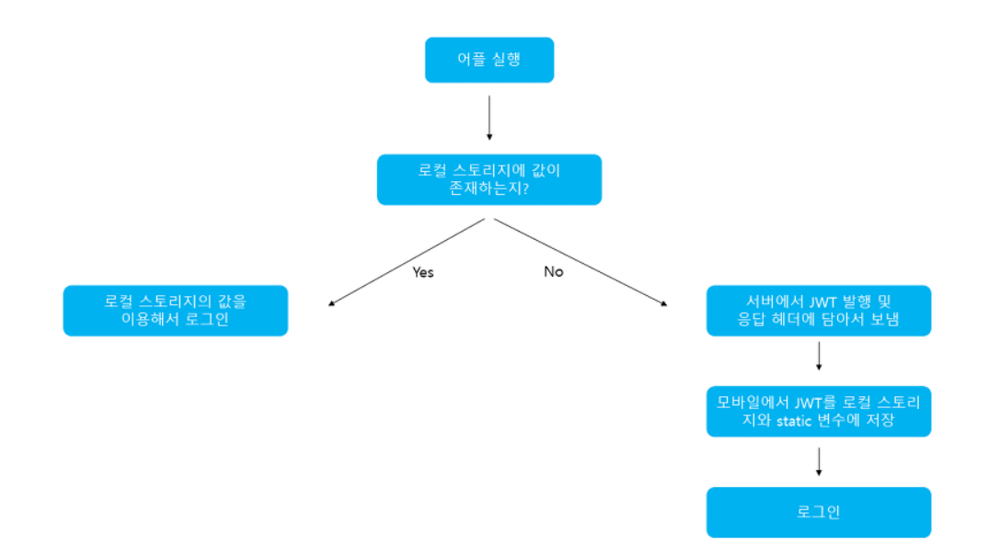
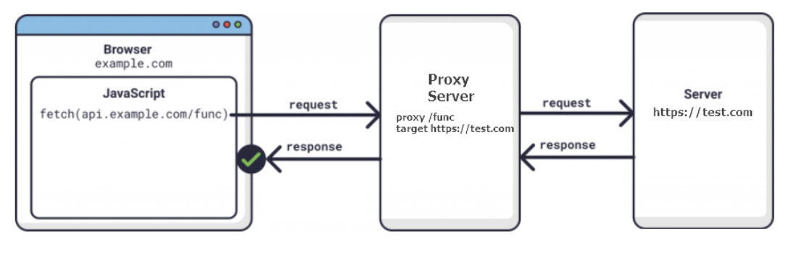
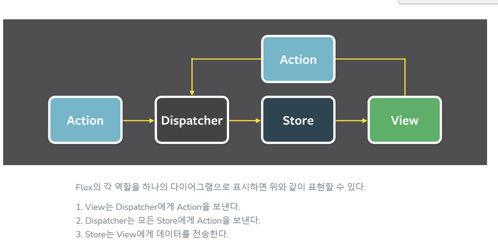

# 프론트 면접 준비

[TOC]

# Javascript

## this는 무엇인가요?

전역환경, 함수에서는 전역 객체를 가리키고

메소드에서는 호출 주체인 객체를 가리킵니다.

명시적으로 바인딩함으로써 this를 활용할 수 있습니다.

## apply, call, bind는 어떻게 사용하고 어떤 결과값을 반환하나요?

명시적으로 this를 바인딩하는 메소드들입니다.

call은 첫번째 인자를 this로 바인딩하고 나머지 인자들을 매개변수로 해서 호출 주체인 함수를 실행한 결과 값을 반환합니다.

apply는 첫번째 인자를 this로 바인딩하고 두번째 인자를 배열로 받아 해당 배열의 원소들을 매개변수로 해서 호출 주체인 함수를 실행하고 그 결과 값을 반환합니다.

bind는 첫번째 인자를 this로 바인딩하고 나머지 인자를 매개변수로 하는 새로운 함수를 반환합니다.

이때 함수는 name이라는 프로퍼티가 추가되고 값으로 bound를 가집니다.

call,apply는 this를 추적하기 어렵지만 bind는 name프로퍼티 덕에 this를 추적하기 쉽습니다.

## scope chain이 뭔가요?

식별자를 검색할 때 스코프의 안에서부터 바깥으로 차례로 검색하는 것을 이야기합니다.

어떤 함수 A에서 내부함수 B를 선언할 때 내부함수의 Lexical Environment의 Outer Environment Reference는 A의 Lexical Environment를 참조합니다.

식별자를 검색할 때 자기 자신의 Lexical Environment에 없으면 Outer Environment Renference에서 찾아보고 없으면 그위로가고 이런 식으로 탐색하는 것을 이야기합니다.

## scope의 정확한 정의를 말해주세요

식별자에 대한 유효범위

## Lexical Environment가 뭔가요?

컨텍스트를 구성하는 환경 정보들이 담겨 있습니다.

environmentRecord와 outer Environment Reference로 구성되어 있습니다.

envorinmentRecord는 현재 컨텍스트와 관련된 식별자들의 정보가 저장되어 있고,

outer Environment Reference는 선언될 당시 환경의 Lexcial Environment를 참조합니다.

## 실행 컨텍스트에 관해 설명해주세요

실행할 코드에 제공할 환경 정보들을 모아놓은 객체입니다.

컨텍스트를 구성하는 방법은 함수를 실행하는 것입니다.

Variable Environment,Lexical Environment, thisBinding 으로 구성되어 있습니다.

Variable Environment는 현재 컨텍스트 내의 식별자에 대한 정보, 외부 환경 정보 로 구성되어 있고 선언 시점의 정보들로 변경되지 않습니다.

Lexical Environment는 초기에는 V.E와 같은데, 변경사항이 실시간으로 반영됩니다.

thisBinding은 this 식별자가 바라보는 대상 객체가 담깁니다.

## promise는 어떤 식으로 사용하고 어떻게 작동하고 무엇을 리턴하나요?

비동기 작업을 동기적으로 처리하기 위해서 사용합니다.

new 연산자와 함께 호출한 promise에 콜백 함수를 넘기면, 콜백함수는 호출할 때 바로 실행이 됩니다. 

콜백함수 내부에서 reject(), resolve()를 만나면 그 때 then,catch 안에 있는 코드들을 실행합니다.

프로미스 객체를 리턴합니다. 프로미스의 메서드들 (then,catch)도 프로미스를 리턴하기 때문에 연결해서 promise chain으로 활용할 수 있습니다.

프로미스 객체의 상태는 비동기 작업이 잘 처리되면 'fulfilled' , 아니면 'rejected'가 됩니다.

## async await 어떻게 작동하고 어떻게 쓰나요?

비동기 작업을 동기적으로 처리하기 위해서 사용합니다.

비동기 작업을 수행하고자 하는 함수 앞에 async, 함수 내부 실질적 비동기 작업이 필요한 위치에 await을 표시해 await 뒤의 내용을 promise로 전환하고, 해당 내용이 resolve된 후에 다음으로 진행합니다. 

## 클로저는 무엇이고 어떨 때 사용하나요?

어떤 함수 A에서 선언한 특정 변수 a를 참조하는 내부 함수 B를 외부로 전달할 경우 A의 실행 컨텍스트가 종료된 이후에도 변수 a가 사라지지 않는 현상입니다. 

특정 데이터 은닉화(외부에 전달된 내부함수를 통해서만 해당 변수에 접근 가능), 커링함수, 디바운스(짧은 시간 동안 동일한 이벤트가 많이 발생할 경우 처음 또는 마지막에 발생한 이벤트에 대해 한번만 처리하는 것) 기법등에서 사용합니다.

커링함수는 원하는 시점까지 함수를 지연시켰다가 실행하거나, 프로그램 내에서 자주 쓰는 함수의 매개변수가 항상 비슷하고 일부만 바뀌는 경우에 사용합니다.

var curry5 = func => a => b => c => d => e => func(a,b,c,d,e)

## 이벤트 루프와 콜스택에 관해 설명해주세요

Javascript는 싱글 스레드 기반 언어이지만 멀티 스레드 언어처럼 작동하게 하는 기술입니다.

엔진에서 코드를 실행하면 콜 스택에 순서대로 쌓입니다. 나중에 들어온 함수를 먼저 실행하며, 스택에 쌓인 함수를 모두 실행합니다.

비동기 함수가 실행되면 web api를 호출하고 web api는 비동기함수의 콜백함수를 콜백 큐에 넣습니다.

이벤트 루프는 콜 스택이 빈 상태가 되면 콜백 큐에 있는 첫번째 콜백을 콜 스택으로 이동시킵니다.

이 과정을 계속 반복합니다. 

## 전역변수 사용을 왜 자제해야 하나요?

다른 사람의 코드를 망가뜨릴수 있기 떄문에 전역 변수의 사용을 자제해야 합니다.

## 일반 script 태그와 script defer, script async는 어떻게 다른가요?

일반 script태그는 HTML파서가 해당 태그를 만나면 파싱을 중단하고 스크립트 파일을 실행하고 실행이 끝나면 다시 파싱합니다.

script defer는 HTML파싱이 완전히 끝나면 해당 스크립트 파일을 실행하게 합니다.

script async는 파싱과 함꼐 스크립트를 다운하고 다운이 완료되면 즉시 스크립트를 실행합니다. 스크립트 실행하는 동안은 HTML 파싱을 멈추고 실행이 끝난 후 다시 파싱합니다.

## var let const의 차이점은 뭔가요?

var은 함수 스코프 변수이고, let,const는 블록 스코프 변수입니다. var,let 은 재할당이 가능하고, const는 재할당이 불가능합니다. let은 초기값이 없어도 되고, const는 초기값을 반드시 할당해야 합니다.

## 이벤트 버블링은 뭔가요?

특정 요소에서 이벤트가 발생했을 때 해당 이벤트가 부모 요소로 전달되는 것을 말합니다.

## 이벤트 버블링은 기본적으로 child -> parent인데 반대로 구현하는 법은?

addEventlistner()에서 옵션 객체의 capture 속성을 true로 지정하면 됩니다.

## 이벤트 버블링을 막기 위한 방법은?

이벤트리스너에 전달한 콜백함수 내부에 e.stopPropagation() 웹 api를 사용하면 됩니다.

## 이벤트 버블링을 잘 활용하려면 어떻게 해야 하나요?

이벤트 위임 - 하위 요소에 각각 이벤트를 붙이지 않고 상위 요소에서 하위 요소의 이벤트를 제어하는데 사용할 수 있습니다. addEventListener를 하나만 사용해서 메모리를 절약하고, 코드도 간결하게 할 수 있습니다. 

## 호이스팅이란?

함수 안에 있는 변수 선언들을 모두 최상단으로 끌어올리는 것을 이야기합니다. 

자바스크립트 파서가 함수를 실행하기 전에 코드를 훑어서 변수의 선언부를 쭉 보고 실행 컨텍스트의 

Variable Environment에 저장합니다. 이때 할당하는 것은 저장하지 않고 선언부만 저장합니다.

## 렌더링 과정 자세히

1. DOM 트리 생성
2. CSSOM 트리 생성
3. 렌더링트리 생성
4. 레이아웃
5. 페인팅

https://medium.com/%EA%B0%9C%EB%B0%9C%EC%9E%90%EC%9D%98%ED%92%88%EA%B2%A9/%EB%B8%8C%EB%9D%BC%EC%9A%B0%EC%A0%80%EC%9D%98-%EB%A0%8C%EB%8D%94%EB%A7%81-%EA%B3%BC%EC%A0%95-5c01c4158ce

## jwt-token이 뭐야?

https://mangkyu.tistory.com/56

Json Web Token의 약자로 Json 포맷을 이용하여 사용자에 대한 속성을 저장하는 Claim 기반의 Web Token이다. JWT는 토큰 자체를 정보로 사용하는 Self-Contained 방식으로 정보를 안전하게 전달한다. 주로 회원 인증이나 정보 전달에 사용됩니다.



앱이 실행될 때, JWT를 static 변수와 로컬 스토리지에 저장합니다. static 변수에 저장하는 이유는 HTTP 통신을 할 때마다 JWT를 HTTP헤더에 담아서 보내야 하는데, 이를 로컬 스토리지에서 계속 불러오면 오버헤드가 발생하기 때문입니다. 클라이언트에서 JWT를 포함해 요청을 보내면 서버는 허가된 JWT인지를 검사한다. 또한 로그아웃을 할 경우 로컬 스토리지에 저장된 JWT 데이터를 제거합니다.

JWT는 Header, Payload, Signature의 3부분으로 이뤄집니다. Json 형태인 각 부분은 Base64로 인코딩 되어 표현됩니다. 암호화된 것이 아니고 같은 문자열에 대해 항상 같은 인코딩 문자열을 반환(Tokenized)

## 리플로우,리페인팅이 언제발생?

사용자의 액션에 따라 발생되는 이벤트로 새로운 HTML요소가 추가되거나, 기존 요소의 스타일이 바뀌거나 하는 변경이 일어나면, 변경을 통해 영향을 받는 모든 노드에 대해서 렌더링 트리 생성과 레이아웃 과정을 다시 수행합니다. 이를 리플로우 라고 합니다.

리플로우는 단지 변경사항을 반영하기 위해 렌더링 트리를 생성하고 레이아웃 과정을 다시 수행하는 것이고, 실제 이 결과를 화면에 그리기 위해서는 다시 페인팅 단계를 수행해야 합니다. 이 과정을 리페인트라고 합니다.

기존 요소에 변경 사항이 생겻다고 해서 항상 리플로우 - 리페인트가 일어나는 것은 아닙니다. 레이아웃에 영향이 없는 단순한 색상 변경 같은 변경사항은 리플로우 수행 없이 바로 리페인트만 수행하게 됩니다.

## CORS 자세히 설명점

https://beomy.github.io/tech/browser/cors/

Cross-Origin Resource Sharing의 약자, 브라우저에서 다른 출처의 리소스를 공유하는 방법입니다.

 Origin : Protocol + Host + Port (https://beomy.github.io:433) , 브라우저는 동일 출처 정책을 지켜서 다른 출처의 리소스 접근을 금지합니다. 이 때 외부 리소스를 사용하기 위한 예외 조항이 CORS입니다.

동작 방식은 단순 요청 방법과 예비 요청을 먼저 보내는 방법 2가지가 있습니다.

단순 요청은 서버에 API를 요청하고, 서버는 Access-Control-Allow-Origin 헤더를 포함한 응답을 브라우저에 보냅니다. 브라우저는 Access-Control-Allow-Origin 헤더를 확인해서 CORS 동작을 수행할지 판단합니다. 서버로 전달하는 요청이 아래 3가지의 조건을 만족해야 서버로 전달하는 요청이 단순 요청으로 동작합니다.

1. 요청 메소드는 GET,HEAD,POST 중 하나
2. Accept, Accept-Language, Content-Language, Content-Type, DPR, Downlink, Save-Data, Viewport-Width, Width를 제외한 헤더를 사용하면 안 됩니다.
3. Content-Type 헤더는 application/x-www-form-urlencoded, multipart/form-data, text/plain 중 하나를 사용해야 합니다.

Preflight request는 서버에 예비 요청을 보내서 안전한지 판단한 후 본 요청을 보내는 방법입니다. GET, POST, PUT, DELETE 등의 메소드로 API 요청했을 때 실제 리소스 요청 전 OPTIONS라는 메서드를 통해 실제 요청을 전송할지 판단합니다. OPTIONS 메소드로 서버에 예비 요청을 먼저 보내고, 서버는 이 예비 요청에 대한 응답으로 Access-Control-Allow-Origin 헤더를 포함한 응답을 브라우저에 보냅니다. 브라우저는 단순 요청과 동일하게 Access-Control-Allow-Origin 헤더를 확인해서 CORS 동작을 수행할 지 판단합니다.

해결방법

1) 서버에서 응답에 access-control 어쩌구 헤더 포함해서 보냄

2) 프록시 서버를 통해 우회 요청



```
var proxy = require('express-http-proxy')
var app = require('express')()

app.use('/proxy', proxy('www.text.com'))
```


## Preflight request가 뭐야?

Preflight request는 서버에 예비 요청을 보내서 안전한지 판단한 후 본 요청을 보내는 방법입니다. GET, POST, PUT, DELETE 등의 메소드로 API 요청했을 때 실제 리소스 요청 전 OPTIONS라는 메서드를 통해 실제 요청을 전송할지 판단합니다. OPTIONS 메소드로 서버에 예비 요청을 먼저 보내고, 서버는 이 예비 요청에 대한 응답으로 Access-Control-Allow-Origin 헤더를 포함한 응답을 브라우저에 보냅니다. 브라우저는 단순 요청과 동일하게 Access-Control-Allow-Origin 헤더를 확인해서 CORS 동작을 수행할 지 판단합니다.


## SSR과 CSR, 프리렌더링 차이점과 장점

https://thinkforthink.tistory.com/324

https://velog.io/@josworks27/CSR-SSR-%EC%B0%A8%EC%9D%B4

### 프리렌더링 

클라이언트에 완성된 HTML문서를 보내줌 -> HTML에서 Js 실행 이런거 없음, 정적인 HTML문서를 바로 받을 수 있어 SEO에 유리. 사용자와 상호작용 위해 JS의 내용이 HTML 문서에 포함 JS 다운이 완료되고 나서야 상호작용 가능 

NEXT.js는 프리렌더링 씀 Static Generation 방식: 빌드할 때 HTML문서를 만듬 -> 사용자가 페이지 요청할 때마다 이 HTML 보낸다 -> 만들어진 문서를 보내는 거라 속도가 빠름

### CSR

클라이언트 측에서 모든 렌더링, 초기 렌더링 느림, 빠른 상호작용

### SSR

서버 측에서 최소한의 렌더링 후 클라이언트에서 렌더링 , 사용자가 요청하면 각 페이지를 매번 보내줌 , 초기 로딩 빠름 -> 모든 요청에 관해 전체 페이지 렌더링하므로 불필요한 작업 발생

# 프레임워크

## Vue와 React 차이

https://brunch.co.kr/@skykamja24/573

리액트는 UI라이브러리, 리액트 자체만으론 전역 상태 관리, 라우팅, 빌드 시스템 등을 지원하지 않습니다. 앞선 기능들을 사용하려면 Redus, Mobx등을 사용해야 한다. 뷰는 프레임워크입니다. 코드를 프레임에 맞춰서 개발해야 합니다. 뷰에서 파일을 만들 때 .vue라는 형태에 맞춰서 개발함 라이브러리와 달리 많은 기능을 디폴트로 제공합니다.

코드형태에 큰 차이가 있습니다. 리액트는 jsx 형태로 코드를 작성하는데 자바스크립트만을 사용해 UI로직과 DOM을 구현합니다. 반면 뷰의 경우 HTML,JS,CSS 코드 영역을 분리해서 작성합니다.

타입스크립트와 같은 자바스크립트의 정적표현(?)이 리액트를 사용할 때 편리하고 함수형 프로그래밍을 적극 활용하기 쉽습니다. 함수형 프로그래밍을 하기 위해선 순수함수 및 매개변수의 데이터 타입을 고정하는 작업이 필수적인데 이를 ts를 사용해 쉽게 처리할 수 있고, 리액트는 모든 코드를 ts로 구현하는게 뷰보다 쉽다.

뷰도 ts를 지원하지만 많은 부분에서 ts용 모듈을 사용해야 하고 코드를 변경해야합니다.

## 디자인패턴 MVC , MVVM,MVP 모델 등 설명

https://beomy.tistory.com/43

### MVC

#### 구조

Model : 어플리케이션에서 사용되는 데이터와 그 데이터를 처리하는 부분입니다.

View : 사용자에게 보여지는 UI 부분입니다.

Controller : 사용자의 입력을 받고 처리하는 부분입니다.

#### 동작

1) 사용자의 Action들은 Controller에 들어오게 됩니다.

2) Controller는 사용자의 Action을 확인하고, Model을 업데이트합니다.

3) Controller는 Model을 나타내줄 View를 선택합니다.

4) View는 model을 이용하여 화면을 나타냅니다

#### MVC에서 View가 업데이트 되는 방법

- View가 Model을 이용하여 직접 업데이트 하는 방법
- Model에서 View에게 Notify하여 업데이트 하는 방법
- View가 pulling으로 주기적으로 Model의 변경을 감지하여 업데이트 하는 방법

#### 특징

Controller는 여러개의 View를 선택할 수 있는 1:n 구조

Controller는 View를 선택할 뿐 직접 업데이트하지 않습니다. (View는 Controller를 알지 못합니다)

#### 장점

MVC 패턴의 장점은 널리 사용되고 있는 패턴이라는 점에 걸맞게 가장 단순. 보편적으로 많이 사용

#### 단점

MVC 패턴의 단점은 View와 Model사이의 의존성이 높다는 것입니다. View와 Model의 높은 의존성은 어플리케이션이 커질수록 복잡해지고 유지보수가 어렵게 만들 수 있습니다.


### MVP

MVC와 MV는 동일, Controller 대신 Presenter가 존재

#### 구조

Model : 어플리케이션에서 사용되는 데이터와 그 데이터를 처리하는 부분입니다.

View : 사용자에게 보여지는 UI 부분입니다.

Presenter : View에서 요청한 정보로 Model을 가공하여 View에 전달. View와 Model을 붙여주는 접착제 역할

#### 동작

1) 사용자의 Action들은 View를 통해 들어오게 됩니다.

2) View는 데이터를 Presenter에 요청합니다.

3) Presenter는 model에게 데이터를 요청합니다.

4) Model은 Presenter에서 요청받은 데이터를 응답합니다.

5) Presenter는 View에게 데이터를 응답합니다.

6) View는 Presenter가 응답한 데이터를 이용해 화면을 나타냅니다.

#### 특징

Presenter는 View와 Model의 인스턴스를 가지고 있어 둘을 연결하는 접착제 역할을 합니다.

Presenter와 View는 1:1관계입니다.

#### 장점

View와 Model의 의존성이 없습니다. Presenter를 통해서만 데이터를 전달받기 떄문입니다.

#### 단점

View와 Presenter 사이의 의존성이 높습니다.


### MVVM

#### 구조

Model : 어플리케이션에서 사용되는 데이터와 그 데이터를 처리하는 부분입니다.

View : 사용자에게 보여지는 UI 부분입니다.

View Model : View를 표현하기 위해 만든 View를 위한 Model입니다. View를 나타내 주기 위한 Model이자 View를 나타내기 위한 데이터 처리를 하는 부분입니다.

#### 동작

1) 사용자의 Action들은 View를 통해 들어오게 됩니다.

2) View에 Action이 들어오면, Command 패턴으로 View Model에 Action을 전달합니다.

3) View Model은 Model에게 데이터를 요청합니다.

4) Model은 View Model에게 요청받은 데이터를 응답합니다.

5) View Model은 응답 받은 데이터를 가공하여 저장합니다.

6) View는 View Model과 Data Binding하여 화면을 나타냅니다.

#### 특징

Command 패턴과 Data Bingding 패턴을 사용하여 구현, VIew 와 View Model 사이의 의존성 없앰

View Model과 View는 1:n 관계

#### 장점

MVVM 패턴은 View와 Model 사이의 의존성이 없습니다. View와 View Model사이의 의존성 또한 없습니다. 각각 부분은 독립적이기 때문에 모듈화하여 개발할 수 있습니다.

#### 단점

MVVM 패턴의 단점은 View Model의 설계가 쉽지 않습니다.(왜?)


## 리액트란

동적인 UI를 쉽게 만들게 해주는 자바스크립트 라이브러리

단방향 데이터흐름

Component 기반 구조

Virtual DOM

Props and State

JSX


## React 가상 돔

https://velog.io/@mollog/React%EC%97%90%EC%84%9C%EC%9D%98-%EA%B0%80%EC%83%81%EB%8F%94-%EA%B0%9C%EB%85%90

DOM에 매번 직접하는 경우 메모리 누수,속도가 느려짐. 컴포넌트 하나하나 조작할 때마다 리플로우,리페인팅 일어남. 회소한의 DOM 조작을 통해 작업을 처리하고자 가상돔 도입

실제 돔에 접근하여 조작하는 대신, 이것을 추상화시킨 자바스크립트 객체를 이용해 사용

1. 변화가 일어남 변화된 버전을 가상돔으로 바꿈 -> 데이터 업뎃시 전체 UI를 가상돔에 리렌더링
2. 변화전,후 가상돔 비교
3. 바뀐 부분만 실제 돔에 적용 : 레이아웃 계산은 한번만 이행


## React Function과 Class 차이

https://devowen.com/298

먼저 컴포넌트는 데이터가 주어졌을 때 이에 맞추어 UI를 만들어 주는 기능을 하고, 라이프 사이클 API를 통해 컴포넌트가 화면에 나타날 때, 사라질 때, 변할 때 작업들을 수행할 수 있게한다.

클래스형 컴포넌트는 state 기능 및 라이프 사이클 기능을 사용할 수 있으며 임의의 메서드를 정의할 수 있다. 메소드 사용 가능 render함수가 꼭 있어야 하고 그 안에서 보여줘야할 JSX를 꼭 반환해야 한다.

함수형 컴포넌트는 클래스형 컴포넌트보다 선언하기가 좀 더 편하고, 메모리 자원을 덜 사용한다는 장점이 있다. 리액트 훅을 활용해 state와 라이프사이클 APi를 사용할 수 있다.

함수형,클래스형 컴포넌트 모두 state를 직접 조작하는 것이 아닌, setState나 useState와 같은 세터함수를 반드시 사용하여 조작해야한다.


## 리액트 훅

함수형 컴포넌트에서 상태 관리, 라이프 사이클과 같은 기능을 사용할 수 있게 해준다

- State Hook

함수 컴포넌트의 상태 관리에 사용할 수 있음

setState, useState는 비동기적으로 작동함 왜? 여러개의 state를 업데이트하기에 비동기 방식이 퍼포먼스에서 유리

리액트는 더 나은 성능을 위해 배칭을 사용함 (여러 개의 state 업데이트를 하나의 리렌더링으로 묶음) - 불필요한 리렌더링 줄임

이렇기 떄문에 setLike()

setLike() 2개 연속으로하면 Like 1개만 는다 2개느는게 아니라

- Effect Hook

렌더링 뒤에 실행됨

함수 컴포넌트의 side effect를 수행

side effect? 외부 api 호출하는 경우

use Effect는 매 렌더링 이후 수행

왜 컴포넌트 내부?

컴포넌트의 상태 변수에 접근하기 위해

두번째 인자를 무엇으로 주냐에 따라 작동이 달라짐

두번쨰 인자 안주면 매 렌더링시마다 호출

useeffect에 전달한 함수에서 다른 함수 리턴하면 걔는 unmount될때만 호출

배열에 state 변수 담으면 해당 state의 값이 변경될때만 호출

[] 빈배열 - 첫 렌더링에만 호출


## 리액트 상태가 뭐냐?

일반 변수는 함수가 끝날 때 사라지지만, state 변수는 React에 의해 사라지지 않는다.

컴포넌트내에서 데이터 관리하는 것, 상태변수 업데이트 -> 리렌더링


## 리액트 Container , Presenter 패턴

container 데이터 처리 - 받아온 데이터를 presenter에 props로 넘김

presenter 데이터 출력 UI


## 리액트 라이프사이클 메소드

componentDidMount : 컴포넌트 마운트될 때

componentDidUpdate : 컴퓨넌트가 리렌더링될 때

componentWillUnmount: 컴포넌트가 마운트 해제되기 전에


## 리액트는 데이터 받아올때(axios, fetch) 어떤식으로 할까

class의 경우 componentdidmount에서 받아옴

useEffect 내에 함수 하나 선언

```
useEffect(() => {
    const takeData = async () => {
        const articleData = await getArticle();
        setArticles()
    }
    takeData();
}, [])

두번쨰 인자 빈배열주면 첫 렌더링에만 호출
```


## 리액트 classnames

jsx의 className="box info mg-10" 태그 1개에 여러 클래스를 추가하거나 특정 값이 true/false에 따라 클래스 명을 추가하는 기능


## 리덕스

유저의 로그인 정보, 장바구니, 새 알람

상태관리 라이브러리, 리액트의 복잡한 컴포넌트 구조속에서 간편하게 state를 공유할 수 있게 해줍니다.

하나의 store에 모든 state를 저장,유지

규칙 3가지

1. 하나의 앱은 하나의 스토어

2. 상태는 읽기 전용, 상태 고유값 수정 않고 새로운 상태를 만들어 이를 수정

3. 리듀서는 순수함수여야 한다 

Action : 어떠한 행위

Reducers :  action을 통해 앱의 상태가 어떻게 바뀌는지 적어놓은 함수

Store: action, action 생성함수 , 저장해놓음

## flux

애플리케이션의 데이터 흐름을 관리하는 패턴

왜? 예측가능성 높여줌, 데이터 일관성 유지하기 쉽게, 버그 발견하기 쉽게, 테스트 쉽게

Dispatcher - 액션들을 받아서 Store에 전달

Store - 데이터 저장, 액션을 어떻게 처리할지 결정(콜백 등록해놓음)

Action - 

View

1. View에서 데이터의 변경이 일어나면 Action 생성
2. Action이 생성되면 Watching하고 있던 Dipatcher에서 반응
3. Dispatcher에서는 해당 Store가 해당 Action으로 등록한 Callback을 실행



## devtool 깔아서 사용해보기

각 컴포넌트들 state props들 확인할 수 있었음


## 리액트 단방향 데이터바인딩

부모 -> 자식으로만 데이터가 흐름 props활용해서 

그럼 자식 -> 부모는 어떻게?

prop으로 콜백 함수를 전달함. 자식함수가 특정 이벤트 발생시 해당 함수 실행시킴


## 타입스크립트 런타임에서 타입 오류나면 어캄?

그런거 사전에 방지하기 위해 컴파일 과정(트랜스파일) 에서 타입 오류 같은거를 잡아줌


## SCSS, Module CSS 등 Styling 기법 차이점,장점들

https://velog.io/@kwonh/React-CSS%EB%A5%BC-%EC%9E%91%EC%84%B1%ED%95%98%EB%8A%94-%EB%B0%A9%EB%B2%95%EB%93%A4-css-module-sass-css-in-js

### 일반 CSS

클래스 명이 같은 경우 클래스 명이 충돌되고 덮어씌워지는 단점이 있따.

### CSS-module

클래스명이 충돌하는 단점 극복, 클래스 이름에 hash 값이 붙어 고유한 값으로 인식

### SASS

CSS와 비슷하지만 문법 변수, 믹스인 등의 개념이 있다. 이를 활용해 재사용성을 높일 수 있다. 별도의 빌드단계를 거쳐 CSS파일로 변환.

### css-in-js

CSS코드를 Js파일안에 작성 내부응집도 올라가고, 동적으로 CSS 변경하기 쉽다


## Vuex(상태관리 라이브러리)는 어떻게 동작?

https://vuex.vuejs.org/kr/

vue.js 애플리케이션에 대한 상태관리 패턴+ 라이브러리 입니다. 애플리케이션의 모든 컴포넌트에 대한 중앙 집중식 저장소 역할을 하며 예측 가능한 방식으로 상태를 변경할 수 있습니다.

1. State

data역할, mutation으로만 변경 가능

2. Mutations

유일하게 state변경 가능 commit으로 호출, 함수로 구현

3. Actions

비동기 작업 가능 dispatch로 호출 , axios를 통한 api호출과 그 결과에 대해 return 또는 mutation commit 용도

4. Getter

computed느낌 , state 값을 얻고 그 결과를 view에 바인딩 가능 얘 변경됨에 따라 view 업뎃

<흐름>

- Vue component에서 dispatch로 action 실행
- Action에서 외부 api호출 등 한 후 commit Mutation으로 state변경
- getter을 이용해 다시 Component에 바인딩 되어 화면 업뎃


## created와 mounted 차이

1. created: vue인스턴스 생성 후, data,computed,methods,watch등이 활성화 되어 접근 가능 DOM에는 추가 안됌 data 직접 접근 가능하기 때문에 외부 에서 받아온 값들로 data세팅하거나 eventlistner작업은 여기서 한다
2. mounted: 가상 DOM이 실제 DOM에 부착되고 난 이후에 실행, this.$el,data,computed,methods,watch등 사용 가능, 부모 mounted훅은 자식 mounted훅 이후 발생, 자식 컴포넌트가 axios같은 비동기 데이터 받아오기 하면 부모 mounted실행 될때 자식들이 다 마운트 안되었을 수도 있다. 따라서 이 때 `this.$nextTick`을 이용하면, 모든 화면이 렌더링된 이후에 실행
3. updated: 가상 DOM을 렌더링하고 실제 DOM이 변경된 이후에 호출된다. 변경된 data가 DOM에도 적용, 여기서 data변경시 무한루프 생길 수 있다. mounted처럼 `this.$nextTick`써서 모든 화면 렌더된 이후 상태 보장 가능
4. destroyed: 인스턴스 해체후 호출, 인스턴스 속성에 접근x 하위 vue인스턴스 역시 삭제

## action에서 비동기 작업이 가능한 이유?

https://beomy.tistory.com/87

store.dispatch의 반환값은 Promise입니다. 이를 활용해 store.dispatch('action').then(()=>{}) 이렇게 비동기 작업을 처리할 수 있습니다. Async, Await도 사용이 가능합니다.

## v-bind와 v-model의 차이?

v-model: 양방향 바인딩 -> 입력 값 변경시 바인딩 된 데이터도 변경 반대로도 똑같이 작동

v-bind: 단방향 바인딩 -> 바인딩 데이터를 변경하여 입력 값을 변경할 수 있지만, 입력 값을 변경하여 바운드된 데이터를 변경할수 없다.

## Vue ref사용할 때 주의사항?

ref는 돔에 접근할 때 사용 -> 돔이 생성되지 않았을 때는 에러 발생


## 피드백

vuex 상태관리 패턴 활용해보기

vue 플러그인 제작해보기

테스트 코드 작성해보기

컴터네트워크 -> 프론트엔드에 중요