# 자소서 특강

1. 직무 역량 중심
2. 경험 정리
3. 이력 다이어트

- 경험 정리

나의 경험과 특징,역량 파악

직무에서 요구하는 역량 파악

회사의 인재상

- 자소서 5대 원칙

1) 두괄식 : 역량/경험/숫자/센스

2) 보기 쉽게: 명확한 단락 구분

3) 핵심 키워드 선정, 논리,통일성 갖추기

4) STAR 기반 ( 상황-행동-결과 명확 )

5) 기업이 원하는 인재임을 강조

- STAR

### 1. 성격의 장단점 및 가치관을 성장과정에 기반하여 작성

>  회사에 따라 달라지는데, 신한은행은 인성을 강조할 것

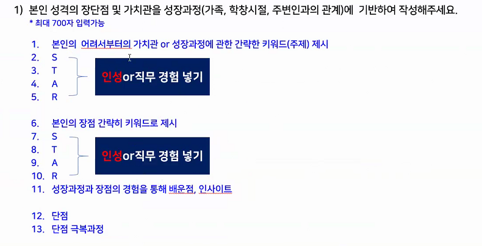

덜렁거린다. 꼼꼼하지 못하다 이런거 쓰지 말기

단점을 장점화 하지 말기

### 2-1. 지원 동기와 희망하는 직무분야, 지원하는 이유

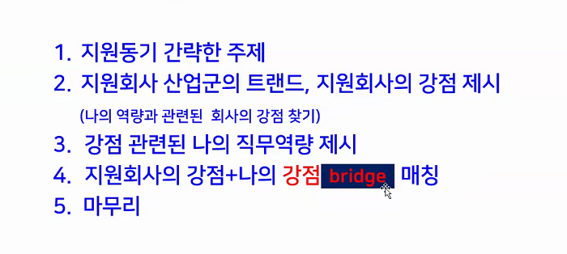

## bridge 진짜 중요

너네가 이런 거 잘하는데 그것과 관련해서 나는 이런 강점이 있다.

너네 회사에서 그런 걸 발전시키고 싶어서 지원했다.

### 2-2. 입사 후 포부

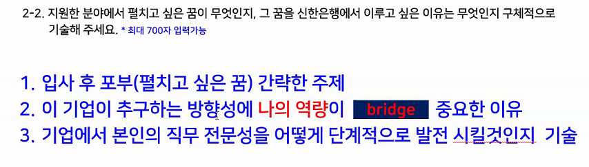

신기술 분야를 활용해서 어디까지 구현하는 개발자가 되겠다. 5년차, 10년차 구체적으로 제시

### 3.

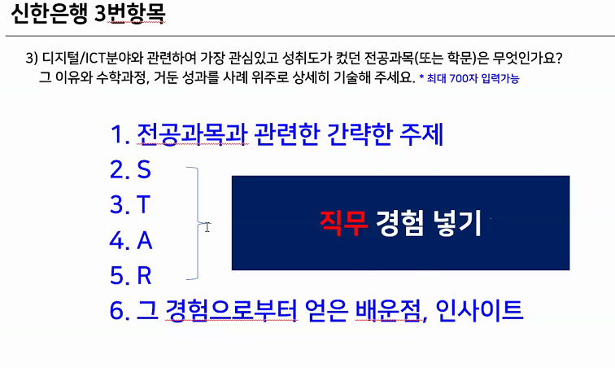

경험 제시해라 하면 무조건 STAR 쓰기. 금융권은 입사가 아니라 입행이라 해야함

### 4.

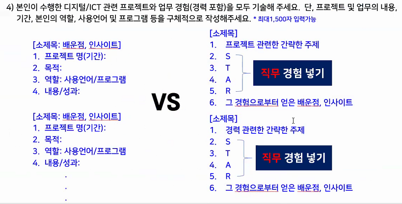

1) 프로젝트한 게 별로 없으면, STAR.

2) 많으면, 개조식

1500자로 늘어난 건 구체적으로 보고 싶다는 뜻. 컨설턴트님은 2번 STAR 추천

3번에서 쓴 거 중복되게 쓰지마.

2~3개만 쓸 것.

## 취업성공후기

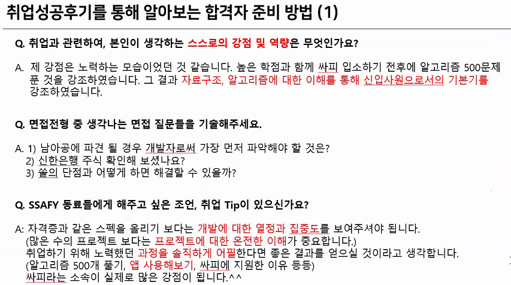

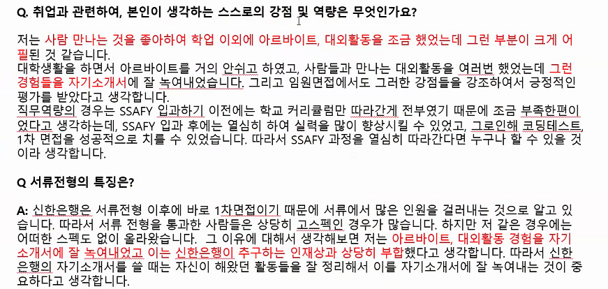

> 고객과의 경험(고객을 설득한 경험)등을 1번에 꼭 쓸 것

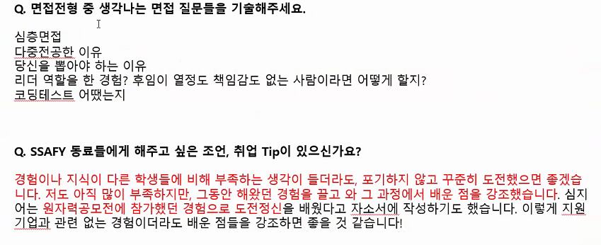

## 신한은행 소개

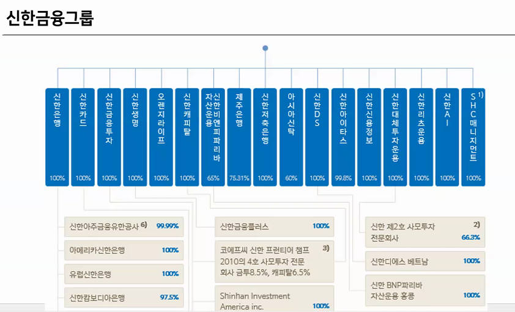

>  인재상이 중요. 

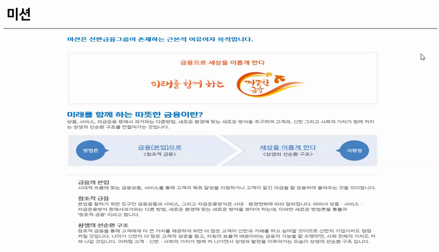

> 신한은행이 봉사활동 많이 함. 1번에 봉사 쓰면 좋을 듯.

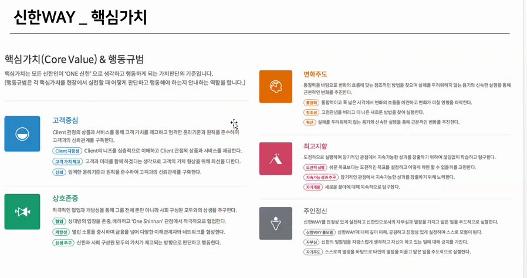

> 이거 다 외워야함. 관련한 경험 있으면 자소서에 써

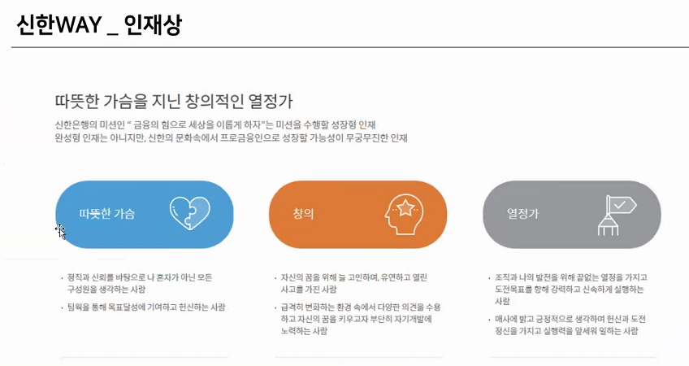

> **열정**이 중요

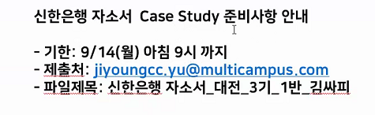