# 03.This

[TOC]

## 01) 상황에 따라 달라지는 this

>  this는 함수를 호출할 때 실행 컨텍스트가 생성되며 함께 결정된다

### 3-1-1 전역 공간에서의 this

this -> 전역 객체

브라우저에서 window, Node.js에서 global

전역 변수를 선언하면 JS 엔진은 이를 전역 객체의 프로퍼티로도 할당 -> JS의 모든 변수는 특정 객체(실행 컨텍스트의 Lexical Environment)의 프로퍼티로서 동작

전역 객체의 프로퍼티에 직접 할당하더라도 변수 선언한 것과 비슷함

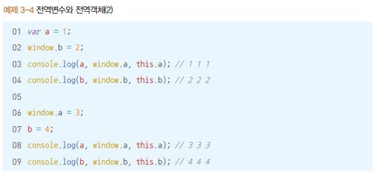

그러나 삭제할 때는 전혀 다른 동작을 한다.

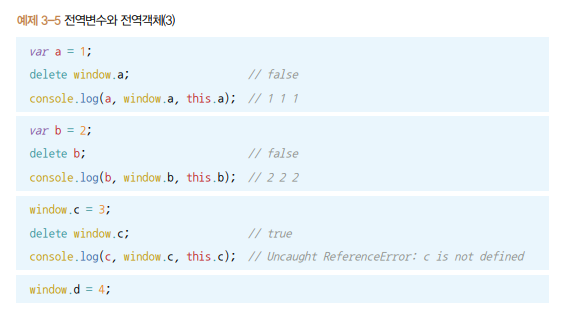

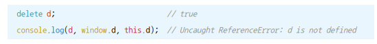

처음부터 전역객체의 프로퍼티로 할당한 경우 삭제가 되지만 전역 변수로 선언한 경우에는 삭제가 안된다. 왜냐하면 전역 변수를 선언하면 JS 엔진이 이를 자동으로 전역 객체의 프로퍼티로 할당하며 추가적으로 해당 프로퍼티의 configurable 속성(변경 및 삭제 가능성)을 false로 정의

### 3-1-2 메서드로서 호출할 때 그 메서드 내부에서의 this

#### 함수 vs 메서드

>  둘의 차이는 독립성이다. 
>
> 함수는 그 자체로 독립적인 기능, 메서드는 자신을 호출한 대상 객체에 관한 동작

어떤 함수를 개체의 프로퍼티에 할당한다고 메서드가 되는 것이 아니라 객체의 메서드로 호출하면 메서드로 동작, 아니면 함수로 동작

#### 메서드 내부에서의 this

this에는 호출한 주체에 대한 정보가 담김

메서드의 호출 주체는 함수명 앞의 객체. 마지막 점 앞에 명시된 객체가 this가 된다.

### 3-1-3 함수로서 호출할 때 그 함수 내부에서의 this

#### 함수 내부에서의 this

this가 지정되지 않은 경우 함수에서의 this는 전역 객체를 가리킨다.

#### 메서드의 내부함수에서의 this

메서드로 실행되면 호출 객체, 아니면 전역 객체

this바인딩에 관해서 함수를 실행하는 당시의 주변환경(메서드 내부인지, 함수 내부인지)은 중요하지 않고, 해당 함수 호출하는 구문 앞에 점 또는 대괄호 표기가 있는지가 관건이다.

#### 메서드의 내부함수에서의 this를 우회하는 방법

호출주체가 없을 때 전역객체를 바인딩 하지 않고, 주변 환경의 this를 상속받아 쓰면 좋겠다.

상위 스코프의 this를 저장해서 내부함수에서 활용하는 방법이 있다.

##### 변수 활용

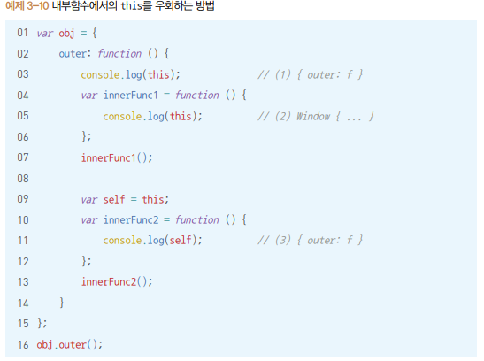

#### this를 바인딩하지 않는 함수

ES6의 화살표함수는 this를 바인딩하지 않는다.

실행 컨텍스트 생성할 때 this 바인딩 과정 자체가 빠져, 상위 스코프의 this를 그대로 활용할 수 있다.

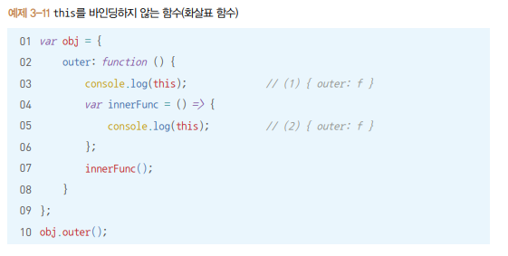

### 3-1-4 콜백 함수 호출 시 그 함수 내부에서의 this

함수 A의 제어권을 다른 함수(또는 메서드) B에게 넘겨주는 함수 A를 콜백함수라 한다.

this는 함수 B 내부 로직에서 정한 규칙에 따라 값이 결정된다.

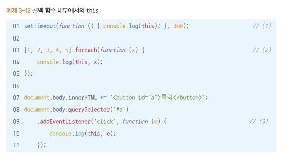

setTimeout 함수와 forEach 메서드는 내부에서 콜백함수 호출할 때 대상이 될 this를 지정하지 않아 this가 전역객체를 참조한다.

addEventListner 메서드는 콜백함수 호출할 때 자신의 this를 상속, 메서드명의 점(.)앞 부분이 this

### 3-1-5 생성자 함수 내부에서의 this

> 생성자 함수는 어떤 공통된 성질을 지니는 객체들을 생성하는데 사용하는 함수
>
> new 명령어와 함께 함수를 호출하면 해당 함수가 생성자로서 동작

생성자 함수로 호출된 경우 내부에서의 this는 곧 새로 만들 구체적인 인스턴스 자신이 된다.

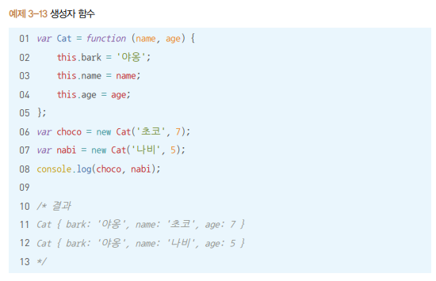

생성자 함수를 호출(new와 함께 함수 호출)하면 우선 생성자의 prototype 프로퍼티를 참조하는 `__proto__`라는 프로퍼티가 있는 객체(인스턴스)를 만들고 미리 준비된 공통 속성을 해당 객체(this)에 부여한다.

## 02) 명시적으로 this를 바인딩하는 방법

### 3-2-1 call 메서드

메서드의 호출 주체인 함수를 즉시 실행하도록 하는 명령

메서드의 첫번째 인자를 this로 바인딩하고, 이후의 인자들을 호출할 함수의 매개변수로 한다.

### 3-2-2 apply 메서드

call 메서드와 기능적으로 완전히 동일

다른 점은 두번째 인자를 배열로 받아 그 배열의 요소들을 호출할 함수의 매개변수로 지정한다.

### 3-2-3 call / apply 메서드의 활용

#### 유사 배열 객체(array-like object)에 배열 메서드를 적용

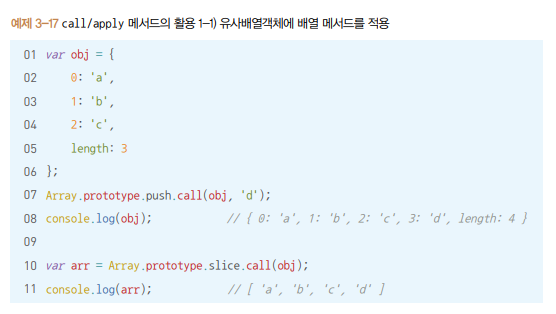

> P82~83 자세한 설명과 같이 보기

유사배열겍체에는 call/apply 메서드를 이용해 모든 배열 메서드를 적용할 수 있다.

문자열도 가능하다. 

단, 문자열의 length 프로퍼티가 읽기 전용이기 때문에 원본 문자열에 변경을 가하는 메서드(push,pop,shift,unshift,splice 등)은 에러를 던지고, concat처럼 대상이 반드시 배열이어야 하는 경우에는 제대로된 결과를 얻을 수 없다.

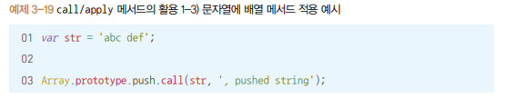

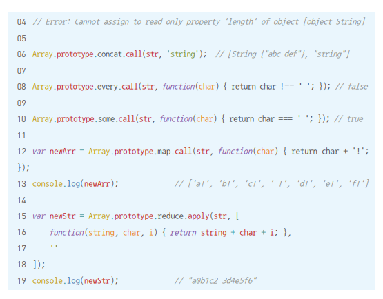

ES6에서는 유사배열 객체 또는 순회 가능한 모든 종류의 데이터 타입을 배열로 전환하는 Array.from 메서드가 있다.

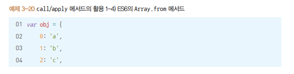

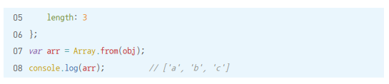

#### 생성자 내부에서 다른 생성자를 호출

생성자 내부에 다른 생성자와 공통된 내용이 있을 경우 call/apply를 활용해 다른 생성자를 호출해 반복을 줄일 수 있다.

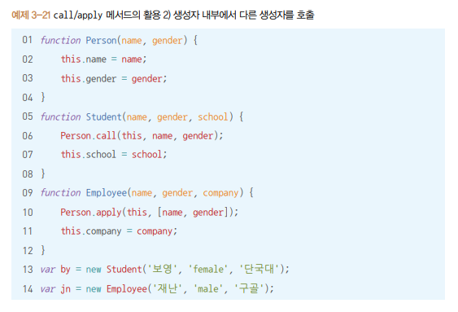

#### 여러 인수를 묶어 하나의 배열로 전달하고 싶을 때 - apply 활용

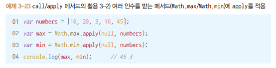

ES6에서는 펼치기 연산자(...) 활용 가능

#### call/apply의 장점과 단점

장점: 명시적으로 별도의 this를 바인딩하면서 함수,메서드를 실행할 수 있다.

단점: this를 예측하기 어렵게 만든다.

### 3-2-4 bind 메서드

call과 비슷하지만 즉시 호출하지는 않고 넘겨받은 this 및 인수들을 바탕으로 새로운 함수를 반환하기만 하는 메서드

다시 새로운 함수를 호출할 때 인수를 넘기면 그 인수들은 기존 bind 메서드를 호출할 때 전달했던 인수들의 뒤에 이어서 등록된다.

함수에 this를 미리 적용하는 것과 부분 적용함수를 구현하는 2가지 목적을 가진다.

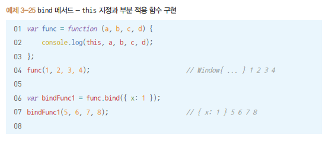

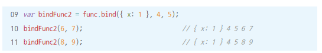

#### name 프로퍼티

bind 메서드를 적용해서 새로 만든 함수는 name 프로퍼티에 'bound'라는 접두어가 붙는다.

기존의 call이나 apply보다 코드를 추적하기에 더 쉽다.

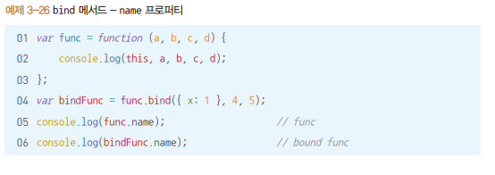

#### 상위 컨텍스트의 this를 내부함수나 콜백 함수에 전달하기

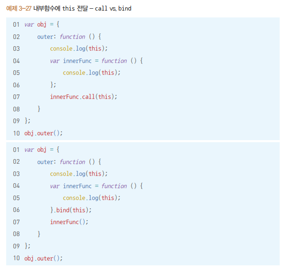

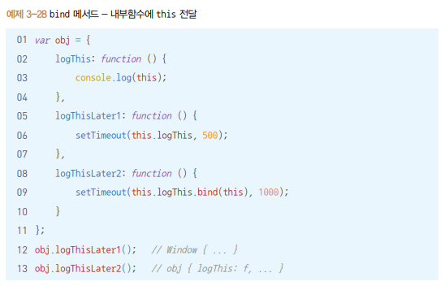

### 3-2-5 화살표 함수의 예외사항

화살표 함수는 실행 컨텍스트 생성 시 this를 바인딩하는 과정이 제외. this에 접근하려 하면 스코프체인상 가장 가까운 this에 접근하게 된다.

### 3-2-6 별도의 인자로 this를 받는 경우(콜백 함수 내에서의 this)

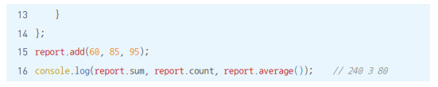

#### 콜백 함수와 함께 thisArg를 인자로 받는 메서드

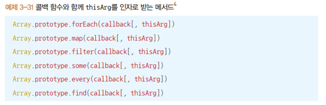

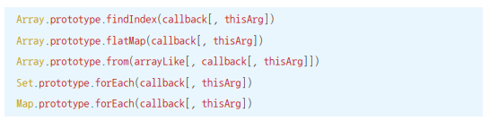

## 03) 정리

다음 규칙은 명시적 this 바인딩이 없는 한 늘 성립한다.

- 전역 공간에서의 this는 전역객체(브라우저에서 window, Node.js에서 global)를 참조
- 어떤 함수를 메서드로서 호출한 경우 this는 메서드 호출 주체(메서드명 앞의 객체)를 참조
- 어떤 함수를 함수로서 호출한 경우 this는 전역객체를 참조. 메서드 내부함수에서도 같다
- 콜백 함수 내부에서의 this는 해당 콜백 함수의 제어권을 넘겨받은 함수가 정의한 바에 따르며, 정의하지 않은 경우에는 전역객체를 참조
- 생성자 함수에서의 this는 생성될 인스턴스를 참조

명시적 this 바인딩

- call, apply 메서드는 this를 명시적으로 지정하면서 함수 또는 메서드를 호출
- bind 메서드는 this 및 함수에 넘길 인수를 일부 지정해서 새로운 함수를 만든다.
- 요소를 순회하면서 콜백 함수를 반복 호출하는 내용의 일부 메서드는 별도의 인자로 this를 받기도 한다.