# 04.콜백함수

[TOC]

## 01) 콜백 함수란?

다른 코드(함수,메서드)에 인자로 넘겨줌으로써 그 제어권도 함께 위임한 함수

## 02) 제어권

콜백 함수의 제어권을 넘겨받은 코드는 콜백 함수 호출 시점에 대한 제어권을 가진다

### 4-2-2 인자

콜백 함수의 제어권을 넘겨받은 코드는 콜백 함수를 호출할 때 인자에 어떤 값들을 어떤 순서로 넘길 것인지에 대한 제어권을 가진다

> ex) array.prototype.map 을 사용할 경우 콜백함수의 1번째 인자에 배열의 요소 중 현재값, 2번째 인자에 현재 값의 인덱스, 3번째 인자에 map 메서드의 대상이 되는 배열이 담긴다

### 4-2-3 this

기본적으로 this가 전역객체를 참조하지만, 제어권을 넘겨받을 코드에서 콜백 함수에 별도로 this가 될 대상을 지정한 경우에는 그 대상을 참조한다

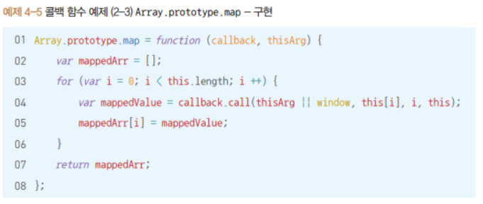

제어권을 넘겨받을 코드에서 call/ apply 메서드의 첫번째 인자에 콜백 함수 내부에서 this가 될 대상을 명시적으로 바인딩하기 때문이다.

## 03) 콜백 함수는 함수다

콜백 함수로 어떤 객체의 메서드를 전달하더라도 그 메서드는 메서드가 아닌 함수로서 호출

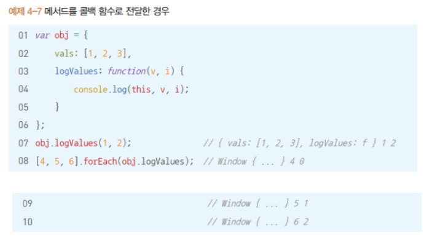

## 04) 콜백 함수 내부의 this에 다른 값 바인딩하기

객체의 메서드를 콜백 함수로 전달하면 해당 객체를 this로 바라볼 수 없다.

콜백 함수 내부에서 this가 객체를 바라보게 하고 싶다면?

__this를 다른 변수에 담아 콜백 함수로 활용할 함수에서 this대신 그 변수를 사용하게 하고, 이를 클로저로 만드는 방식이 전통적으로 많이 쓰임__

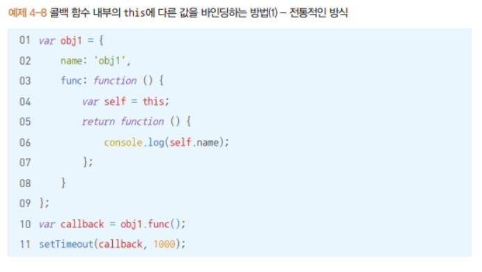

전통적인 방식은 코드가 너무 복잡하고 번거롭다

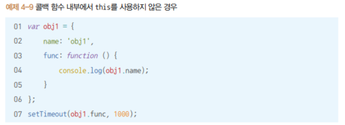

이 경우는 훨씬 간결하고 직관적이지만 작성한 함수를 this를 이용해 재활용할 수 없게 된다.

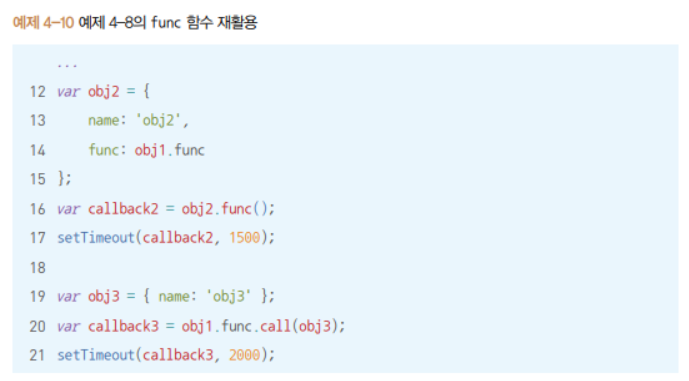

4.8은 이렇게 this가 다른 것을 바라보게 재활용할 수 있다.

ES5의 bind 메서드는 이런 전통 방식의 아쉬움을 보완한다

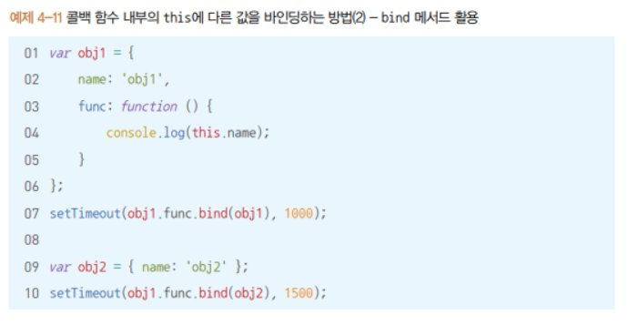

## 05) 콜백 지옥과 비동기 제어

> 콜백 지옥(콜백 헬): 콜백 함수를 익명 함수로 전달하는 과정이 반복되어 코드의 들여쓰기 수준이 감당하기 힘들 정도로 깊어지는 현상

> 비동기: 현재 실행 중인 코드의 완료 여부와 무관하게 즉시 다음 코드로 넘어감
>
> ex) setTimeout,addEventListener,XMLHttpRequest 등 __별도의 요청, 실행 대기, 보류 등과 관련__

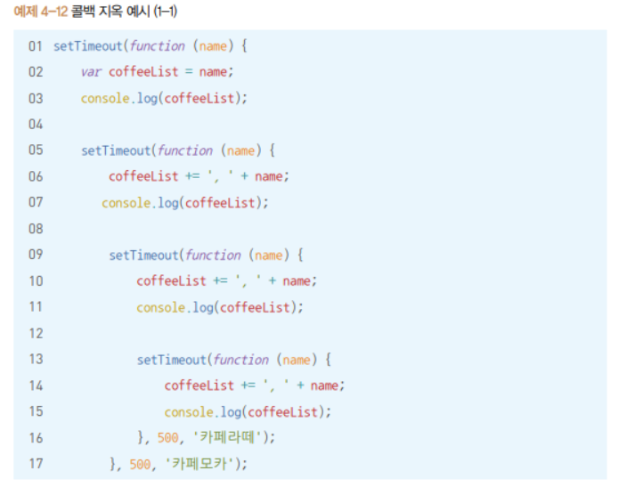

### 콜백 지옥 해결하는 방법들

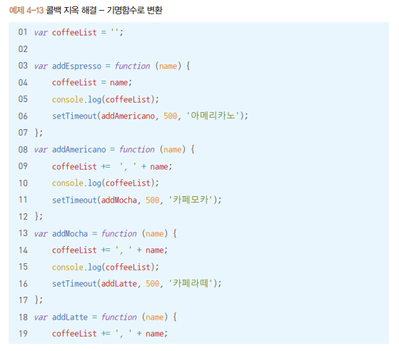

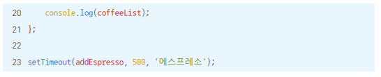

#### ES6의 Promise

new 연산자와 함께 호출한 promise의 인자로 넘겨주는 콜백 함수는 호출할 때 바로 실행

그 내부에 resolve또는 reject 함수를 호출하는 구문이 있을 경우 둘 중 하나가 실행되기 전까지는 then,catch로 넘어가지 않는다.

따라서 비동기 작업이 완료될 때 resolve,rejct를 호출하는 방법으로 비동기 작업의 동기적 표현이 가능

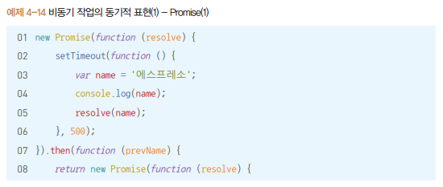

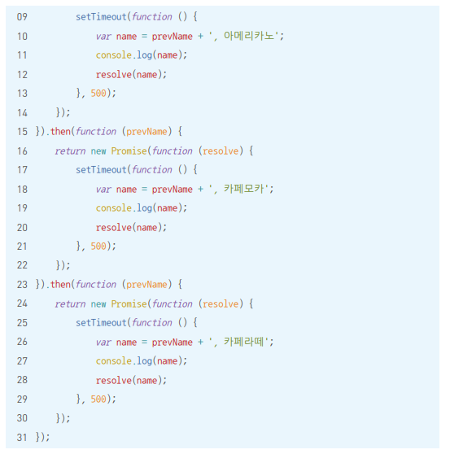

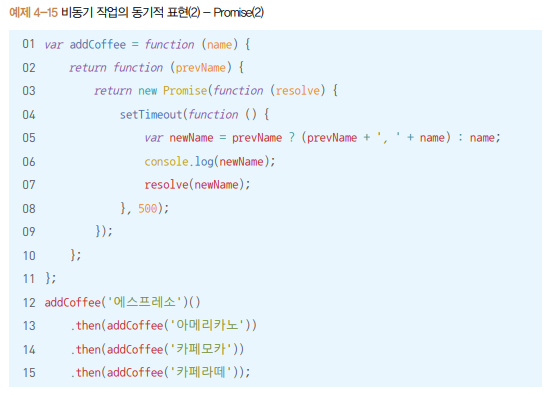

#### ES6의 Generator

*이 붙은 함수가 Generator 함수

Generator 함수를 실행하면 Iterator가 반환되는데, Itereator는 next라는 메서드를 가진다

이 next 메서드를 호출하면 Generator 함수 내부에서 가장 먼저 등장하는 yield에서 함수의 실행을 멈춤

이후 다시 next 메서드를 호출하면 멈췄던 부분부터 시작해서 그 다음에 등장하는 yield에서 함수의 실행을 멈춘다

비동기 작업이 완료되는 시점마다 next 메서드를 호출하면 위에서부터 아래로 순차적으로 진행

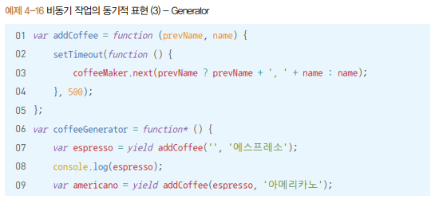

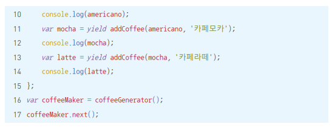

#### ES2017의 async/await

비동기 작업을 수행하고자 하는 함수 앞에 async 표기, 함수 내부에서 실질적 비동기 작업이 필요한 위치마다 await을 표기해 뒤의 내용을 Promise로 전환하고, 해당 내용이 resolve된 이후에야 다음으로 진행

Promise의 then과 흡사한 효과

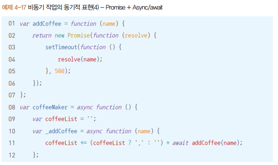

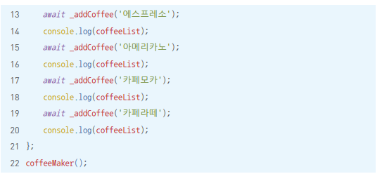

## 06) 정리

콜백 함수는 다른 코드에 인자로 넘겨줌으로써 그 제어권도 함께 위임한 함수

제어권을 넘겨받은 코드는 다음과 같은 제어권을 가진다

1. 콜백 함수를 호출하는 시점을 스스로 판단해서 실행
2. 콜백 함수를 호출할 때 인자로 넘겨줄 값들 및 그 순서가 정해져 있다. 이 순서를 따르지 않고 코드를 작성하면 엉뚱한 결과
3. 콜백 함수의 this가 무엇을 바라보도록 할 지가 정해져 있는 경우도 있다. 정하지 않은 경우에는 전역객체를 바라본다. 사용자 임의로 this를 바꾸고 싶을 경우 bind메서드를 활용하면 된다

어떤 함수에 인자로 메서드를 전달하더라도 이는 결국 함수로서 실행

비동기 제어를 위해 콜백 함수를 사용하다 보면 콜백 지옥에 빠지기 쉽다. Promise,Generator,async/await등 콜백 지옥에서 벗어날 수 있는 방법들이 있다.

