# 07.클래스

[TOC]

JS는 프로토타입 기반 언어라 상속 개념이 없다. 클래스 흉내내는 여러 기술이 있고 ES6에 클래스 문법이 추가됐다. ES6의 클래스도 일정 부분 프로토타입을 활용한다

## 01) 클래스와 인스턴스의 개념 이해

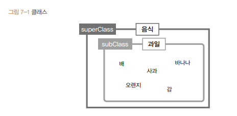

음식 - 상위 클래스, 과일 - 하위 클래스

클래스는 하위로 갈 수록 상위 클래스의 속성을 상속하면서 더 구체적 요건이 추가 또는 변경된다

클래스 : 추상적 개념 ( 공통 특징을 가지는 집합,조건) 플밍에서는 추상적 대상일 수도 있고, 구체적 개체가 될 수도 있다.

인스턴스 :  어떤 클래스의 속성을 지니는 실존하는 개체

클래스를 먼저 정의해야 그로부터 인스턴스를 생성할 수 있다.

## 02) 자바스크립트의 클래스

프로토타입은 클래스와 비슷하게 해석할 수 있는 요소가 있다.

생성자 함수를 new 연산자와 함께 호출해 인스턴스를 생성한다. 이 때 Array를 일종의 클래스라고 하면, Array의 prototype 객체 내부 요소들이 인스턴스에 '상속'된다고 볼 수 있다. ( 정확히는 상속이 아닌 프로토타입 체이닝에 의한 참조)

인스턴스에 상속되지 않으면 스태틱 메서드, 상속되면 프로토타입 메서드(인스턴스에서 직접 호출할 수 있다)라 한다

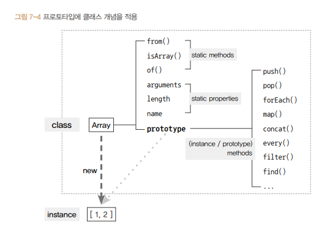

## 03) 클래스 상속

### 7-3-1 기본 구현

#### 프로토타입 체인을 활용해 클래스 상속 구현

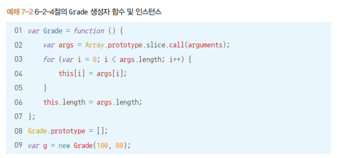

얘는 2가지 큰  문제가 있다. length 프로퍼티가 configurable(삭제 가능)한 것과, Grade.prototype에 빈 배열을 참조시켰다는 점이다

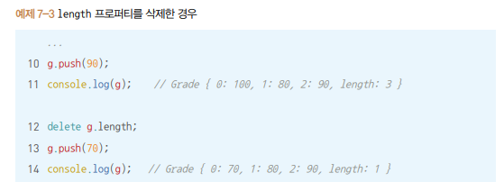

내장 객체인 배열 인스턴스의 length 프로퍼티는 configurable 속성이 false이지만 Grade클래스의 인스턴스인 g는 배열 메서드를 상속하지만 기본적으로 일반 객체의 성질을 지녀 length가 삭제 가능하다

그런데 왜 push 했을 때 0번째 index에 70이 들어가고 length가 1이 됐을까?

`g.__proto__`가 빈 배열을 가리키고 있기 때문

length가 없으니 프로토타입 체이닝으로 `g.__proto__.length`(빈 배열)의 length를 가져옴 

빈 배열의 length가 0이니 여기에 값을 할당하고 length를 1 증가시킴 

__위 상황처럼 클래스 에 있는 값이 인스턴스의 동작에 영향을 줘서는 안된다__

#### 두 클래스의 상속관계를 구현

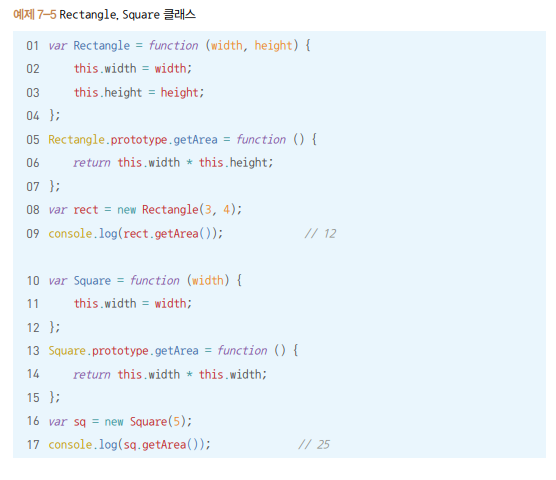

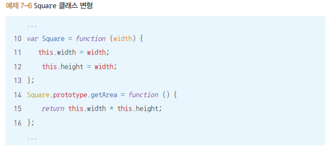

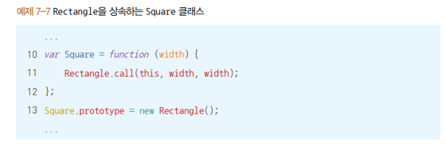

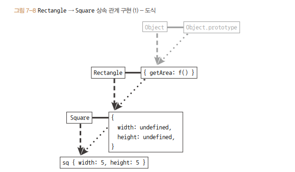

__얘도 동일하게 클래스에 있는 값이 인스턴스에 영향을 줄 수 있다__

__그리고 constructor가 여전히 Rectangle을 보고 있다__

구조적 안전성 떨어짐

### 7-3-2 클래스가 구체적 데이터를 지니지 않게 하는 방법

1. 일단 만들고 나서 프로퍼티들을 일일이 지우고 더는 새로운 프로퍼티들을 추가할 수 없게 한다

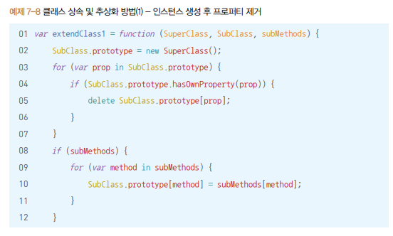

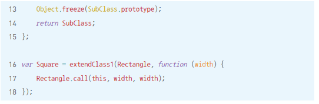

2. SubClass의 prototype에 직접 SuperClass의 인스턴스를 할당하는 대신 아무런 프로퍼티를 생성하지 않는 빈 생성자 함수(Bridge)를 하나 더 만들어서 그 prototype이 SuperClass의 prototype을 바라보게끔 한 다음, SubClass의 prototype에는 Bridge의 인스턴스를 할당한다

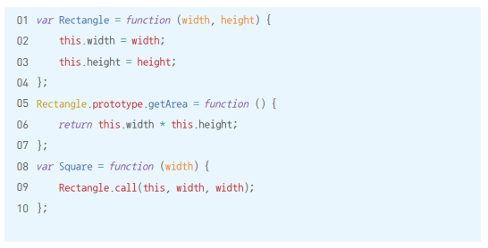

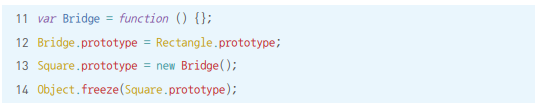

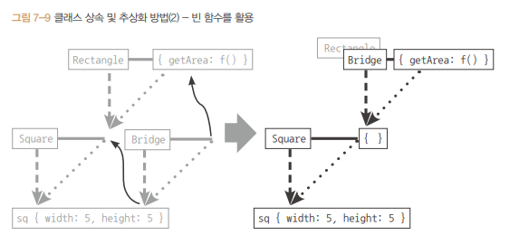

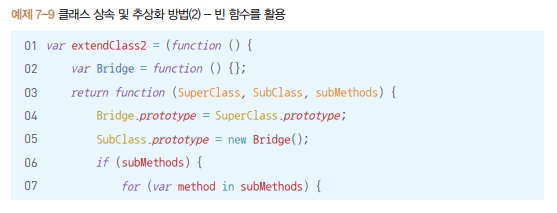

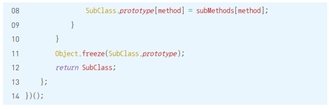

3. Object.create를 이용한 방법 - 앞서 소개한 2방법보다 간단하고 안전

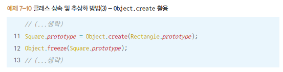

### 7-3-3 constructor 복구하기

위 3가지 방법 모두 SubClass 인스턴스의 constructor는 여전히 SuperClass를 가리킨다

정확히는 SubClass 인스턴스에는 constructor가 없고, SubClass.prototype에도 없어서 프로토타입 체인상에 가장 먼저 등장하는 SuperClass.prototype의 constructor에서 가리키는 대상인 SuperClass가 출력되는 것이다

따라서 위 코드들의 SubClass.prototype.constructor가 원래의 SubClass를 바라보도록 하면 된다

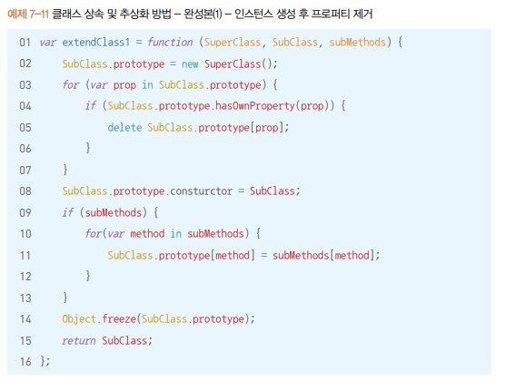

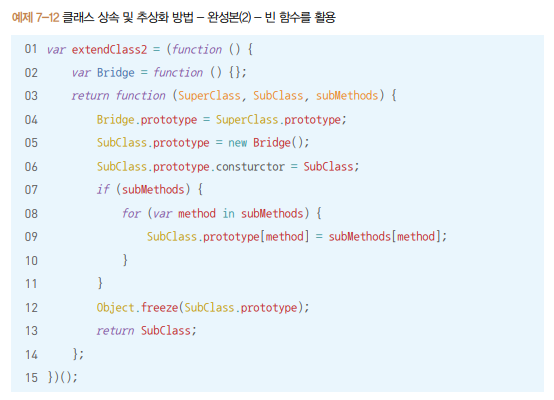

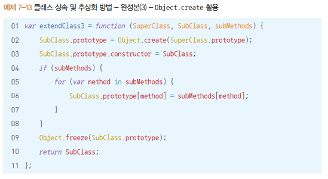

### 7-3-4 상위 클래스에의 접근 수단 제공

다른 객체지향 언어들의 클래스 문법 중 하나인 `super`를 흉내내자

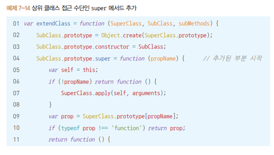

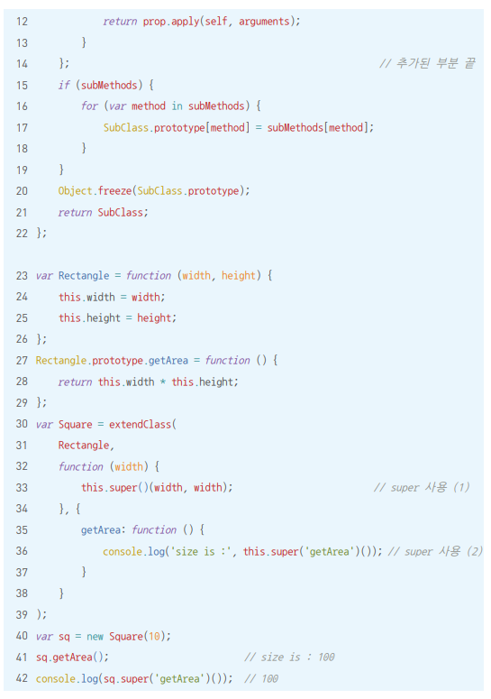

## 04) ES6의 클래스 및 클래스 상속

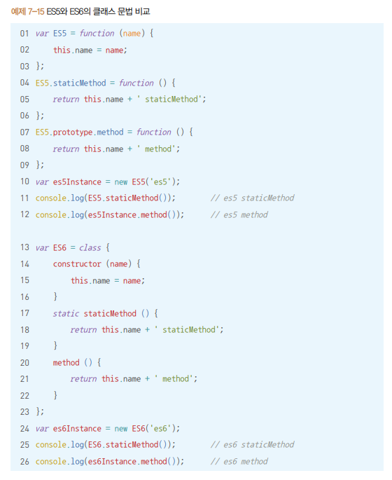

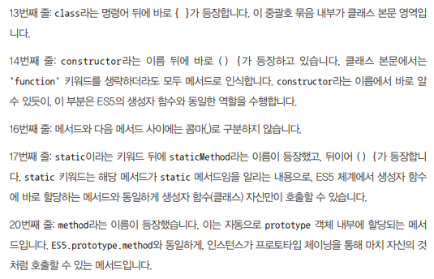

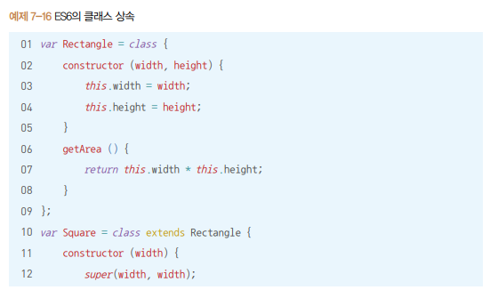

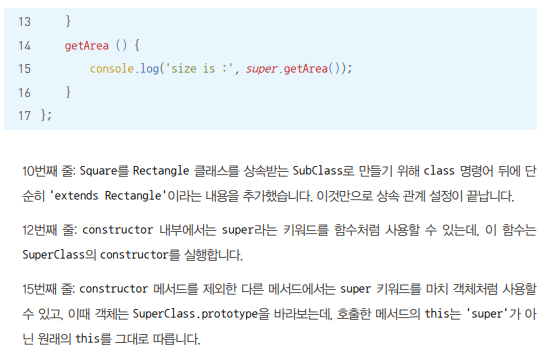

## 05) 정리

자바스크립트는 프로토타입 기반 언어라서 클래스 및 상속 개념은 존재하지 않지만 프로토타입을 기반으로 클래스와 비슷하게 동작하게끔 하는 다양한 기법들이 도입돼 왔다.

클래스는 어떤 사물의 공통 속성을 모아 정의한 추상적인 개념이고, 인스턴스는 클래스의 속성을 지니는 구체적 사례이다. 상위 클래스(superclass)의 조건을 충족하면서 더욱 구체적인 조건이 추가된 것을 하위 클래스(subclass)라고 한다.

클래스의 prototype 내부에 정의된 메서드를 프로토타입 메서드라고 하며, 이들은 인스턴스가 마치 자신의 것처럼 호출할 수 있다. 한편 클래스(생성자 함수)에 직접 정의한 메서드를 스태틱 메서드라고 하며, 이들은 인스턴스가 직접 호출할 수 없고 클래스(생성자 함수)에 의해서만 호출할 수 있다.

클래스 상속을 흉내내기 위한 3가지 방법

1. Subclass.Prototype에 SuperClass의 인스턴스를 할당한 다음 프로퍼티를 모두 삭제
2. 빈 함수(Bridge) 활용
3. Object.create를 이용

위 세 방법 모두 constructor 프로퍼티가 원래의 생성자 함수를 바라보도록 조정해야 한다.

상위 클래스에 접근할 수 있는 수단인 super도 구현 가능

ES6에서는 클래스 문법으로 간단하게 상속,추상화를 구현할 수 있다.